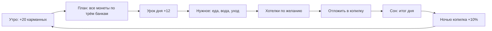
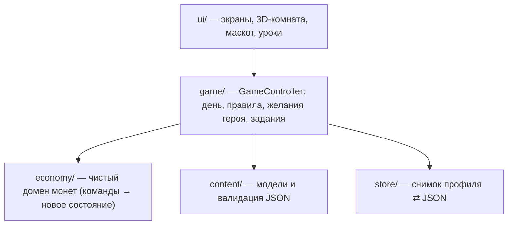

# Питомец Финни

**Обучающая игра-тамагочи о финансовой грамотности для детей 7–11 лет.** Проект хакатона Департамента финансов города Москвы.

Ребёнок заботится о 3D-питомце Финни и каждый игровой день принимает маленькие денежные решения: раскладывает монеты по трём банкам, сначала покупает нужное, копит на мечту и проходит короткие уроки. Все монеты **вымышленные**: вне игры они ничего не стоят. Сети, аккаунтов и персональных данных нет.

<p>
   
</p>

> ### 📦 Готовый APK — без сборки
> **[Релиз v1.2.2 в GitHub Releases](https://github.com/IMaruli/Pet_Finni_hackathon/releases/tag/v1.2.2)** — файл `finni-1.2.2.apk` (~53 МБ, Android 7.0+; ТЗ требует 8.0+). Все релизы — [Releases](https://github.com/IMaruli/Pet_Finni_hackathon/releases).
> Скопируйте APK на телефон, откройте его и разрешите установку из этого источника. Каждый пуш тоже собирает APK: **Actions → Android APK → Artifacts → `finni-apk`**.

> ### 🎬 Промо и запись приложения
> **[Промо-материалы на Яндекс Диске](https://disk.yandex.ru/d/d3zIb8Cg6BFYmQ)** — презентация и сопутствующие файлы.
> **[Запись приложения](https://disk.yandex.ru/i/OTgwsRBrmhxnTQ)** — видео прохождения.

> ### 📖 История Финни
> Как появились идея и герой: концепт от нейросети, своя 3D-сцена в Blender, страшный первый маскот, сломанный рендер и путь до релиза — **[сторибук](docs/story/README.md)**.

| Пакет | Версия | Номер сборки | Android | Стек |
|-------|--------|--------------|---------|------|
| `ru.petfinni.finni` | **1.2.2** (`pubspec.yaml`: `1.2.2+5`) | в CI — номер запуска GitHub Actions | 7.0+ (ТЗ: 8.0+), портрет, офлайн | Flutter 3.47 / Dart 3.13 |

**Содержание:** [Быстрый запуск и демо](#быстрый-запуск-и-демо-режим) · [О приложении](#о-приложении) · [Механики с примерами](#механики-с-примерами) · [Реализованные требования](#реализованные-требования-тз) · [Техническое решение](#техническое-решение) · [Состав репозитория](#состав-репозитория) · [Собрать самому](#собрать-самому-flutter) · [Документация](#документация)

---

## Быстрый запуск и демо-режим

1. **Установка.** Скачать APK из [Releases](https://github.com/IMaruli/Pet_Finni_hackathon/releases), скопировать на телефон, открыть, разрешить установку из этого источника. Среда разработки не нужна.
2. **Первый запуск** — «Кто заходит?» → **Ребёнок** → знакомство (нужное / хочу / отложить) → «Настрой Финика»: облик, цвет, имя питомца и игровое имя. Регистрации, телефона и e-mail нет.
3. **Тестовые данные.** Новый профиль — это и есть тестовый профиль: 40 монет на старт + 20 карманных, цели и уроки открыты по правилам игры. Ничего подготавливать не нужно.
4. **Демо-режим (5 периодов без ожидания).** Игровой день завершается кнопкой **«Задания» → «Завершить день»** — сразу открывается итог и следующее утро, календарь не нужен. Пять дней подряд проходятся за несколько минут.
5. **Сценарий Приложения А:** план трёх банок (облачко героя) → урок (+12) → нужное пузырями над героем, хотелка, попытка купить без денег → «Копилка»: цель и пополнение → «Завершить день» → итог и рост → закрыть и открыть приложение (прогресс сохранён) → раздел взрослого.
6. **Сброс профиля.** Дом → «•••» → **«Для взрослых»** (удерживать 3 секунды) → **«Сбросить профиль (тест)»** → подтвердить. Профиль возвращается к исходному состоянию, сценарий можно пройти заново. Тот же раздел — со стартового экрана кнопкой «Взрослый».

Подробный сценарий демо для жюри и чеклист — [`docs/release/RELEASE_v1.0.0.md`](docs/release/RELEASE_v1.0.0.md).

---

## О приложении

**📘 Полное бизнес-описание со скриншотами: [`docs/business/README.md`](docs/business/README.md)** — 9 документов, по одному на механику.

### Какую задачу решаем

Дети 7–11 лет впервые распоряжаются карманными деньгами, но «бюджет», «накопления» и «вклад» для них пока просто слова. Финни превращает эти слова в ежедневную заботу о питомце. Питомец просит завтрак, и ребёнок сам решает, хватит ли монет. Питомец мечтает о телескопе, и ребёнок видит, сколько дней на него копить.

### Для кого

| Кто | Что получает |
|-----|--------------|
| Ребёнок 7–11 лет | Питомца, о котором заботится сам; понятные правила; безопасные ошибки |
| Родитель | Раздел взрослого (удержание 3 с): прогресс по темам без оценок, сброс профиля |
| Жюри / заказчик | Все пункты Приложения А ТЗ, 5 демо-дней подряд, 3 стадии роста, офлайн |

### Главная идея — день как законченный круг



Финни сам подсказывает следующий шаг облачком. Время суток за окном идёт вместе с днём: утро, день, закат, ночь со звёздами. Правила не дают перескочить главное: **сначала нужное, потом хотелки**.

### Принципы

- **Ошибка безопасна.** Плохой выбор объясняется и всё равно чему-то учит. Стадию роста потерять нельзя.
- **Питомец грустит, но не болеет и не уходит.** Никакого давления «зайди, или он умрёт».
- **Монеты только игровые.** Ни покупок, ни рекламы, ни сети.
- **Ребёнок решает сам.** Игра показывает последствия и не наказывает.

## Механики с примерами

| Механика | Как работает | Пример |
|----------|--------------|--------|
| **Знакомство** | Герой здоровается и рассказывает правила в 6 репликах. День 1 мягкий: план → урок → игра → «проголодался». | «Привет, Аня! Я Финя — твой питомец». После урока: «После урока и игры я проголодался… Купишь мне завтрак?» |
| **План трёх банок** | Утром все монеты кошелька раскладываются на «Нужное», «Хочу» и «Отложить». «Готово» нажимается, только когда разложено всё. После подтверждения план закреплён. | 60 монет: Нужное 12, Хочу 20, Отложить 28. Вечером итог показывает план → факт по каждой банке |
| **Сначала нужное** | Нужды дня висят пузырями над героем. Пока нужное не куплено, хотелки и игры закрыты. | Над героем 🍲 7 и 💧 4. Мороженое купить нельзя: «Сначала завтрак и вода» |
| **Нужды по расписанию** | Еда и умывание каждый день, вода почти всегда, купание, стирка и стрижка раз в 3–5 дней. Всегда не дороже карманных. | Грязный герой с пятнами становится чистым после умывания 🪥 4. Миски в комнате наполняются |
| **Покупки** | Шторка показывает цену, тип (нужное или хочу), влияние на героя и остаток «было → останется». Если не хватает, монеты не списываются: игра подсказывает, сколько не хватает и где заработать. | «Не хватает 3 монет: пройди урок (+12) или выбери дешевле» |
| **Образ и дом** | Одежда примеряется до покупки, на каждое место одна вещь. Вещи для комнаты сразу появляются в 3D-комнате. | Надел корону — кепка снялась: «Корона вместо «Кепка»». Купил аквариум — рыбки у окна |
| **Копилка и цели** | 7 целей с ценой и прогрессом. Награда появляется сразу: облик, вещь в комнате или вторая комната. | «Поездка в зоопарк 30 / 35». После «Забрать» на стене фото с жирафом |
| **Копилка как вклад** | Каждую ночь копилка растёт на 10%: 1 монета за каждые 10. | Отложил 44, утром 48. «Этой ночью: +4 🌙» |
| **Срок до цели** | Считается по средней сумме, которую ребёнок реально откладывает (ТЗ 2.5.7). | «В среднем ты откладываешь 6 в день — ещё примерно 4 дн.» |
| **Снять из копилки** | Можно, но с ценой решения: герой реагирует, видно, насколько отодвинутся цель и срок и что прибавка этой ночью сгорит. Затем второе подтверждение. | Взять 10: 😟 «Ой… мечта отодвинется», до цели 6 → 16, срок 1 → 3 дн., прибавка +4 → 0 |
| **Уроки** | 7 тем, 14 уроков в стиле Duolingo: мысль → практика → ситуация с последствием. Один блок в день, первый урок дня +12. | «Разложи»: перетащи «Хлеб» в «Нужно», «Игрушку» в «Хочу». Ошибка объясняется сразу |
| **Задания** | 3 задания дня и 5 недели, награда по кнопке «Забрать». | «Пройди 1 урок» +3, «Поучись в 4 разных дня» +10 |
| **Мини-игры** | По желанию, раз в день: +6 за победу, +3 за попытку. | «Нужно или хочу?», «Уложись в бюджет», «Копилка-ловец» |
| **Состояние героя** | На Доме плашка «настроение · сытость · чистота» словами и эмодзи; тап объясняет, от чего зависит. | «🙂 спокоен · 🍽️ голоден · ✨ чистый» |
| **История** | «Покупки сегодня» на экране плана и карточка «Итог дня» во вкладке «Задания» — в любой момент. | «🥣 Завтрак · Нужное · −8» |
| **День и рост** | Итог дня: план и факт, настроение, копилка подросла, совет. Хороший день — нужное куплено, хотелки не больше плана и что-то отложено: три условия видны галочками. | 2 хороших дня — «уже как взрослый», 4 — «настоящий взрослый» и облик Мартышки |
| **Доступность** | «Меньше движения», крупный текст 16 sp, кнопки от 48 dp, игра не ломается при увеличенном системном шрифте. | Взрослый раздел → «Меньше движения» |

Все цифры экономики собраны в [`docs/business/README.md`](docs/business/README.md#экономика-в-цифрах). Как каждое правило ТЗ реализовано в коде — в [аудите соответствия](docs/work/product/TZ_RULES_COMPLIANCE.md).

## Реализованные требования ТЗ

Статусы по п. 7.1: ✅ реализовано · 🟡 в работе · ⬜ не начато. Полная матрица по всем пунктам со ссылками на экраны, модули и тесты — [`TZ_FULL_AUDIT.md`](docs/work/product/TZ_FULL_AUDIT.md).

| Раздел ТЗ | Требование | Статус | Где |
|-----------|------------|--------|-----|
| 2.5.1 | Первый запуск, гостевой профиль, подсказка в любой момент | ✅ | Знакомство; «•••» → «Как играть», «Словарик» |
| 2.5.2 | Внешний вид и имя питомца | ✅ | «Настрой Финика», «Образ» |
| 2.5.3 | Главный экран: питомец, баланс, накопления, цель, состояние, задание | ✅ | Дом |
| 2.5.4 | Игровая валюта, подписанные начисления | ✅ | Тосты, итог дня; источники `pocket / lesson / game / quest / weekly / interest` |
| 2.5.5 | План ≥ 3 направлений, остаток, план → факт | ✅ | «План дня» |
| 2.5.6 | Покупки двух типов, цена и влияние, история, запрет долга | ✅ | Шторка покупки, «Покупки сегодня», «Не хватает N» |
| 2.5.7 | Цель, накопления, срок по средней сумме, снятие с подтверждением | ✅ | «Копилка» |
| 2.5.8 | Задания по 3+ темам с выбором и последствием | ✅ | «Уроки» (7 тем, 14 уроков), мини-игры |
| 2.5.9 | Последствия и путь восстановления | ✅ | Облачко героя, «Выбрать снова», советы |
| 2.5.10 | ≥ 3 стадий по серии решений (нужное, план, накопления) | ✅ | Итог дня, стадия на Доме |
| 2.5.11 | История, прогресс цели, итоги периода, словарик | ✅ | «Задания», «Уроки», «Словарик» |
| 2.5.12 | Раздел взрослого за барьером | ✅ | Удержание 3 с |
| 2.5.13 | Сохранение и демо-режим с тестовым профилем | ✅ | `shared_preferences`, «Завершить день», сброс |
| 2.5.14 | Новое задание без переработки логики | ✅ | `assets/content/lessons.json` |
| 2.6 | Минимальный объём контента | ✅ | 7 обликов × 8 цветов, 5 демо-периодов, 14 уроков, 35 товаров, 7 целей, 3 стадии |
| 3.1 | Android 8+, портрет 360 dp, без разрешений, офлайн | ✅ | Проверено на эмуляторе |
| 3.1 | Проверка на физическом устройстве ≥ 3 ГБ | ⬜ | Форма отчёта — документация, раздел 10 |
| 3.3 | Подписанный релизный APK | 🟡 | Сейчас debug-подпись; релизный ключ — следующий шаг |
| 3.3 | Карточка RuStore | ✅ | [`docs/release/rustore/CARD.md`](docs/release/rustore/CARD.md) |
| 3.4 | Архитектура, тесты, без секретов, старт ≤ 5 с | ✅ | 181 автотест в CI, старт 2,2 с (эмулятор) |
| 3.5 | Без ПДн, рекламы, покупок, внешних ссылок | ✅ | — |
| 3.6 | Доступность: 16 sp, 48 dp, отключение анимаций | ✅ | «Меньше движения», тест масштаба шрифта |
| 4 | Презентация и резервное видео | ⬜ | Готовит команда |
| 5 | Документация (README + PDF) | ✅ | [`Finni_Documentation.pdf`](docs/documentation/Finni_Documentation.pdf) |

Вопросы и ограничения для консультации с заказчиком (п. 7.1.7) — в конце [`TZ_FULL_AUDIT.md`](docs/work/product/TZ_FULL_AUDIT.md#вопросы-к-заказчику-п-717).

---

## Техническое решение

**🛠 Подробности для разработчика: [`client/README.md`](client/README.md)** — архитектура, экономика, матрица требований ТЗ. Системные спецификации по каждой истории лежат в [`docs/work`](docs/work/README.md).

### Стек

| Слой | Выбор | Почему |
|------|-------|--------|
| Клиент | **Flutter 3.47 / Dart 3.13** | Один код, нативный APK, 60 FPS, свой рендер без движка |
| Хранение | `shared_preferences` (JSON-снимок профиля) | Офлайн, без сервера и ПДн |
| Графика | `CustomPainter` + собственный 3D-рендер на `Canvas.drawVertices` | Весь арт нарисован кодом: нет чужих картинок и лицензий, APK без ассетов-картинок |
| Контент | JSON в `assets/content/` | Уроки, товары, цели, облики и тексты меняются без кода |
| CI/CD | GitHub Actions | analyze → test → release APK на каждый пуш, GitHub Release по тегу |

### Архитектура



Зависимости направлены только вниз. Домен экономики — чистые функции `EconomyEngine.apply(state, command)`: `Credit`, `ConfirmPlan`, `BuyItem`, `TransferToSavings`, `RequestWithdraw` → `ConfirmWithdraw`, `RedeemGoal`, `AccrueInterest`, `ClosePeriod`. Состояние неизменяемое, `GameCoins` не бывает отрицательным, поэтому долг невозможен по построению. Каждое начисление подписано источником: `pocket:`, `lesson:`, `game:`, `quest:`, `weekly:`, `interest:`.

### Интересные решения

- **Свой 3D-рендер комнаты** ([`ui/room3d/`](client/lib/ui/room3d)). Сетки из треугольников, камера на орбите (комнату крутят пальцем), алгоритм художника с приоритетами слоёв. Свет направленный, точечный и фоновый; плавное затенение по нормалям вершин; мягкие тени; 4 времени суток. Картины на стене рисуются отдельным слоем без сортировки, поэтому не мерцают. Полностью обставленная комната — около 6 350 треугольников, кадр считается примерно за 3,7 мс.
- **3D-маскот на сфере** ([`ui/mascot/`](client/lib/ui/mascot)). Глаза, рот, уши, аксессуары — точки на поверхности сферы, которая поворачивается и дышит. 7 обликов, 10 аксессуаров, эмоции, «грязный» вид.
- **Контент как данные.** Новый урок — одна запись в `lessons.json`. `GameContent.validate()` проверяет объёмы ТЗ, рецепты уроков и места одежды.
- **Иконка и заставка из кода.** `tool/icon/make_icon_test.dart` рисует героя теми же функциями, что и в игре.

### Качество

| Что | Цифры |
|-----|-------|
| Код | ~13,4 тыс. строк Dart в `lib/`, ~2,8 тыс. строк тестов |
| Автотесты | 181: домен экономики, контроллер дня, контент, хранение, уроки, мини-игры, 3D-комната, маскот, доступность, сквозной путь Приложения А на экране 360 dp |
| Статический анализ | `flutter analyze` — 0 замечаний |
| NFR | холодный старт 2,2 с (норма ≤ 5 с), 0 разрешений, офлайн, портрет |
| Процесс | Системная спецификация (SA) до кода по каждой истории F-002…F-066, TDD, CI на каждый пуш |

## Состав репозитория

| Путь | Что внутри |
|------|------------|
| [`client/`](client) | Flutter-приложение: `lib/` — код (`economy/`, `content/`, `store/`, `game/`, `ui/`), `assets/content/` — учебный и игровой контент JSON, `test/` — автотесты, `android/` — сборка APK, `tool/icon/` — генератор иконки |
| [`docs/business/`](docs/business/README.md) | Бизнес-описание механик со скриншотами |
| [`docs/documentation/`](docs/documentation/FINNI_DOCUMENTATION.md) | Сопроводительная документация по разделу 5 ТЗ (Markdown + PDF), карта контента |
| [`docs/work/`](docs/work/README.md) | Системные спецификации по историям, аудиты ТЗ |
| [`docs/release/`](docs/release/RELEASE_v1.0.0.md) | Релизы, чеклист сдачи, карточка RuStore |
| [`docs/story/`](docs/story/README.md) | История проекта |
| [`.github/workflows/`](.github/workflows/android-apk.yml) | CI: проверки, тесты, release APK |

---

## Собрать самому (Flutter)

Нужен только компьютер: macOS, Windows или Linux. Всё ставится один раз.

### 1. Что нужно

| Компонент | Версия | Зачем |
|-----------|--------|-------|
| **Flutter SDK** | 3.47.x (stable) | Фреймворк и компилятор Dart |
| **Java (JDK)** | 17 (Temurin) | Gradle собирает Android-часть |
| **Android SDK** | platform-tools, `platforms;android-36`, `build-tools;36.0.0`, `ndk;28.2.13676358`, `cmdline-tools;latest` | Сборка и подпись APK |
| Эмулятор (по желанию) | `emulator` + образ `system-images;android-35;google_apis;arm64-v8a` (или `x86_64` на Intel/AMD) | Запуск без телефона |

### 2. Установка

**macOS (Homebrew):**

```bash
brew install --cask flutter
brew install --cask temurin@17
brew install --cask android-commandlinetools
export JAVA_HOME=$(/usr/libexec/java_home -v 17)
sdkmanager --sdk_root=$HOME/Library/Android/sdk "platform-tools" "platforms;android-36" "build-tools;36.0.0" "ndk;28.2.13676358" "cmdline-tools;latest"
flutter config --android-sdk $HOME/Library/Android/sdk
```

**Windows / Linux:** проще всего поставить [Flutter](https://docs.flutter.dev/get-started/install) и [Android Studio](https://developer.android.com/studio). В Android Studio откройте SDK Manager и поставьте Android SDK 36, Build-Tools 36, NDK 28.2 и Command-line Tools. Java 17 входит в Android Studio.

**Лицензии Android SDK** принимаются один раз вручную: отвечайте `y` на каждый вопрос.

```bash
flutter doctor --android-licenses
```

### 3. `flutter doctor` — проверка окружения

`flutter doctor` проверяет, всё ли готово к сборке, и подсказывает, чего не хватает:

```bash
flutter doctor
```

```text
[✓] Flutter (Channel stable, 3.47.5)
[✓] Android toolchain - develop for Android devices (Android SDK version 36.0.0)
[!] Xcode - develop for iOS and macOS        ← для APK не нужен, можно игнорировать
[✓] Connected device (1 available)
```

| Строка | Что значит | Если ✗ |
|--------|------------|--------|
| Flutter | SDK установлен и в `PATH` | Переустановить Flutter, добавить в `PATH` |
| Android toolchain | Найдены Android SDK, Java и приняты лицензии | «Unable to locate Android SDK» → `flutter config --android-sdk <путь>`; «licenses not accepted» → `flutter doctor --android-licenses`; «requires Android SDK 36» → поставить `platforms;android-36` |
| Xcode / Chrome / Visual Studio | Сборка под iOS, веб, Windows | Для APK не нужны |
| Connected device | Телефон по USB (отладка включена) или эмулятор | Нужен только для `flutter run` |

### 4. Сборка и запуск

```bash
git clone https://github.com/IMaruli/Pet_Finni_hackathon.git
cd Pet_Finni_hackathon/client
flutter pub get             # зависимости
flutter analyze             # статический анализ
flutter test                # 181 автотест
flutter build apk --release # → build/app/outputs/flutter-apk/app-release.apk
flutter install             # поставить на подключённый телефон/эмулятор
```

Первая сборка идёт 5–10 минут: Gradle скачивает зависимости. Дальше около минуты.

### 5. Частые проблемы (мы сами их встретили)

| Сообщение | Решение |
|-----------|---------|
| `Unable to locate a Java Runtime` | Поставить JDK 17, выполнить `export JAVA_HOME=$(/usr/libexec/java_home -v 17)` |
| `Unable to locate Android SDK` | SDK не скачан или не указан путь: `flutter config --android-sdk <путь>` |
| `sdkmanager ... finished with non-zero exit value` при сборке | Gradle не смог скачать NDK: поставить `ndk;28.2.13676358` через `sdkmanager` или вручную |
| Эмулятор выдаёт 3 FPS | Он запустился на программной графике: `emulator -avd <имя> -gpu host` |
| APK не ставится поверх старого | Разные ключи подписи (локальный debug и CI): удалите старую версию |

Подпись релизным ключом и выпуск версии описаны в [`docs/release/RELEASE_v1.0.0.md`](docs/release/RELEASE_v1.0.0.md).

---

## Документация

| Что | Где |
|-----|-----|
| 📖 История проекта: идея, маскот, падения и рост | [`docs/story`](docs/story/README.md) |
| 📘 Бизнес-описание механик со скриншотами | [`docs/business`](docs/business/README.md) |
| 🛠 Техническое описание клиента | [`client/README.md`](client/README.md) |
| 📐 Системные спецификации по историям (F-002 … F-066) | [`docs/work`](docs/work/README.md) |
| ✅ Полный аудит по ТЗ: статусы «реализовано / в работе / не начато» и план до финала | [`docs/work/product/TZ_FULL_AUDIT.md`](docs/work/product/TZ_FULL_AUDIT.md) |
| ✅ Соответствие правилам ТЗ (аудит 2026-09-25) | [`docs/work/product/TZ_RULES_COMPLIANCE.md`](docs/work/product/TZ_RULES_COMPLIANCE.md) |
| 📄 Сопроводительная документация по разделу 5 ТЗ (PDF) | [`docs/documentation/Finni_Documentation.pdf`](docs/documentation/Finni_Documentation.pdf) · [Markdown](docs/documentation/FINNI_DOCUMENTATION.md) · [карта контента](docs/documentation/CONTENT_MAP.md) |
| 🏪 Черновик карточки RuStore | [`docs/release/rustore/CARD.md`](docs/release/rustore/CARD.md) |
| 📦 Релиз и чеклист сдачи | [`docs/release/RELEASE_v1.0.0.md`](docs/release/RELEASE_v1.0.0.md) |
| 🎬 Промо-материалы | [Яндекс Диск](https://disk.yandex.ru/d/d3zIb8Cg6BFYmQ) |
| 🎥 Запись приложения | [Яндекс Диск](https://disk.yandex.ru/i/OTgwsRBrmhxnTQ) |
