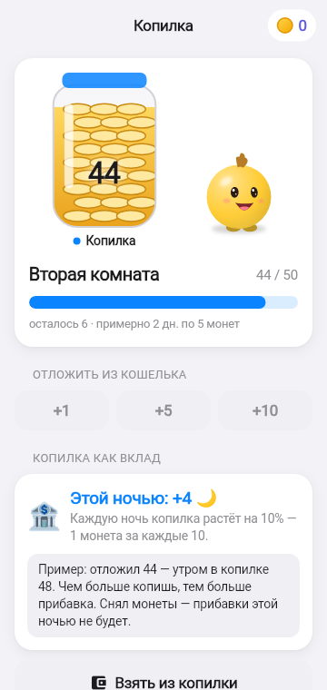

# Питомец Финни

Обучающая игра-тамагочи о финансовой грамотности для детей 7–11 лет (хакатон Департамента финансов Москвы). Ребёнок заботится о 3D-питомце и учится распоряжаться **вымышленными игровыми монетами**: план трёх банок, сначала нужное, копилка на мечту, короткие уроки. Монеты не имеют ценности вне игры. Без сети, аккаунтов и персональных данных.

<p>
   
</p>

## Установить

1. Скачать APK: **Releases** (тег `v*`) или **Actions → Android APK → Artifacts → `finni-apk`**.
2. Скопировать на телефон с Android 7.0+ и открыть; разрешить установку из этого источника.

## Собрать

```bash
cd client
flutter pub get
flutter test
flutter build apk --release
```

Подробно: [`client/README.md`](client/README.md) — архитектура, экономика, матрица требований ТЗ.

## Документация

| Что | Где |
|-----|-----|
| Механики для бизнеса со скриншотами | [`docs/business`](docs/business/README.md) |
| Системные спецификации по историям (F-002 … F-053) | [`docs/work`](docs/work/README.md) |
| Соответствие правилам ТЗ | [`docs/work/product/TZ_RULES_COMPLIANCE.md`](docs/work/product/TZ_RULES_COMPLIANCE.md) |
| Релиз и чеклист сдачи | [`docs/release/RELEASE_v1.0.0.md`](docs/release/RELEASE_v1.0.0.md) |
