# 1. Вход и настройка Финика

**Зачем.** Ребёнок заботится о том, кого создал сам. Облик Финика — первый выбор в игре, а редкий облик Мартышки — награда за финансовые привычки, а не за одну накопленную сумму.

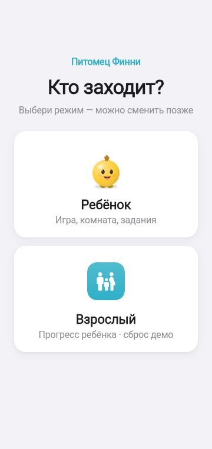 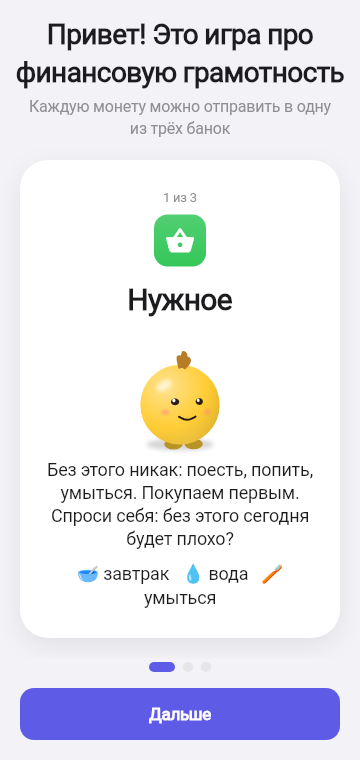 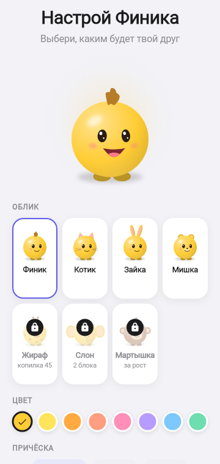 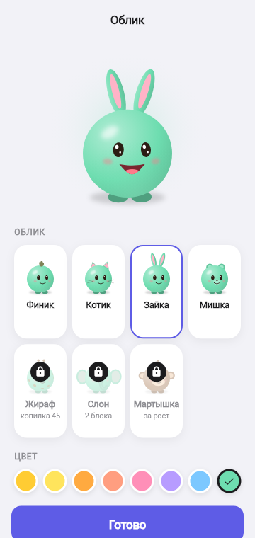 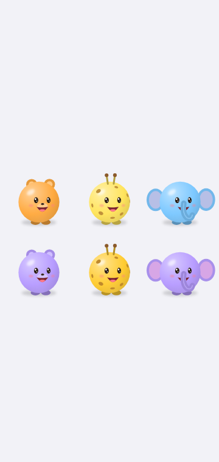

## Как это работает

1. **Кто заходит?** Ребёнок или взрослый. Взрослый попадает в раздел прогресса за удержанием кнопки 3 секунды (без оценок, со сбросом профиля).
2. **«Привет! Это игра про финансовую грамотность»** — три карточки простыми словами (F-062):
   - **Нужное** — «без этого никак: поесть, попить, умыться. Покупаем первым. Спроси себя: без этого сегодня будет плохо?»;
   - **Хочу** — «просто хочется: вкусняшка, игрушка, одежда. Можно, если остались монеты. А можно и не брать!»;
   - **Отложить** — «не тратим сейчас, а кладём в копилку на мечту. Копилка — отдельно от кошелька, в магазине её не тратят».
3. **Настрой Финика** — живой 3D-герой в центре и выбор:
   - открыты сразу: **Финик** (хохолок / чёлка / пучки), **Котик** (ушки и усики), **Зайка** (длинные ушки), **Мишка** (круглые ушки и носик);
   - **Жираф** (рожки и пятнышки) — копится: цель «Облик Жираф» в Копилке, 45 монет;
   - **Слон** (большие уши и хобот) — за учёбу: откроется после 2 блоков уроков;
   - **Мартышка** — за рост: стадия «настоящий взрослый»;
   - закрытые облики видны с замком и подписью («копилка 45», «2 блока», «за рост»); тап — Финик качает головой и объясняет, как открыть;
   - 8 цветов палитры (у Мартышки свой цвет);
   - имя героя и игровое имя ребёнка (фамилия и телефон не нужны).
4. Позже облик меняется бесплатно в разделе **«Образ» → вкладка «Облик»** — выбор применяется сразу. Там же видно все закрытые облики и как их открыть.

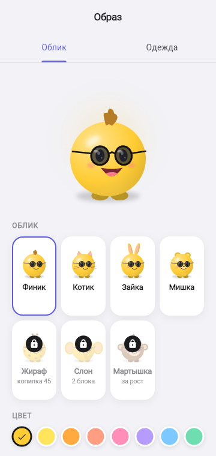 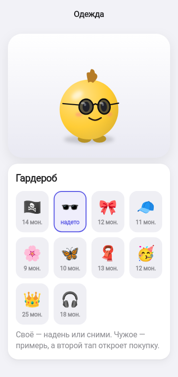

5. **Знакомство.** На Доме герой — чистый и радостный — здоровается и рассказывает об игре, шесть реплик с кнопками:
   - «Привет, Аня! Я Финя — твой питомец. Будем знакомы!» — «Привет!»
   - «Мы вместе будем учиться финансовой грамотности: планировать монеты, копить на мечту и выбирать с умом.» — «Здорово!»
   - «Каждый день я буду о чём-то просить: покушать, помыться, узнать новое. А ты решаешь, на что потратить монеты.» — «Понятно»
   - «Сегодня просто знакомимся: разложим монеты, пройдём первый урок и поиграем. А потом я попрошу перекусить!» — «Ура!»
   - «А ещё копилка — как вклад: каждую ночь она подрастает на 10%. Чем больше отложишь — тем больше прибавка!» — «Здорово!»
   - «Главное правило: сначала нужное, потом хотелки. Начнём?» — «Начнём!»

   **День 1 — мягкий вход:** план (с подписанным доходом «40 на старт и 20 карманных») → первый урок → «Хочу поиграть!» (показываем игры) → и только потом просыпаются нужды: «После урока и игры я проголодался… Купишь мне завтрак?» — завтрак и вода, без умывания и грязи → копилка → сон. **Со второго дня** — завтрак, вода, умывание, дальше по расписанию.

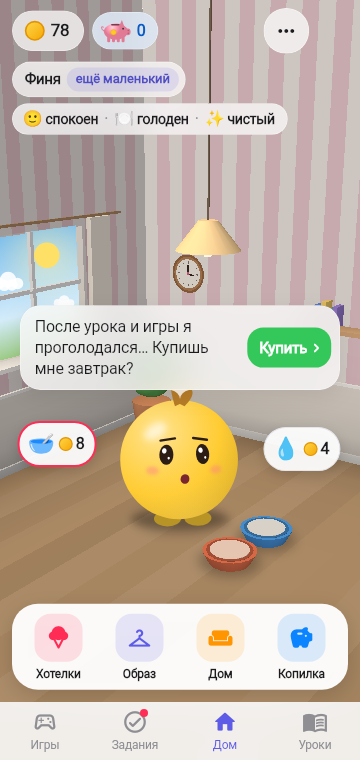

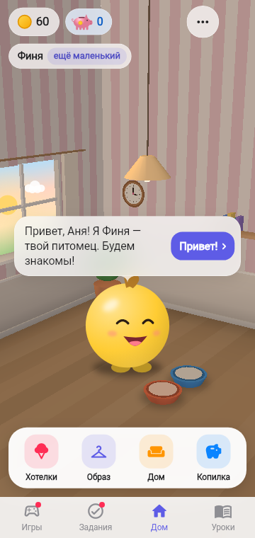 

## Подсказки при первом входе в раздел

Ребёнок в тесте не понял, что делать в Плане, Копилке, Образе и Доме. Теперь при первом входе в раздел появляется окошко: эмодзи, 2–3 строки «что это и как пользоваться» и кнопка «Понятно» (F-062). Показывается один раз; после сброса профиля — снова. Разделы: План, Копилка, Хотелки, Образ, Дом, Уроки, Игры, Задания.

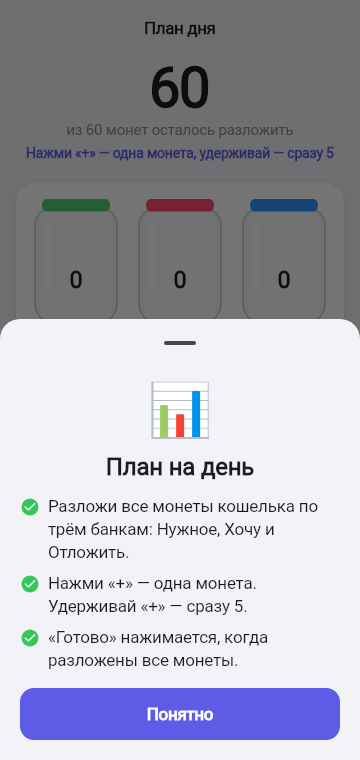 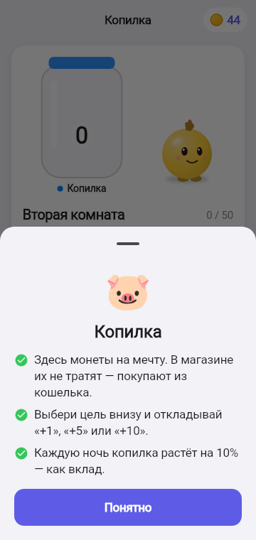

## Правила

| Правило | Значение |
|---------|----------|
| Облики | 4 открытых + Жираф (копилка 45) + Слон (2 блока уроков) + Мартышка (стадия 3) |
| Мартышка | открывается на стадии «настоящий взрослый» (4 хороших дня); в итоге того дня — «Открыт новый облик — Мартышка!» |
| Смена облика | бесплатно, монеты не тратятся |
| Данные | только игровое имя и имя героя, хранятся на устройстве |

SA: [F-023](../work/ui/F-023_FINIK_STYLE_SA_SPEC.md), [F-038](../work/ui/F-038_PET_GREETING_SA_SPEC.md), [F-037](../work/ui/F-037_MORE_CHARACTERS_SA_SPEC.md), [F-008](../work/ui/F-008_ONBOARDING_SA_SPEC.md).
