# 2. Дом, желания и эмоции

**Зачем.** Тамагочи оживает, когда питомец сам просит. Каждое финансовое действие — купить нужное, отложить, поучиться — становится ответом на просьбу героя, а не пунктом чеклиста.

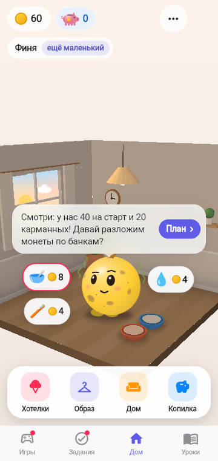 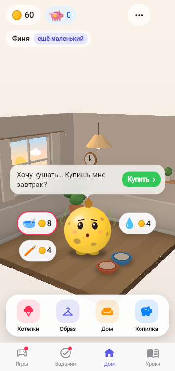 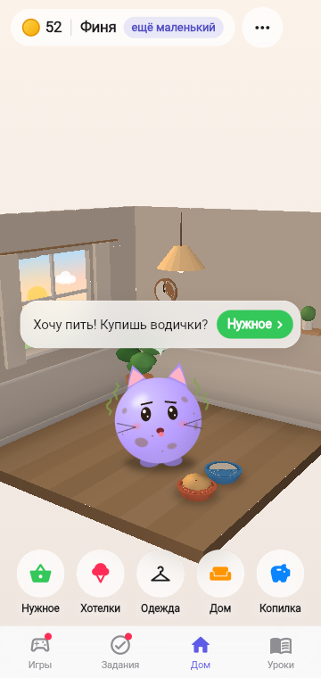 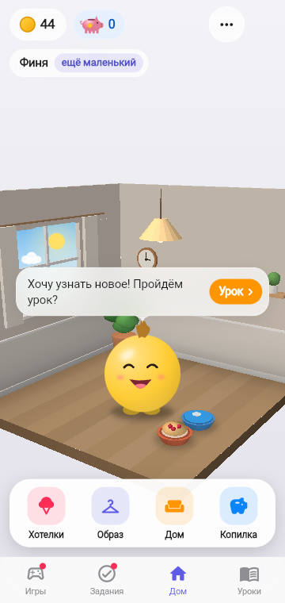 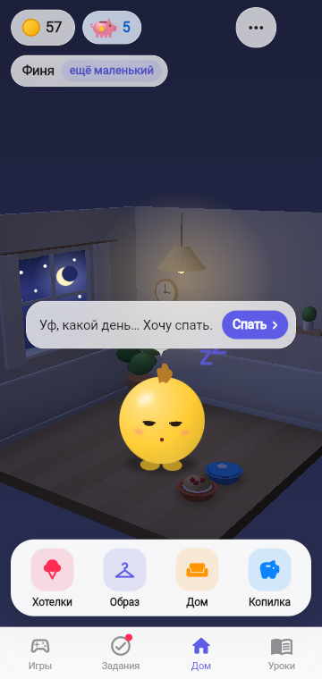

## Как это работает

- Финик живёт в **3D-комнате**: её можно покрутить пальцем, купленные вещи появляются в ней, вторая комната (игровая) открывается целью копилки.
- Над героем — **облачко-сообщение**: сначала «печатает…», потом реплика и маленькая кнопка-капсула, которая ведёт туда, где просьба исполняется.
- Внизу четыре раздела на светлой панели (читается и днём, и ночью): **Хотелки · Образ · Дом · Копилка**; нужное — пузырями над героем. Сверху — кошелёк и копилка (сколько отложено, прогресс к цели, тап — в Копилку), ниже — имя и стадия.
- Тап по герою — он подпрыгивает и рассказывает, как себя чувствует.

## Потребности видны в комнате

Рядом с Фиником стоят две миски, а уход виден по самому герою — без текста, как в настоящем тамагочи.

 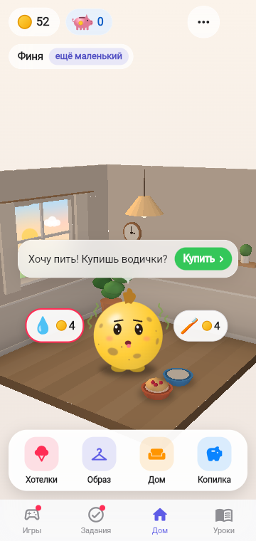 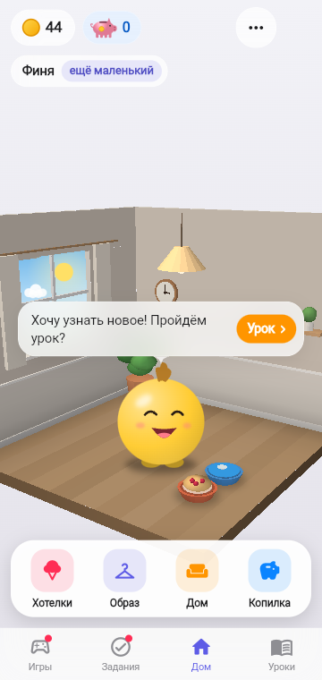

| Состояние | Когда | Что видно |
|-----------|-------|-----------|
| Миска с едой пустая | еда дня (завтрак, суп или фрукты) не куплена | светлое дно миски |
| Миска с едой полная | еда дня куплена | каша с ягодами |
| Миска с водой пустая | вода нужна сегодня и не куплена | серое дно |
| Миска с водой полная | вода куплена или сегодня не нужна | голубая вода с бликом |
| Неухоженный | уход дня (умывание, купание, стирка, стрижка) не куплен | мультяшные пятна грязи и волнистые линии «запаха» по бокам головы |
| Чистый | уход куплен | пятна и «запах» исчезают |

Новым утром миски снова пустые, а уход снова нужен: потребности — каждый день. Слева направо на скриншотах: утро (ничего не куплено), после завтрака, всё нужное куплено.

## Радость от хотелок видна на герое

Купленная сегодня хотелка радует Финика до вечера — это видно: шарик на ниточке, сердечки, искорки, пузыри, ноты или звёздочки вокруг.

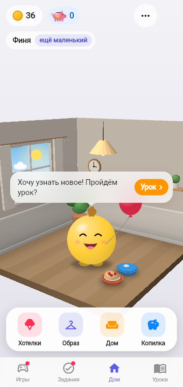 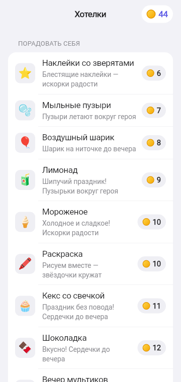

## Время суток идёт вместе с днём

Комната живёт по часам игрового дня: свет, небо в окне и лампы меняются вместе с желаниями героя. Ребёнок видит, что день клонится к вечеру — пора отложить монеты и ложиться спать.

  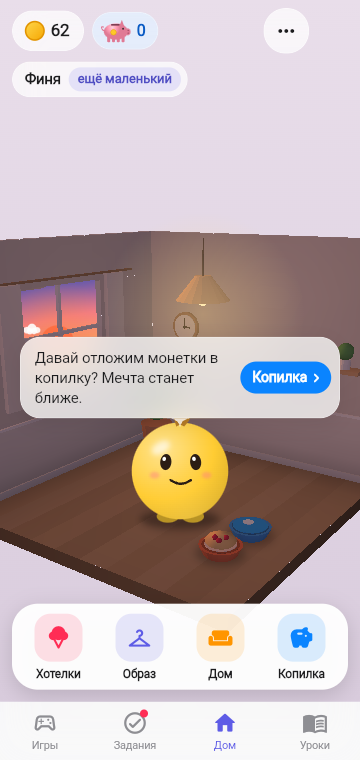 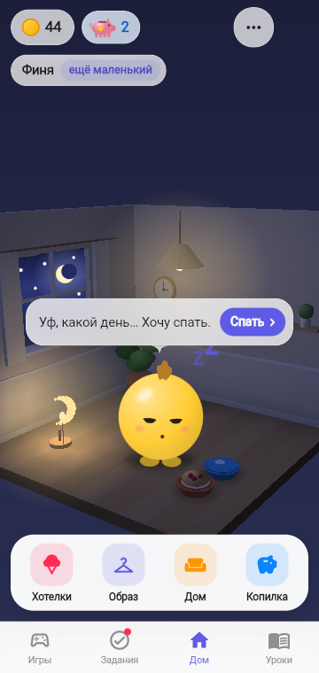

| Время | Шаги дня | Что видно |
|-------|----------|-----------|
| Утро | план, еда, вода, уход | тёплое солнце встаёт, облачко, мягкий золотистый свет |
| День | урок, мини-игра | высокое солнце, голубое небо, облака, яркий свет |
| Вечер | копилка | закат: оранжево-розовое небо, солнце у горизонта, уже зажжены люстра и ночник, но ещё светло |
| Ночь | «Хочу спать» | тёмное небо, месяц и звёзды, комнату освещают люстра и ночник (если куплен) |

План остаётся утренним: по правилам монеты раскладывают до трат. После сна наступает новое утро.

## Желания за день

| Когда | Реплика | Эмоция и анимация | Кнопка |
|-------|---------|-------------------|--------|
| Первый день, нет плана | «Смотри: у нас 40 на старт и 20 карманных! Давай разложим монеты по банкам?» | любопытный, оглядывается | План |
| Нет плана | «Давай сначала разложим монеты?» | любопытный | План |
| Не куплена еда | своя реплика: «Хочу кушать… Купишь мне завтрак?», «Хочу супчика с хлебом!», «Хочу фруктов!» | голодный, покачивается | Купить |
| Не куплена вода | «Хочу пить! Купишь водички?» | хочет пить, язычок | Купить |
| Не куплен уход | «Хочу умыться!», «Хочу искупаться — я весь в пыли!», «Хохолок лезет в глаза — пора подстричься!» | рот волной | Купить |
| Нет урока дня | «Хочу узнать новое! Пройдём урок?» | восторг, сам прыгает | Урок |
| Ничего не отложено | «Давай отложим монетки в копилку?» | спокойный | Копилка |
| Всё сделано | «Уф, какой день… Хочу спать.» | сонный, улетают «z» | Спать |

## Настроение и граница питомца

Настроение дня (радуется / спокоен / грустит) считается экономикой по плану и факту и может вернуться от одного решения. Короткая грусть допустима; болезни, смерти и ухода из дома как наказания нет.

SA: [F-020](../work/ui/F-020_PET_WISHES_SA_SPEC.md), [F-027](../work/ui/F-027_NEEDS_IN_ROOM_SA_SPEC.md), [F-028](../work/ui/F-028_DAY_TIME_SA_SPEC.md), [F-019](../work/ui/F-019_ROOM_3D_SA_SPEC.md), [F-007](../work/ui/F-007_MASCOT_3D_SA_SPEC.md), [F-006](../work/game/F-006_GAME_CONTROLLER_SA_SPEC.md).
