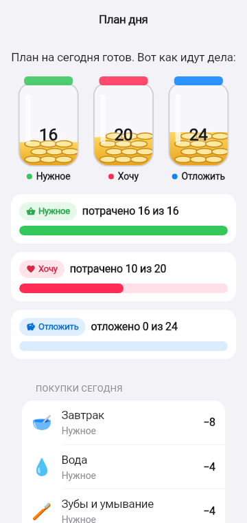

# 3. План: три банки

**Зачем.** Бюджет появляется раньше покупок. Ребёнок заранее решает, сколько монет на нужное, сколько на радости и сколько на мечту, а вечером видит, совпал ли план с фактом.

  

## Как это работает

1. Утром Финни просит разложить монеты. Экран плана показывает, сколько монет ещё **осталось разложить**, и три банки со степперами: **Нужное · Хочу · Отложить**. Под счётчиком подсказка: **«Нажми «+» — одна монета, удерживай — сразу 5»**; при первом входе — окошко о плане (F-062).
   - Когда все монеты разложены, «+» становится серым и не нажимается; «−» — серый, если банка пустая (F-066).
   - **«Готово» и «Подсказать» закреплены внизу экрана** — подсказки не сдвигают их за край (F-066).
2. Внизу список нужного на сегодня с суммой — подсказка, сколько минимум положить в «Нужное».
3. «Подсказать» раскладывает всё за ребёнка: нужное по списку, остаток пополам между «Хочу» и «Отложить».
4. **«Готово» нажимается, только когда разложены все монеты** и «Нужное» не меньше стоимости нужного дня.
5. После подтверждения план закреплён до вечера. Экран показывает **план и факт** по каждой банке (второй скриншот).

## Правила

| Правило | Что будет |
|---------|-----------|
| Сумма банок больше кошелька | Отказ: «В банках больше монет, чем у тебя есть» |
| Сумма банок меньше кошелька | Отказ: «Разложи все монеты: ещё N без банки» |
| «Нужное» меньше нужного дня | Отказ с суммой, сколько положить |
| Повторное подтверждение | Отказ: план уже подтверждён, новый — завтра |
| Монеты пришли после плана (урок, игра) | Лежат в кошельке и раскладываются в плане следующего дня |
| В «Нужное» положено больше, чем стоят нужды (20 при 16) | Не ошибка: «нужное куплено», когда куплено всё нужное дня (F-061) |

## Почему «все монеты по банкам»

Если оставлять монеты «вне банок», большой запас позволяет обойти выбор. Когда каждая монета знает своё место, перенос остатка на следующий день не отменяет решения между нужным, желаемым и накоплением.

SA: [F-010](../work/ui/F-010_BUDGET_JARS_SA_SPEC.md), [F-024](../work/game/F-024_PLAN_ALL_COINS_SA_SPEC.md).
