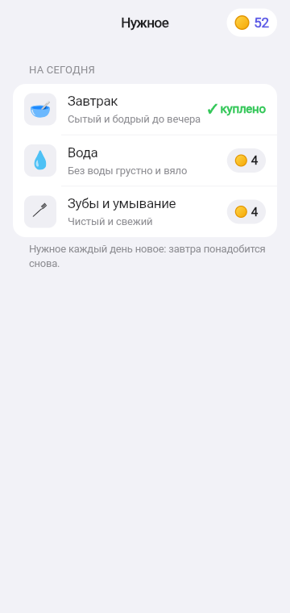
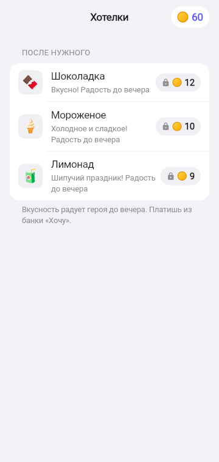
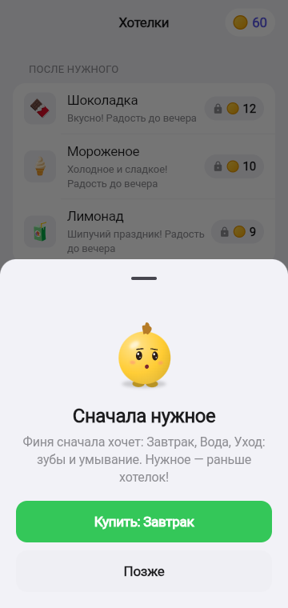
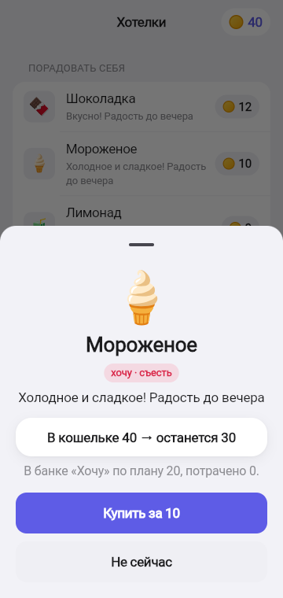
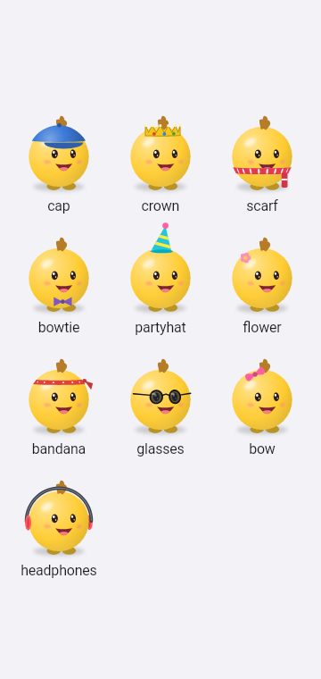
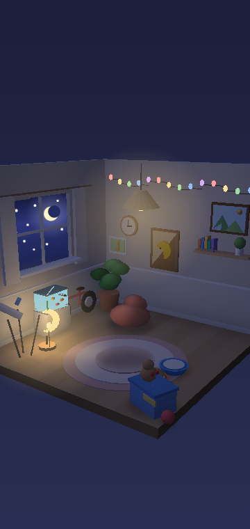
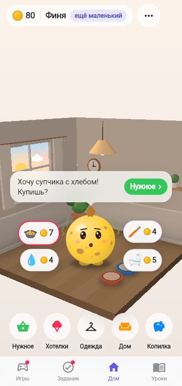

# 4. Нужное первым и покупки

**Зачем.** Главный урок кошелька — сначала потребности, потом желания. Это не совет, а правило игры: пока Финик голоден, хотелки, игры с наградой и «лишние» переводы в копилку закрыты.

   

   

## Нужное — пузырями над героем

Всё, что Финику нужно сегодня, плавает рядом с ним пузырями: эмодзи и цена. Самое срочное (то, что он просит в облачке) пульсирует с красной обводкой. Тап по пузырю — сразу окно подтверждения покупки; куплено — пузырь исчезает, Финик подпрыгивает, миска наполняется. Кнопка «Купить» в облачке желания делает то же самое. Покупка нужного — 2 тапа вместо 4–5.

 

## Разделы покупок

Отдельного «магазина всего» нет: каждая покупка живёт в своём разделе на Доме.

| Раздел | Что там | Особенность |
|--------|---------|-------------|
| Нужное | нужное на сегодня: еда (завтрак / суп / фрукты), умывание, вода; раз в несколько дней — купание, стирка, стрижка | куплено — «✓ куплено»; в комнате наполняется миска, после ухода герой чистый ([подробнее](02_HOME_AND_WISHES.md#потребности-видны-в-комнате)) |
| Хотелки | 9 радостей: наклейки, пузыри, шарик, лимонад, мороженое, раскраска, кекс, шоколадка, мультики | радость видна на герое до вечера |
| Одежда | 10 вещей: цветок, бабочка, кепка, бантик, колпак, шарф, бандана, очки, наушники, корона | тап — примерка на герое, второй тап — покупка; купленное надеть / снять |
| Дом | 8 вещей: картина, гирлянда, постер, ящик с игрушками, ночник-луна, коврик, кресло-мешок, аквариум | вещь появляется в 3D-комнате; гирлянда и ночник светятся вечером |

## Нужное меняется день ото дня

| Вещь | Цена | Когда нужна |
|------|------|-------------|
| Завтрак / суп с хлебом / фрукты | 8 / 7 / 6 | каждый день — одно блюдо |
| Зубы и умывание | 4 | каждый день |
| Вода | 4 | почти каждый день |
| Купание | 5 | раз в 3 дня |
| Стирка одежды | 4 | раз в 4 дня |
| Стрижка хохолка | 6 | раз в 5 дней |

Сумма нужного дня никогда не больше карманных (20): если дел слишком много, необязательное переносится. У каждой вещи своя реплика героя.

## Покупка

Перед покупкой шторка показывает **цену, тип** («хочу · съесть», «нужное · на сегодня»), **влияние на питомца**, «в кошельке 40 → останется 30» и сколько в банке «Хочу» по плану. Покупку надо подтвердить.

## Правило «сначала нужное»

| Ситуация | Что видит ребёнок |
|----------|-------------------|
| Хотелка, пока нужное не куплено | У цены замок, раздел «после нужного»; тап — шторка с голодным Фиником: «Финя сначала хочет: Завтрак, Вода… Нужное — раньше хотелок!» и кнопка «Купить: Завтрак» |
| Игра с наградой, пока нужное не куплено | Карточки игр с замком и подписью «Сначала нужное» |
| Перевод в копилку съедает деньги на нужное | Отказ: «Если отложить N, не хватит на нужное» |
| Монет на нужное не хватает | Игры открыты — способ заработать; тупика нет |

## Отказ и запрет долга

Если монет не хватает, списания нет: «Не хватает N монет» и три пути — заработать уроком, сыграть в игру, выбрать дешевле или подождать. Баланс никогда не уходит в минус.

SA: [F-039](../work/ui/F-039_NEED_BUBBLES_SA_SPEC.md), [F-021](../work/game/F-021_NEEDS_FIRST_SA_SPEC.md), [F-022](../work/ui/F-022_SECTIONS_SA_SPEC.md), [F-011](../work/ui/F-011_SHOP_WARDROBE_SA_SPEC.md).
