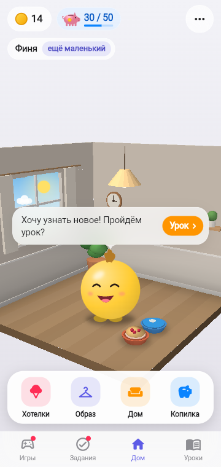
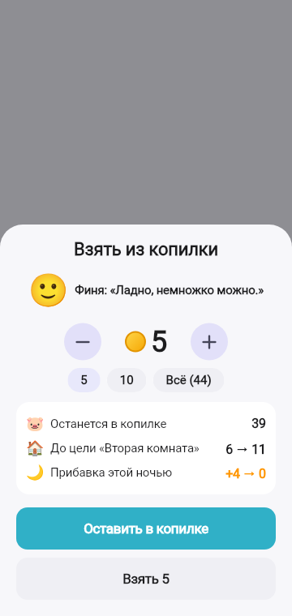

# 5. Копилка и цели

**Зачем.** Накопления лежат отдельно от кошелька. Ребёнок копит на вещь с понятной ценой, видит, сколько уже есть и сколько осталось, и учится не трогать копилку ради мелочей.

  

**Копилка на виду.** На Доме рядом с кошельком — плашка копилки с нарисованной свинкой: сколько отложено, а при выбранной цели — «30 / 50» и полоска прогресса. Тап — сразу в Копилку.

## Как это работает

1. **Цель** выбирается в Копилке: поездка в зоопарк (35 → фото с жирафом на стене), подарок другу (40), телескоп (45 → у окна), вторая комната (50), крупная мебель (50, с выбором вещи), велосипед (60 → у стены). Награды-вещи появляются в 3D-комнате и не продаются — только копятся.
2. Банка-копилка наполняется монетками; рядом — «Вторая комната 30 / 50», полоска и прогноз «осталось 20 — примерно 4 дня по 5 монет».
3. **Отложить из кошелька**: +1, +5, +10 или «Отложить по плану: N» (отложено сегодня считается для хорошего дня).
4. Когда в копилке хватает — кнопка «Забрать: Вторая комната»: комната появляется в Доме, мебель — в комнате, подарок отмечается как достигнутая цель.

## Цель достигнута — сразу к награде

После «Забрать» — праздник и кнопка перехода: облик (Жираф) → **«Примерить облик»** (Образ → Облик); вещь в комнату, мебель, вторая комната → **«Посмотреть в комнате»** (для второй комнаты — сразу игровая); подарок другу — «Ура!».

## Копилка как вклад

Копилка работает как накопительный счёт в банке: **каждую ночь +10%** — 1 монета за каждые 10 (44 → утром 48). Прибавка зачисляется прямо в копилку, в итоге дня — строка «Копилка подросла: +4». На экране Копилки карточка «Копилка как вклад»: «Этой ночью: +4 🌙», как считается и пример. Ещё при знакомстве герой рассказывает: «копилка — как вклад, каждую ночь подрастает на 10%».

## Взять из копилки

Снять можно — это по ТЗ, — но так, чтобы ребёнок видел цену решения:

1. **«Взять из копилки»** → шторка с выбором суммы: − / + и быстрые 5, 10, «Всё».
2. Герой реагирует на сумму: немного — 🙂 «Ладно, немножко можно», половина — 😟 «Ой… мечта отодвинется», почти всё — 😢 «Почти всё? Мы же так копили…».
3. Сразу видно, что теряем: сколько останется в копилке, насколько отодвинется цель (6 → 11) и что **прибавка этой ночью сгорит** (+4 → 0).
4. Главная кнопка — **«Оставить в копилке»**; «Взять N» ведёт на второе подтверждение «Да, снять» (ТЗ А.8).
5. Снял сегодня — ночью без процентов; карточка вклада пишет «Сегодня снимали — ночью без прибавки».

## Правила

| Правило | Значение |
|---------|----------|
| Накопления | отдельный счёт, не тратятся из кошелька |
| Перевод в копилку | не больше кошелька и не в ущерб нужному дня |
| Проценты | каждую ночь `floor(копилка × 10%)`, прямо в копилку; в день снятия — 0 |
| Снятие | выбор суммы с реакцией героя и ценой решения, затем второе подтверждение |
| Получение цели | списывается из копилки, награда сразу в игре |

SA: [F-044](../work/game/F-044_SAVINGS_DEPOSIT_SA_SPEC.md), [F-040](../work/ui/F-040_PIGGY_ON_HOME_SA_SPEC.md), [F-014](../work/ui/F-014_SAVINGS_GOALS_SA_SPEC.md), [F-003](../work/economy/F-003_REDEEM_GOAL_SA_SPEC.md).
