# 6. Уроки в стиле Duolingo

**Зачем.** Урок на 3–5 минут: сначала прямо сказать мысль, потом узнать, что к чему относится, применить к ситуации и увидеть исход, закрепить формулировку. Жизней, очков и рейтинга нет — ошибка не стыдит и не сгорает.

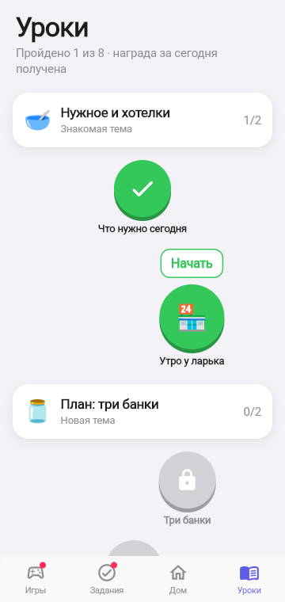 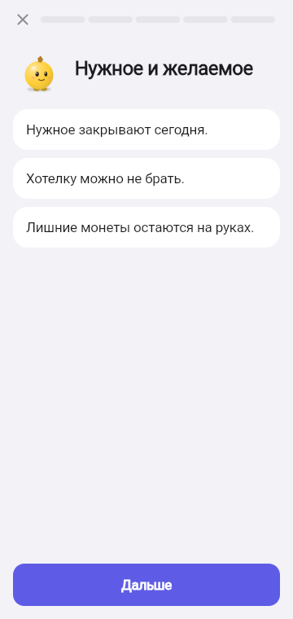 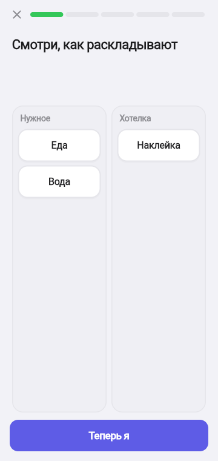 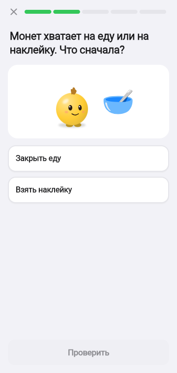

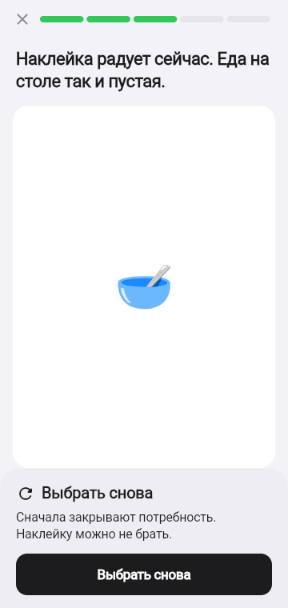 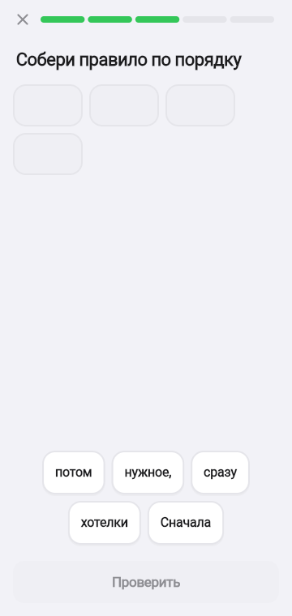 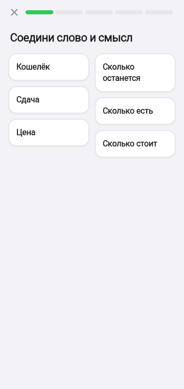 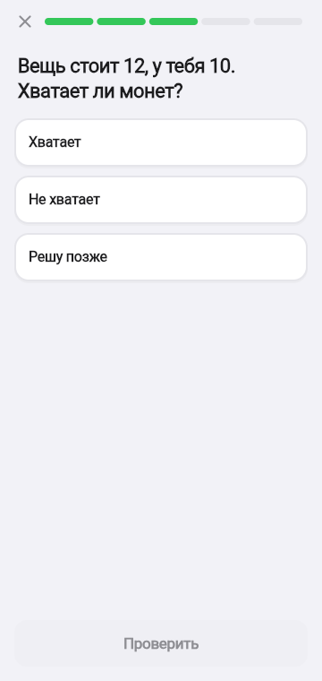

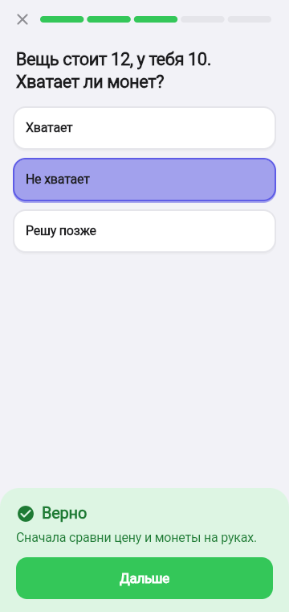 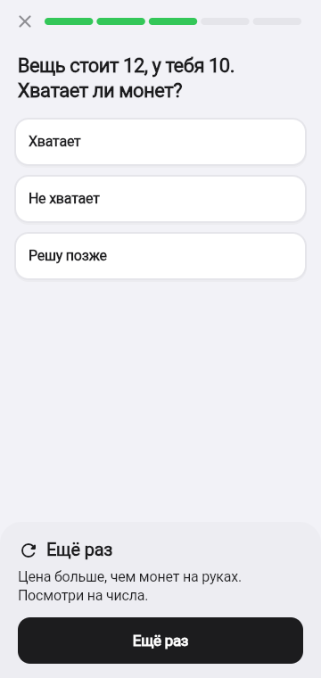 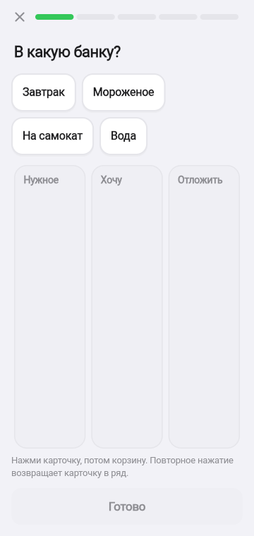

## Рецепт урока

| Шаг | Игра | Зачем |
|-----|------|-------|
| 1 | Карточка | Прямо сказать мысль: 1–3 короткие фразы |
| 2 | Разложи или Пары | Узнать, что к чему относится |
| 3 | Что дальше | Применить мысль к ситуации и увидеть исход |
| 4 | Нажми верное или Собери фразу | Закрепить формулировку |
| 5 | Карточка | Одна фраза «запомни» |

Короткий урок пропускает шаг 4. Для практики шаг 2 или 3 повторяется с новой карточкой.

## Шесть игр

| Игра | Что делает ребёнок | Как реагирует игра |
|------|--------------------|--------------------|
| Карточка | Читает и жмёт «Дальше» | Кнопка включается после короткой паузы |
| Нажми верное | Выбирает одну плитку из 2–4 | «Верно» + почему / «Ещё раз» + подсказка по смыслу; плитка отпускается |
| Разложи | Тап по карточке, потом по корзине | При первой встрече — показ решённым и «Теперь я»; неверные выпадают обратно |
| Пары | Соединяет пример и слово | Верная пара остаётся связанной; «Эта пара не сошлась: наклейка — хотелка, не еда» |
| Собери фразу | Ставит 3–4 плитки по порядку (+ лишняя) | Тап по слоту возвращает плитку |
| Что дальше | Выбирает, чем кончится ситуация | Экран меняется на последствие; слабый исход — «Выбрать снова», подходящий — «Дальше» |

## Путь уроков

4 темы × 2 урока: **Нужное и хотелки · План: три банки · Копилка и цель · Умные покупки**. Следующий урок открывается после предыдущего, пройденные можно повторить. Над текущим — «Начать» или «Доиграть»: урок, закрытый крестиком, продолжается с того же шага.

## Награда урока

Первый законченный урок дня — **+12 монет «за урок»** с конфетти. Повторы — тренировка без монет. Новый урок добавляется в `lessons.json` без правки кода; рецепт проверяется автоматически.

SA: [F-025](../work/ui/F-025_LESSON_ENGINE_SA_SPEC.md).
