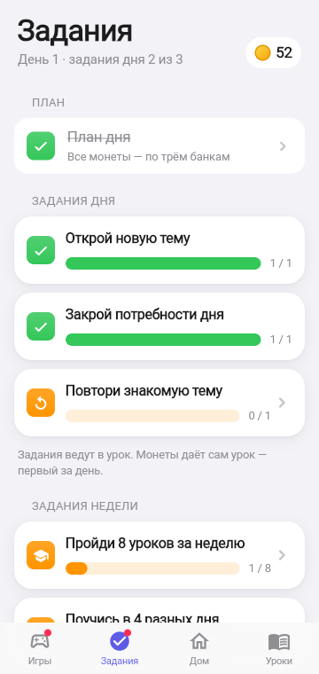

# 7. Задания дня и недели

**Зачем.** Задания устроены как квесты Duolingo: они подталкивают учиться и заботиться о герое, ведут в урок, но **не платят монеты сверху** — иначе экономика разъедется. Монеты даёт сам урок.

## Задания дня

В день видны 3 из пула 10:

| Задание | Ориентир Duolingo |
|---------|-------------------|
| Пройди 1 урок до конца | Complete 1 lesson |
| Пройди 2 урока до конца | Complete 2 lessons |
| Поучись 5 минут | 5 minutes learning |
| Поучись 10 минут | Длинный квест на время |
| Повтори знакомую тему | Practice |
| Открой новую тему | Следующий навык на пути |
| Пройди урок, где есть «что дальше» | Квест на тип упражнения |
| Разложи карточки в уроке | Квест на тип упражнения |
| Закрой потребности дня | Забота о дне, без штрафа за пропуск |
| Доиграй начатый урок | Вернись к незаконченному |

**Правила выбора:** не ставятся вместе «1 урок» и «2 урока», «5 минут» и «10 минут»; «Новая тема» — только пока есть непройденная; «Доиграй» — только если урок начат. Список фиксируется утром и не прыгает в течение дня.

## Задания недели

Неделя = 5 игровых дней демо: пройди 8 уроков, поучись в 4 разных дня, закрой потребности в 3 днях, встреть 2 новые темы, повтори 3 знакомые темы.

## Как выглядит

Карточка задания: иконка, название, полоска прогресса «1 / 1». Выполненное — зелёная галочка. Тап ведёт в подходящий урок или в раздел «Нужное». На той же вкладке — «План дня», рост героя и «Завершить день».

Квестов «без ошибок», «соревнуйся» и «пригласи друга» нет.

SA: [F-026](../work/game/F-026_DAILY_WEEKLY_QUESTS_SA_SPEC.md).
