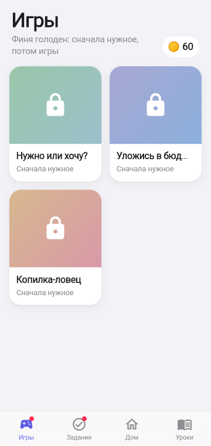
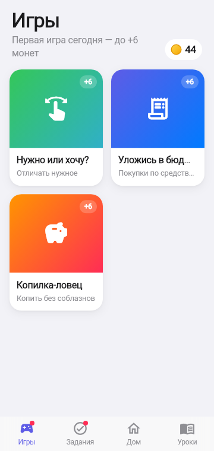
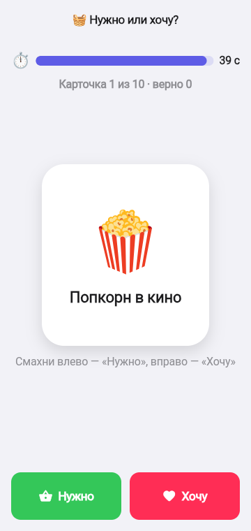
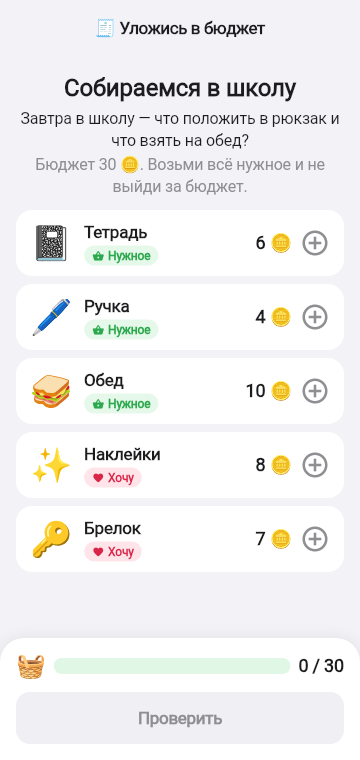
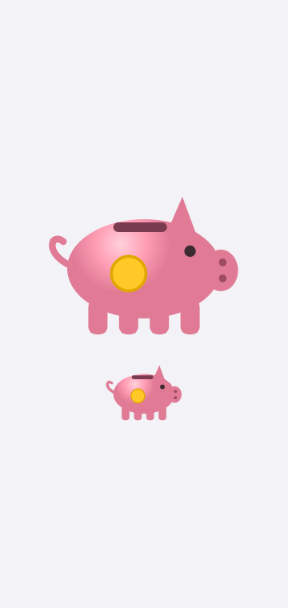

# 8. Мини-игры

**Зачем.** Навык в игровой форме и дополнительный заработок. Игра — по желанию: Финни не просит играть каждый день. Первая игра дня платит +6 (победа) / +3 (попытка), остальные — тренировка.

    

## Игры

| Игра | Что делает ребёнок | Чему учит | Разнообразие |
|------|--------------------|-----------|--------------|
| Нужно или хочу? | Смахивает карточки: влево «Нужное», вправо «Хочу», на время | Отличать потребность от желания | 40 карточек, в раунде 10 случайных |
| Уложись в бюджет | Собирает покупки к ситуации с короткой историей | Взять всё нужное и не выйти за бюджет | 10 ситуаций: школа, пикник, подарок маме, дождь, день рождения друга, лагерь, бабушка, котёнок, кино, грядка |
| Копилка-ловец | 30 секунд ловит монеты нарисованной копилкой (цель 25) | Копить без соблазнов | монеты 🪙 1, 💵 3, 💰 5; 10 соблазнов с названиями отнимают по 3 |

## Объяснения ошибок

- **Нужно или хочу:** ошибка объясняется сразу под карточкой — «❌ Учебник — это «Нужно»: без него не сделать уроки», а в итоге — разбор всех ошибок.
- **Уложись в бюджет:** «Не хватает нужного: …» или «Перебор на N — убери что-то из хотелок».
- **Копилка-ловец:** пойманный соблазн подписан («🍭 Леденец: −3»), в итоге — какие соблазны пойманы и сколько монет они съели.

## Правила

| Правило | Значение |
|---------|----------|
| Награда | +6 победа / +3 попытка, один раз в день, подписано «+6 в кошелёк» |
| Замок | пока нужное дня не куплено и на него хватает монет — карточки серые с замком «Сначала нужное» |
| Исключение | если монет на нужное не хватает — игры открыты, чтобы заработать |
| Рекорд | лучший результат виден на карточке игры |

SA: [F-013](../work/ui/F-013_MINI_GAMES_SA_SPEC.md), [F-033](../work/ui/F-033_MINIGAMES_VARIETY_SA_SPEC.md), [F-021](../work/game/F-021_NEEDS_FIRST_SA_SPEC.md).
