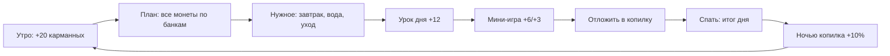

# 9. День, итог и рост

**Зачем.** Период — законченный круг решений. Вечером ребёнок видит план против факта, короткий вывод и совет на завтра, а Финик растёт, если привычки держатся несколько дней подряд.

## Круг дня

За окном круг дня виден буквально: утро → день → закат → ночь со звёздами ([подробнее](02_HOME_AND_WISHES.md#время-суток-идёт-вместе-с-днём)).

**День 1 — знакомство:** план → урок → игра, и только потом герой просит завтрак и воду (без умывания). Со второго дня круг полный.

## Итог дня

- **План и факт** по трём банкам (бледный столбик — план, яркий — факт).
- **Настроение** с объяснением: «Спокоен: всё идёт ровно. Держишься плана».
- **Хороший ли день** и шкала роста: «ещё маленький → уже как взрослый → настоящий взрослый».
- **Копилка подросла: +N** — проценты вклада (если в этот день не снимали).
- Совет на завтра: что улучшить (нужное, копилка или план).
- Утром — «Доброе утро! +20 🪙 карманных».

## Рост

| Правило | Значение |
|---------|----------|
| Хороший день | куплено всё нужное дня **и** на хотелки — не больше плана **и** отложено больше нуля (отложено = пополнения минус снятия, F-054, F-061) |
| Стадия 2 | после 2 хороших дней |
| Стадия 3 | после 4 хороших дней; открывает облик Мартышки |
| Плохой день | стадию не отнимает; новый план, урок или отказ от хотелки поправляют ситуацию |

## Демонстрационный режим

Пять периодов идут подряд без ожидания календарного дня, по тем же правилам. Прогресс сохраняется на устройстве и переживает перезапуск; взрослый может сбросить профиль.

SA: [F-015](../work/ui/F-015_NIGHT_SUMMARY_SA_SPEC.md), [F-006](../work/game/F-006_GAME_CONTROLLER_SA_SPEC.md), [F-016](../work/ui/F-016_ADULT_GLOSSARY_APP_SA_SPEC.md).
