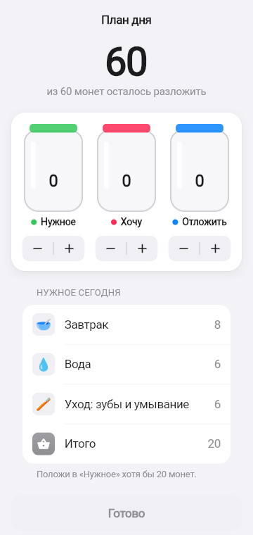
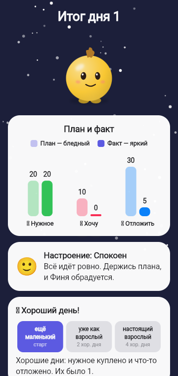

# Питомец Финни — бизнес-описание механик

Детская игра-тамагочи (7–11 лет), где ребёнок заботится о питомце Финике и учится распоряжаться **вымышленными игровыми монетами**: планировать, отличать нужное от желаемого, копить на цель и не залезать в долг. Монеты не имеют ценности вне игры, сети и персональных данных нет.

Скриншоты сняты с текущей сборки ветки `Egor_DevStand` (экран телефона 360 × 760 dp).

   

## Главная идея

Каждый игровой день — это законченный круг решений: **план → нужное → урок → игра → копилка → сон**. Финни сам подсказывает следующий шаг облачком-сообщением, а правила игры не дают перескочить через главное: сначала потребности, потом хотелки.

## Карта механик

| # | Документ | Чему учит |
|---|----------|-----------|
| 1 | [Вход и настройка Финика](01_START_AND_FINIK.md) | Привязанность к герою; облик как награда за привычки |
| 2 | [Дом, желания и эмоции](02_HOME_AND_WISHES.md) | Забота: финансовое действие — ответ на просьбу героя |
| 3 | [План: три банки](03_BUDGET_PLAN.md) | Бюджет до трат, каждая монета при деле, план и факт |
| 4 | [Нужное первым и покупки](04_NEEDS_AND_PURCHASES.md) | Потребности раньше желаний, цена и влияние покупки, отказ без долга |
| 5 | [Копилка и цели](05_SAVINGS_AND_GOALS.md) | Накопления отдельно, цель с ценой, защита копилки |
| 6 | [Уроки в стиле Duolingo](06_LESSONS.md) | Короткие уроки: мысль → практика → ситуация с последствием |
| 7 | [Задания дня и недели](07_QUESTS.md) | Привычка учиться без раздувания экономики |
| 8 | [Мини-игры](08_MINI_GAMES.md) | Навык в игровой форме, заработок |
| 9 | [День, итог и рост](09_DAY_AND_GROWTH.md) | План против факта, развитие за несколько периодов |

## Навигация

Нижний бар: **Игры · Задания · Дом · Уроки**. На Доме пять разделов: **Нужное · Хотелки · Одежда · Дом · Копилка**. Принцип — одно действие живёт в одном месте, облачко героя ведёт туда.

## Экономика в цифрах

| Параметр | Значение |
|----------|----------|
| Старт | 40 монет + 20 карманных первого дня |
| Карманные | 20 в день (подписаны «+20 карманных») |
| Нужное дня | 20 (завтрак 8, вода 6, уход 6) и 14 (завтрак, уход) по очереди |
| Хотелки-вкусности | лимонад 9, мороженое 10, шоколадка 12 |
| Одежда | бантик 12, бандана 14, очки 15, наушники 18 |
| Вещи в комнату | постер 14, ночник 16, коврик 18 |
| Цели копилки | подарок другу 40, вторая комната 50, крупная мебель 50 |
| Урок | +12 за первый законченный урок дня |
| Мини-игра | +12 победа / +6 попытка, один раз в день |
| Хороший день | нужное куплено и что-то отложено |
| Стадии героя | 1 → 2 после 2 хороших дней, 3 после 4 |
| Демо | 5 дней подряд без ожидания календаря |

## Соответствие ТЗ

Полная матрица правил ТЗ → код: [TZ_RULES_COMPLIANCE.md](../work/product/TZ_RULES_COMPLIANCE.md). Системные спецификации по историям: [docs/work/README.md](../work/README.md).
