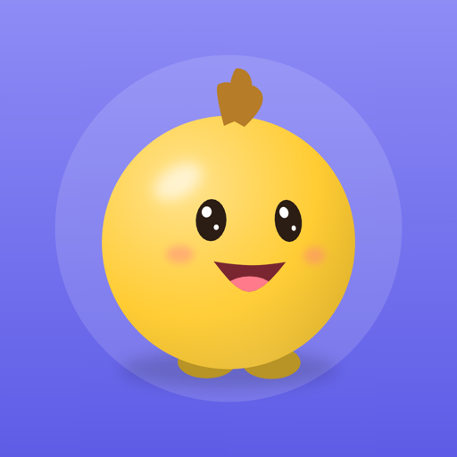
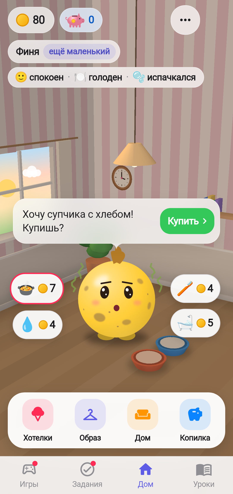
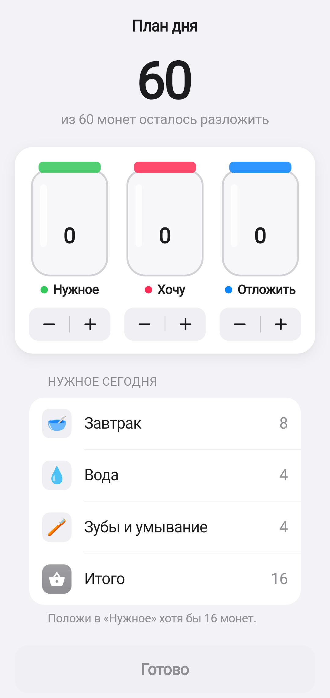
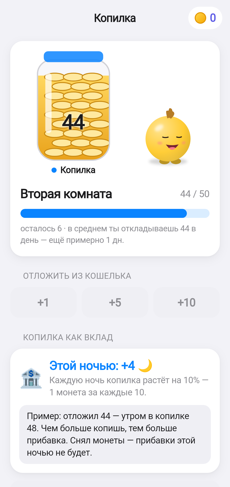
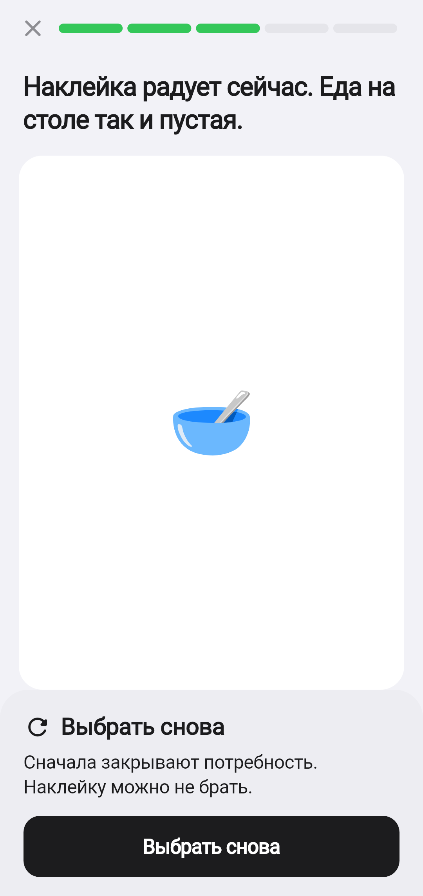
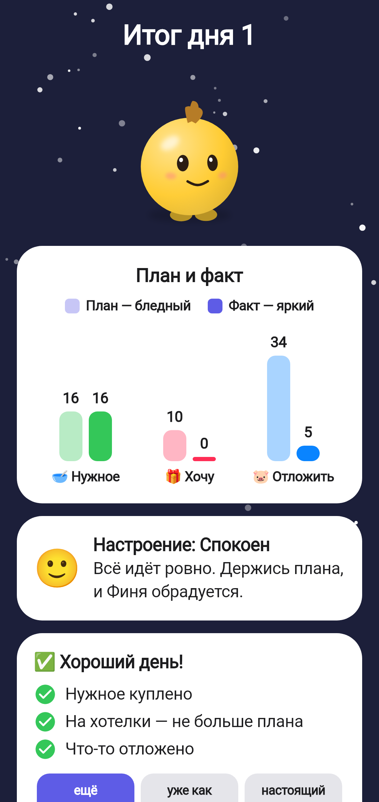

# Черновик карточки RuStore — «Питомец Финни»

Материалы для карточки приложения по п. 3.3 ТЗ. Публикация во время конкурса не обязательна; сборка (Flutter, APK / AAB) позволяет разместить приложение без смены платформы.

## Основное

| Поле | Значение |
|------|----------|
| Название | **Питомец Финни** (под иконкой — «Финни») |
| Пакет | `ru.petfinni.finni` |
| Версия | 1.0.0 (versionCode — номер сборки CI) |
| Категория | **Образование** (дополнительно: «Для детей») |
| Возрастная маркировка | **0+** — обоснование ниже |
| Цена | Бесплатно, без встроенных покупок и рекламы |
| Требования | Android 7.0 и выше (ТЗ: 8.0+), портретная ориентация, работает без Интернета |
| Разрешения | Нет |

## Краткое описание (≤ 80 символов)

> Питомец учит ребёнка планировать монеты, копить на мечту и выбирать с умом

## Полное описание

Питомец Финни — игра-тамагочи о финансовой грамотности для детей 7–11 лет. Ребёнок заботится о питомце и каждый день принимает маленькие решения о деньгах. Все монеты в игре выдуманные, настоящих денег нет.

**Как играть**
• Утром раскладываешь монеты по трём банкам: «Нужное», «Хочу» и «Отложить».
• Сначала покупаешь нужное: Финни просит завтрак, воду, умыться.
• Хотелки — по желанию: наклейки, мороженое, одежда, вещи в комнату.
• Копишь в копилке на мечту: телескоп, велосипед, поездку в зоопарк. Копилка растёт, как вклад.
• Проходишь короткие уроки: разложи карточки, выбери, что будет дальше, найди пары.
• Вечером видишь итог дня: план и факт, настроение питомца, совет на завтра.

**Питомец растёт вместе с тобой.** Хорошие дни — нужное куплено, хотелки по плану, что-то отложено — помогают Финни вырасти от «ещё маленького» до «настоящего взрослого» и открывают новые облики.

**Ошибаться не страшно.** Питомец может погрустить, но не болеет и никуда не уходит. Игра объясняет, что пошло не так и как исправить.

**Для родителей.** Раздел взрослого (удержание кнопки) показывает цели игры и пройденные темы без оценок, там же можно сбросить профиль. Без регистрации, рекламы, покупок и сбора данных. Работает без Интернета.

## Обоснование возрастной маркировки 0+

По критериям Федерального закона № 436-ФЗ «О защите детей от информации, причиняющей вред их здоровью и развитию» (категория «для детей, не достигших возраста шести лет»):

| Критерий | В приложении |
|----------|--------------|
| Насилие, жестокость, страх | Нет. Питомец только грустит; болезни, травм и смерти нет (ТЗ 2) |
| Нецензурная лексика, пугающие образы | Нет |
| Реклама, внешние ссылки | Нет |
| Покупки за реальные деньги, лутбоксы | Нет. Только выдуманные игровые монеты |
| Общение между пользователями, чаты | Нет |
| Сбор персональных данных | Нет. Игровое имя и имя питомца хранятся только на устройстве |
| Азартные механики | Нет |

Целевая аудитория — 7–11 лет, но содержание безопасно для любого возраста, поэтому достаточно маркировки 0+. Окончательную маркировку утверждает команда при публикации.

## Иконка и скриншоты

| Файл | Что |
|------|-----|
| [`icon_512.png`](icon_512.png) | Иконка 512 × 512 px: герой Финни на фиолетовом фоне (своя графика, F-053) |
| [`screenshot_1_home_bubbles4.png`](screenshot_1_home_bubbles4.png) | Дом: питомец в 3D-комнате, состояние, нужды пузырями, кошелёк и копилка |
| [`screenshot_2_plan_edit.png`](screenshot_2_plan_edit.png) | План трёх банок |
| [`screenshot_3_savings_deposit.png`](screenshot_3_savings_deposit.png) | Копилка: цель, срок, копилка как вклад |
| [`screenshot_4_lesson.png`](screenshot_4_lesson.png) | Урок: ситуация и последствие, «Выбрать снова» |
| [`screenshot_5_night.png`](screenshot_5_night.png) | Итог дня: план и факт, настроение, условия хорошего дня |

Скриншоты 1080 × 2280 px, портрет.

     

## Данные и конфиденциальность (для анкеты RuStore)

Приложение не собирает, не передаёт и не хранит на сервере никаких данных. Прогресс хранится только на устройстве; удаляется сбросом профиля во взрослом разделе или удалением приложения.

## Контакты разработчика

Заполняет команда при публикации (e-mail поддержки, сайт или страница проекта).
