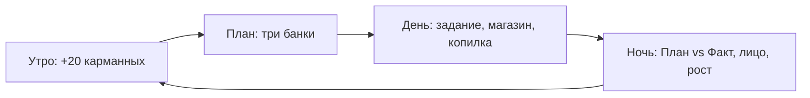

# 2026-09-24 — design: игра поверх экономики «Питомец Финни»

| Поле | Значение |
|------|----------|
| Классификация Superpowers | **Architectural** (новый клиентский слой) |
| Статус | Согласовано Егором 2026-09-24 («полный алл инклюзив» + 3D и мини-игры); Ивану на ревью |
| Автор | Егор (`Egor_DevStand`, от `Ivan_DevStand`) |
| SA | `docs/work/product/FINNI_GAME_UI_SA_SPEC.md` (F-002) |
| Основа | design F-001, SA F-001, `2026-09-21_PRODUCT_HANDOFF.md` |
| Валюта | Только вымышленные игровые монеты |

Закрывает подсистемы roadmap **2 (контент JSON), 3 (persist), 4 (UI А.1–А.8), 5 (цикл, рост, демо, взрослый)**. Домен `client/lib/economy/` не переписываем, только одно добавление (см. §6).

---

## 1. Ощущение игры (что делает её «крутой»)

Ребёнок должен за 3 секунды понять: **мои решения → мой герой и мой дом**. Всё, что ниже, служит этому.

1. **Живой герой.** Жёлтый кружок-эмодзи, нарисованный кодом (`CustomPainter`, свой арт, без эмодзи Apple/WhatsApp). Моргает, дышит (лёгкий scale), подпрыгивает при покупке, щурится от радости. Лицо = настроение (`glad` / `steady` / `uneasy`). Налепки want (бандана, очки, бантик, наушники, чёлка, корона) сидят поверх базы.
2. **Три банки вместо формы.** План бюджета — это три стеклянные банки «Нужное / Хочу / Отложить». Монеты ставятся тапом `+`/`−` и **падают в банку с анимацией**. Остаток виден стопкой монет сверху. Перерасход невозможен физически: лишняя монета отскакивает с подсказкой.
3. **Комната, которая растёт.** Главный экран — комната-студия: стол с «нужным дня», слоты для ночника, коврика и постера (want). Крупная мебель и вторая комната — цели копилки. Купил → предмет «влетает» в слот.
4. **Сцены вместо тестов.** Задание — короткая история в 2–3 реплики с героем и выбором из 2–3 действий. Любой выбор даёт монеты (+12 / +6) и объяснение «что случилось и почему». Проиграть нельзя.
5. **Ночь = итог дня.** Кнопка «Лечь спать» → затемнение, звёзды → карточка «План vs Факт» столбиками, лицо героя, прогресс взросления (3 ступеньки). При росте стадии — конфетти и фраза «Ты уже как взрослый!».
6. **Копилка-банка с целью.** Цель висит картинкой над банкой, банка заполняется. Снятие — через «Ты уверен? Цель отодвинется на N монет» + второе подтверждение.

Тон: тёплый, без стыда, без таймеров и «питомец страдает». Звук и вибрация отключаемы.

---

## 2. Игровой цикл (один период = «день»)



- Утро: `Credit(20, 'pocket')`; первый день ещё `Credit(40, 'start')`.
- Список «нужного дня» (2 позиции, 16–18 монет, ~90% карманных) показан до плана. Он **всегда** закрывается одними карманными.
- План обязателен до первой покупки (домен уже требует).
- 1 задание в день (демо позволяет больше). Серия дней и её бонус — **не в этой итерации** (сумма не зафиксирована в handoff).
- Демо-режим: «Лечь спать» доступно сразу, 5 периодов подряд без ожидания.

---

## 3. Экраны

| # | Экран | Приложение А | Суть |
|---|-------|--------------|------|
| S1 | Знакомство (3 карточки) | 1 | Нужное / Хочу / Отложить на примерах героя |
| S2 | Создание героя | 2–3 | Имя игрока, имя героя, 3 оттенка базы × 3 стартовые причёски = 9 обликов |
| S3 | Дом (главный) | 4, 10 | Комната + герой + баланс + копилка/цель + задание + «Лечь спать»; стадия текстом |
| S4 | План (три банки) | 5 | Распределение, остаток, подтверждение |
| S5 | Задание (сцена) | 6 | Реплики, выбор, начисление, объяснение |
| S6 | Магазин | 7 | Вкладки Нужное / Хочу; карточка: цена, тип, влияние на героя; подтверждение; отказ при нехватке |
| S7 | Копилка и цели | 8 | 3 цели, выбор, пополнение, двухшаговое снятие, получение цели |
| S8 | Ночь (итог) | 9–10 | План vs факт, настроение, рост, совет на завтра |
| S9 | Гардероб | — | Надеть/снять купленные налепки (бесплатно) |
| S10 | Словарик и подсказка | — | 10+ терминов простыми словами, всегда доступна с дома |
| S11 | Раздел взрослого | 12 | Барьер удержанием 3 с → цели продукта, прогресс без оценок, сброс профиля |

Навигация: дом — центр, всё остальное — один шаг от дома и назад.

---

## 4. Архитектура

Зависимости только вниз.

```
ui/            экраны, виджеты, painter героя и комнаты
  └─ game/     GameController (ChangeNotifier): день, инвентарь, задания, цель
       ├─ economy/   (Иван) чистый домен, без изменений API
       ├─ content/   модели + загрузчик assets/content/*.json + валидация
       └─ store/     ProfileSnapshot ⇄ JSON, SharedPreferences, сброс
```

- **content**: `Item`, `Goal`, `Quest`, `CopyText`, `NeedList` из JSON. Валидация на загрузке: уникальные id, цены > 0, у задания ≥ 2 выбора и у каждого есть объяснение. Новое задание = новая запись в JSON (BR-10).
- **store**: снимок = `EconomyState` + профиль (имена, облик) + инвентарь (купленные налепки, надетые, мебель, комнаты) + выбранная цель + номер дня + пройденные задания + последний итог. Сериализация вне домена (домен не знает JSON). Запись после каждой команды.
- **game**: единственная точка изменения состояния. Каждое действие → команда домена → новый снимок → save → `notifyListeners`. Объяснения домена (`exp.*`) → тексты из content.
- **ui**: без логики экономики. Зависимости pub: `shared_preferences` и всё. Анимации на встроенных `AnimationController`.

---

## 5. Контент MVP (черновик цифр из handoff)

- Старт 40, карманные 20 за день.
- Need (3): Завтрак 8, Вода 8, Уход (умыться/зубы) 10. Список дня — 2 из 3 по кругу.
- Want (8): Шоколадка 12 (расходник, радость на день), Бандана 14, Очки 15, Бантик 12, Наушники 18, Ночник 16, Коврик 18, Постер 14.
- Цели (3, по 50): Вторая комната; Облик «Обезьянка»; Крупная мебель (выбор: диван / полка / телевизор / приставка).
- Задания (6 × 3 темы: бюджет, сбережения, покупки): награда +12 осмысленный выбор / +6 слабый, объяснение всегда.
- Облики при создании: 9. Плюс save-облик «Обезьянка» = 10.

---

## 6. Одно изменение домена

Нет команды «потратить накопления на цель». Добавить `RedeemGoal(goalId, cost)`: если `savings ≥ cost` → `savings −= cost`, объяснение `exp.goal_done`; иначе `insufficientFunds`. Через TDD, отдельные тесты, остальной домен не трогаем. Ивану — на ревью.

---

## 7. Альтернативы, которые отклонены

- **Flame / игровой движок.** Тяжелее, дольше, а экраны у нас в основном карточки. Анимаций Flutter хватает.
- **Картинки-эмодзи / сток.** Лицензии и запрет handoff. Рисуем кодом.
- **Riverpod / Bloc.** Лишняя зависимость для 11 экранов. `ChangeNotifier` + `InheritedNotifier`.
- **Hive / SQLite.** Снимок один и маленький, `shared_preferences` хватает.

---

## 8. Тесты

- content: валидация JSON, объёмы 2.6 (≥8 покупок двух типов, 3 цели, 6 заданий / 3 темы, ≥9 обликов).
- store: round-trip снимка, сброс не оставляет хвостов.
- game: сквозной путь Приложения А без UI (5 дней, рост до стадии 2+, покупка, отказ, копилка, снятие, цель).
- ui: widget-тесты золотого пути (онбординг → дом → план → покупка → ночь), ручной чеклист на устройстве.

---

## 9. Дельта 2026-09-24: 3D-маскот и мини-игры (Егор)

### 9.1 3D-маскот без движка

Герой — шар, поэтому честный 3D считаем сами, без Flame/GLB/WebView:

- Черты лица, налепки и уши облика заданы **точками на сфере** (широта/долгота). Каждый кадр: поворот (yaw/pitch) → проекция на экран → рисуем только видимое (z > 0). Глаза и рот сплющиваются на поворотах, как на настоящем шаре.
- Свет: радиальный градиент со смещением к источнику, блик, мягкая тень на полу, тень сжимается при прыжке.
- Анимации: дыхание, моргание, idle-покачивание, взгляд за пальцем, прыжок со squash & stretch при покупке, «ой» при отказе, танец при росте стадии. Героя можно крутить пальцем.
- Стадия: 1 — меньше, большие глаза («ещё маленький»); 2 — средний; 3 — крупный, уверенное лицо.
- Облики: 3 оттенка × 3 причёски = 9 при создании; «Обезьянка» — цель копилки (уши, мордочка).
- Ассеты: только код, лицензия чистая.

### 9.2 Мини-игры (игротека)

Каждый день есть **задание-сцена** и **игра дня**. Обе платят один раз в день (+12 хорошо / +6 попытка). Повторы — ради удовольствия, без монет, чтобы не раздувать доход.

| Игра | Учит (рамка компетенций) | Механика |
|------|---------------------------|----------|
| «Нужно или хочу?» | 2. Обязательное vs желаемое | Карточки вылетают по одной, тап/свайп в корзину, 10 карточек, объяснение ошибок в конце |
| «Уложись в бюджет» | 1, 3. Покупки при ограниченном бюджете | Список дел + бюджет; собери корзину: всё нужное и ≤ бюджета |
| «Копилка-ловец» | 4. Цель и откладывание | Ведёшь банку пальцем, ловишь монеты; соблазны-хотелки отнимают монеты из банки; цель — набрать N за 30 с |

Доход дня максимум: 20 + 12 + 12 = 44. Нужное 16–18, поэтому купить всё и сразу закрыть цель 50 за день нельзя (Q&A про ограниченность).

### 9.3 Экран

S12 «Игротека» — три игры, отметка «сегодня уже награда получена».

---

## Self-review

- Валюта только игровая, внешних связей нет.
- Ничего из «не берём» handoff §2.7 (лутбоксы, энергия, рейтинги).
- Серия дней и родительские начисления — вне итерации, явно.
- Домен меняется одной командой под TDD.
