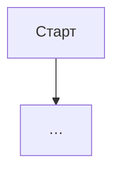

# {Название фичи} — системная спецификация (SA)

> Шаблон перенесён из практики fintech-web (`*_SA_SPEC.md`).  
> Копия: заполни секции, сохрани как `docs/work/{area}/{FEATURE}_SA_SPEC.md`.

| Поле | Значение |
|------|----------|
| **ID** | F-{XXX} |
| **Назначение** | SA-спецификация фичи Pet Finni hackathon |
| **Репозиторий** | `Pet_Finni_hackathon` |
| **Источник** | (созвон / чат / участник …) |
| **Статус** | Черновик / Согласовано / В разработке / Готово |
| **Участники** | … |
| **Связанные артефакты** | design/plan, бизнес-док, задачи |

---

## Содержание

1. [Контекст](#1-контекст)
2. [Цель](#2-цель)
3. [Бизнес-требования](#3-бизнес-требования)
4. [Описание](#4-описание)
5. [Сценарии](#5-сценарии)
6. [Матрица исходов](#6-матрица-исходов)
7. [NFR](#7-nfr)
8. [API и контракты](#8-api-и-контракты) *(если есть)*
9. [Зависимости](#9-зависимости)
10. [Открытые вопросы](#10-открытые-вопросы)
11. [Приложения](#11-приложения) *(опционально)*

---

## 1. Контекст

Кратко: зачем фича, AS-IS, ограничения, кто заказчик среди участников.

---

## 2. Цель

Одна формулировка цели + измеримый результат (если есть).

---

## 3. Бизнес-требования

| ID | Требование | Приоритет |
|----|------------|-----------|
| BR-01 | … | Must / Should / Could / Out of scope |

---

## 4. Описание

### 4.1 AS-IS

### 4.2 TO-BE

### 4.3 Поток / процесс

### 4.4 Затронутые компоненты

| Слой | Путь / модуль |
|------|----------------|
| … | … |

---

## 5. Сценарии

| UC | Актор | Цель | Предусловия |
|----|-------|------|-------------|
| UC-01 | … | … | … |

### UC-01 — {название}

Шаги: …

---

## 6. Матрица исходов

### Success (S)

| ID | Условие | Результат |
|----|---------|-----------|

### Exception (E)

| ID | Условие | HTTP / поведение |
|----|---------|------------------|

---

## 7. NFR

| ID | Категория | Требование |
|----|-----------|------------|
| NFR-01 | UX / perf / security | … |

---

## 8. API и контракты

| Метод | Endpoint | Назначение |
|-------|----------|------------|

---

## 9. Зависимости

| Зависимость | Тип |
|-------------|-----|
| F-… / участник / внешний сервис | Блокер / soft |

---

## 10. Открытые вопросы

| # | Вопрос | Владелец | Статус |
|---|--------|----------|--------|

---

## 11. Приложения

Ссылки на макеты, записи созвонов, design-спеки superpowers.
