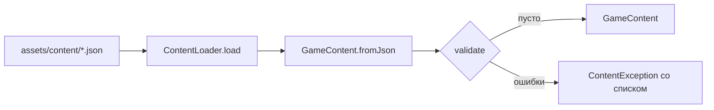

# Контент-пакет (JSON) — системная спецификация (SA)

| Поле | Значение |
|------|----------|
| **ID** | F-004 |
| **Назначение** | Весь учебный и игровой контент в JSON, отдельно от кода; загрузка и валидация |
| **Репозиторий** | `Pet_Finni_hackathon` |
| **Источник** | ТЗ 2.5.8, 2.6; SA F-001 §8; handoff 2026-09-21 §2.3, §2.9, §3 |
| **Статус** | Согласовано Егором 2026-09-24 |
| **Участники** | Егор |
| **Связанные артефакты** | F-002, F-006 (контроллер), F-012 (задания), F-013 (мини-игры) |


> **Актуальность (2026-09-24).** `quests.json` заменён на `lessons.json` (темы и уроки из шагов-игр, F-025); `looks.json` дополнен `skins` и `palette` (F-023); из `goals.json` убран облик-обезьянка, добавлена цель «Подарок другу» (F-023); `items.json`: вода 6, уход 6, добавлены мороженое и лимонад (аудит ТЗ, F-022); `config.needRotation`: уход каждый день.

---

## 1. Контекст

ТЗ требует: новое задание добавляется данными, без переписывания ядра (BR-10 F-001). Объёмы 2.6: ≥ 9 обликов, 5 периодов, 6 заданий / 3 темы, 8 покупок / 2 типа, 3 цели, 3 стадии. Сейчас контента нет.

## 2. Цель

`assets/content/*.json` → `GameContent` одним вызовом `ContentLoader.load()`. Битый контент ловится при загрузке списком понятных ошибок, а не падением в середине демо.

## 3. Бизнес-требования

| ID | Требование | Приоритет |
|----|------------|-----------|
| BR-01 | Товары need/want с ценой, эмодзи, влиянием на героя и слотом | Must |
| BR-02 | 3 цели по 50, у мебели 4 варианта на выбор | Must |
| BR-03 | 6 заданий, 3 темы (budget, save, buy), 2–3 выбора, объяснение у каждого | Must |
| BR-04 | 9 обликов (3 оттенка × 3 причёски) | Must |
| BR-05 | Тексты объяснений домена `exp.*` и копирайт интерфейса | Must |
| BR-06 | Словарик ≥ 10 терминов | Should |
| BR-07 | Данные мини-игр (карточки сортировки, задачи бюджета, настройки ловца) | Must |
| BR-08 | Цифры экономики (старт, карманные, награды) в конфиге, не в коде | Must |
| BR-09 | Валидация: уникальные id, цены > 0, ссылки существуют, объёмы 2.6 | Must |
| BR-10 | 7-е задание = новая запись JSON, без правки Dart | Must |

## 4. Описание

### 4.1 AS-IS

Контента нет; цены в тестах домена заданы руками.

### 4.2 TO-BE

Семь файлов в `client/assets/content/`, модели в `client/lib/content/`, загрузчик и валидатор.

### 4.3 Поток



### 4.4 Затронутые компоненты

| Слой | Путь |
|------|------|
| Данные | `client/assets/content/{config,items,goals,quests,looks,copy,minigames}.json` |
| Модели | `client/lib/content/models.dart` |
| Сборка и валидация | `client/lib/content/game_content.dart` |
| Загрузка | `client/lib/content/content_loader.dart` |
| Тесты | `client/test/content/content_test.dart` |

## 5. Сценарии

| UC | Актор | Цель | Предусловия |
|----|-------|------|-------------|
| UC-01 | Приложение | Загрузить контент при старте | APK собран с ассетами |
| UC-02 | Контент-автор | Добавить 7-е задание | Правка только `quests.json` |
| UC-03 | Контент-автор | Ошибиться в JSON | Дубликат id / нет объяснения |

### UC-02 — Новое задание

Шаги: добавить объект в `quests.json` → перезапуск → задание попадает в ротацию F-006 (по порядку в массиве). Код не меняется.

### UC-03 — Ошибка

Шаги: `validate()` возвращает `['quests: duplicate id q_budget_1', …]` → в debug `ContentException` с текстом; тест контента красный до исправления.

## 6. Матрица исходов

### Success (S)

| ID | Условие | Результат |
|----|---------|-----------|
| S-01 | Корректный пакет | `GameContent`, `validate()` пуст |
| S-02 | 7 заданий | Все 7 доступны, ротация по дню |
| S-03 | Нет строки копирайта | `text(id)` возвращает `id` (видно в QA, не падает) |

### Exception (E)

| ID | Условие | Поведение |
|----|---------|-----------|
| E-01 | Дубликат id в любой коллекции | Ошибка валидации |
| E-02 | price ≤ 0 или cost ≤ 0 | Ошибка валидации |
| E-03 | Задание < 2 выборов или пустое explanation | Ошибка валидации |
| E-04 | `needRotation` ссылается на несуществующий или не-need товар | Ошибка валидации |
| E-05 | Объёмы ниже 2.6 | Ошибка валидации |
| E-06 | Неизвестная тема / тип / слот | `FormatException` при разборе |

## 7. NFR

| ID | Категория | Требование |
|----|-----------|------------|
| NFR-01 | Perf | Загрузка всех файлов ≤ 200 мс (JSON < 50 КБ) |
| NFR-02 | Content | Тексты ≤ 140 символов на реплику, без стыда и страха |
| NFR-03 | Currency | Только игровые монеты, без брендов и реальных цен |
| NFR-04 | Legal | Эмодзи — системный шрифт устройства, картинок в APK нет |

## 8. API и контракты

### 8.1 Dart API

```dart
// models.dart
enum ItemSlot { consumable, hero, room }
enum QuestTheme { budget, save, buy }
enum GoalReward { room, skin, furniture }

final class ShopItem {
  final String id; final ItemKind kind; final int price;
  final String title; final String emoji; final String effect;
  final ItemSlot slot; final String? accessory; // hero: bandana|glasses|bow|headphones; room: lamp|rug|poster
  GameCoins get coins; CatalogItem get catalogItem; // мост в домен
}
final class GoalOption { final String id; final String title; final String emoji; }
final class GoalDef { final String id; final String title; final String emoji; final String description;
  final int cost; final GoalReward reward; final List<GoalOption> options; }
final class QuestLine { final String speaker; final String text; } // speaker: narrator|pet|friend|seller
final class QuestChoice { final String text; final int reward; final bool wise; final String explanation; }
final class Quest { final String id; final QuestTheme theme; final String title; final String emoji;
  final List<QuestLine> lines; final List<QuestChoice> choices; }
final class Look { final String id; final String title; final int color; final String hair; } // hair: tuft|bangs|buns
final class GlossaryEntry { final String term; final String meaning; }
final class SortCard { final String emoji; final String title; final ItemKind kind; final String why; }
final class PuzzleItem { final String emoji; final String title; final int price; final ItemKind kind; }
final class BudgetPuzzle { final String id; final String title; final int budget; final List<PuzzleItem> items; }
final class CatcherConfig { final int seconds; final int target; final List<String> temptations; final int temptationPenalty; }
final class GameConfig { final int startCoins; final int pocketMoney; final int rewardWise; final int rewardTry;
  final int demoPeriods; final List<List<String>> needRotation; }

// game_content.dart
final class GameContent {
  factory GameContent.fromJson(Map<String, dynamic> files); // ключи = имена файлов без .json
  List<ShopItem> get needItems; List<ShopItem> get wantItems;
  ShopItem item(String id); GoalDef goal(String id); Look look(String id);
  List<ShopItem> needsForDay(int day); // needRotation[(day-1) % n]
  Quest questForDay(int day);          // quests[(day-1) % n]
  BudgetPuzzle puzzleForDay(int day);
  String text(String id, [Map<String, String> vars]); // {pet} {player} {n}
  List<String> validate();
}
final class ContentException implements Exception { final List<String> problems; }

// content_loader.dart
abstract final class ContentLoader {
  static const files = ['config','items','goals','quests','looks','copy','minigames'];
  static Future<GameContent> load([AssetBundle? bundle]); // бросает ContentException
}
```

### 8.2 JSON-контракты

| Файл | Корень | Поля элемента |
|------|--------|----------------|
| `config.json` | объект | `startCoins`, `pocketMoney`, `rewardWise`, `rewardTry`, `demoPeriods`, `needRotation: [[id,…],…]` |
| `items.json` | `{items: []}` | `id`, `kind: need\|want`, `price`, `title`, `emoji`, `effect`, `slot: consumable\|hero\|room`, `accessory?` |
| `goals.json` | `{goals: []}` | `id`, `title`, `emoji`, `description`, `cost`, `reward: room\|skin\|furniture`, `options: [{id,title,emoji}]` |
| `quests.json` | `{quests: []}` | `id`, `theme: budget\|save\|buy`, `title`, `emoji`, `lines: [{speaker,text}]`, `choices: [{text,reward,wise,explanation}]` |
| `looks.json` | `{looks: []}` | `id`, `title`, `color: "#RRGGBB"`, `hair: tuft\|bangs\|buns` |
| `copy.json` | `{texts: {id: text}, glossary: [{term,meaning}]}` | |
| `minigames.json` | объект | `sortCards: [{emoji,title,kind,why}]`, `puzzles: [{id,title,budget,items:[{emoji,title,price,kind}]}]`, `catcher: {seconds,target,temptations,temptationPenalty}` |

Плейсхолдеры в текстах: `{pet}` — имя героя, `{player}` — имя игрока, `{n}` — число.

## 9. Зависимости

| Зависимость | Тип |
|-------------|-----|
| Домен `CatalogItem`, `ItemKind`, `GameCoins` | Блокер, есть |
| `pubspec.yaml` assets | Блокер |

## 10. Открытые вопросы

| # | Вопрос | Владелец | Статус |
|---|--------|----------|--------|
| 1 | Цифры экономики финальные | Иван | Черновик handoff, вынесены в `config.json` |
