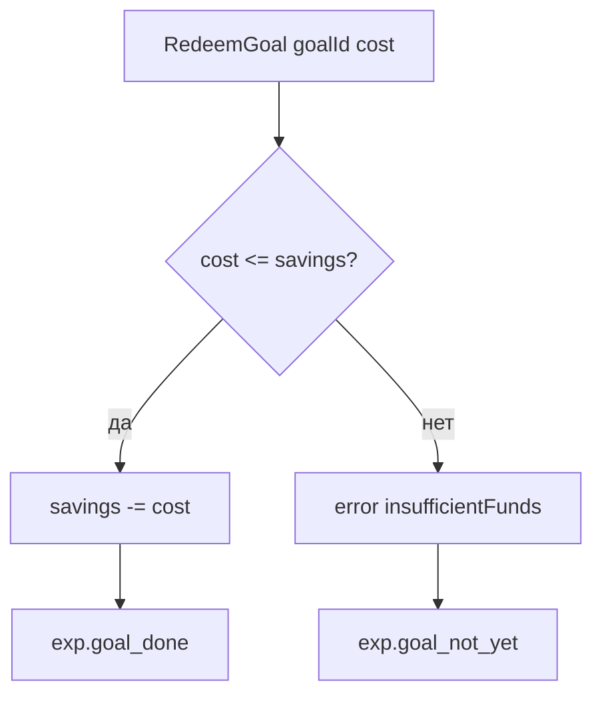

# Получение цели копилки (RedeemGoal) — системная спецификация (SA)

| Поле | Значение |
|------|----------|
| **ID** | F-003 |
| **Назначение** | Команда домена: потратить накопления на цель копилки |
| **Репозиторий** | `Pet_Finni_hackathon` |
| **Источник** | Design F-002 §6; handoff 2026-09-21 §2.6 (три цели копилки) |
| **Статус** | Согласовано Егором 2026-09-24; Ивану на ревью (меняет его домен) |
| **Участники** | Егор (автор), Иван (владелец домена) |
| **Связанные артефакты** | F-002, F-006 (контроллер), F-014 (UI копилки) |

---

## 1. Контекст

Домен умеет копить (`TransferToSavings`) и снимать (`RequestWithdraw` + `ConfirmWithdraw`). Потратить накопления на цель нельзя. Обходной путь через снятие + покупку ломает смысл: снятие показывает «цель отодвинется», а мы как раз цель получаем.

## 2. Цель

Одна атомарная команда: накопления ≥ цены цели → списать с копилки, записать объяснение. Иначе отказ без изменений.

## 3. Бизнес-требования

| ID | Требование | Приоритет |
|----|------------|-----------|
| BR-01 | Цель оплачивается только из копилки, не из доступных монет | Must |
| BR-02 | Нехватка → отказ, состояние не меняется | Must |
| BR-03 | Повторное получение одной цели блокирует слой игры (F-006), не домен | Must |
| BR-04 | Получение цели не влияет на `savedThisPeriod`, настроение и стадию | Must |

## 4. Описание

### 4.1 AS-IS

Нет команды траты накоплений.

### 4.2 TO-BE

`RedeemGoal(goalId, cost)` в `commands.dart`; ветка в `EconomyEngine.apply`.

### 4.3 Поток



### 4.4 Затронутые компоненты

| Слой | Путь |
|------|------|
| Домен | `client/lib/economy/commands.dart`, `economy_engine.dart` |
| Тесты | `client/test/economy/redeem_goal_test.dart` |

## 5. Сценарии

| UC | Актор | Цель | Предусловия |
|----|-------|------|-------------|
| UC-01 | Ребёнок | Забрать цель | savings ≥ cost |
| UC-02 | Ребёнок | Попробовать раньше времени | savings < cost |

## 6. Матрица исходов

### Success (S)

| ID | Условие | Результат |
|----|---------|-----------|
| S-01 | savings = 55, cost = 50 | savings = 5, available без изменений, `['exp.goal_done']` |
| S-02 | savings = 50, cost = 50 | savings = 0 (ровно весь баланс допустим) |

### Exception (E)

| ID | Условие | Поведение |
|----|---------|-----------|
| E-01 | savings = 49, cost = 50 | error `insufficientFunds`, `['exp.goal_not_yet']`, состояние не меняется |
| E-02 | pendingWithdraw есть | Не трогаем: снятие и цель независимы; pending проверяется при `ConfirmWithdraw` |

## 7. NFR

| ID | Категория | Требование |
|----|-----------|------------|
| NFR-01 | Currency | Только `GameCoins`, без отрицательных значений |
| NFR-02 | Quality | Покрыто юнит-тестами S-01, S-02, E-01, BR-04 |

## 8. API и контракты

```dart
final class RedeemGoal extends EconomyCommand {
  const RedeemGoal({required this.goalId, required this.cost});
  final String goalId;
  final GameCoins cost;
}
```

| Вход | Выход `EconomyResult` |
|------|------------------------|
| `RedeemGoal(goalId, cost)` при `cost <= savings` | `state.savings - cost`, `explanationIds: ['exp.goal_done']`, `error: null` |
| иначе | `state` без изменений, `['exp.goal_not_yet']`, `EconomyError.insufficientFunds` |

Копирайт (`copy.json`, F-004): `exp.goal_done`, `exp.goal_not_yet`.

## 9. Зависимости

| Зависимость | Тип |
|-------------|-----|
| Ревью Ивана | Soft |

## 10. Открытые вопросы

| # | Вопрос | Владелец | Статус |
|---|--------|----------|--------|
| 1 | Нужен ли отдельный код ошибки `goalNotAffordable`? | Иван | Решено: переиспользуем `insufficientFunds` |
