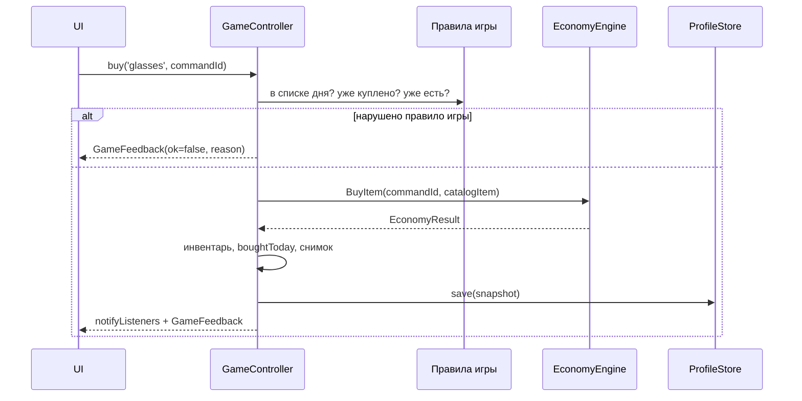

# Игровой контроллер (день, инвентарь, награды) — системная спецификация (SA)

| Поле | Значение |
|------|----------|
| **ID** | F-006 |
| **Назначение** | Единая точка изменения состояния игры поверх домена, контента и хранения |
| **Репозиторий** | `Pet_Finni_hackathon` |
| **Источник** | Design F-002 §2, §4, §9.2; handoff §2.3–2.6; SA F-001 UC-02…UC-09 |
| **Статус** | Согласовано Егором 2026-09-24 |
| **Участники** | Егор |
| **Связанные артефакты** | F-003, F-004, F-005; все UI-истории F-007…F-016 |

---

## 1. Контекст

Домен считает монеты, но не знает про день, список нужного, инвентарь, задания, мини-игры и цель. UI не должен сам вызывать домен и хранилище: иначе логика расползётся по экранам и её не протестировать.

## 2. Цель

`GameController` (`ChangeNotifier`): каждое действие = проверка правил игры → команда домена → обновление снимка → запись в хранилище → уведомление UI → `GameFeedback` с текстами «что изменилось и почему». Весь путь Приложения А проходится юнит-тестом без UI.

## 3. Бизнес-требования

| ID | Требование | Приоритет |
|----|------------|-----------|
| BR-01 | Создание профиля: старт 40 + карманные 20, день 1 | Must |
| BR-02 | «Нужное» в плане не меньше суммы списка дня (нужное обязательно) | Must |
| BR-03 | Нужное покупается только из списка дня и один раз за день | Must |
| BR-04 | Постоянную хотелку (налепка, мебель) нельзя купить второй раз; налепка надевается сразу | Must |
| BR-05 | Шоколадка — расходник: короткая радость на день (лицо «рад», если нужное не сорвано) | Must |
| BR-06 | Задание дня платит один раз (+12 мудрый / +6 попытка); повтор — только объяснение | Must |
| BR-07 | Мини-игра платит один раз в день (+12 победа / +6 попытка); лучший результат хранится | Must |
| BR-08 | Цель: выбор (мебель — с вариантом), получение через `RedeemGoal`, награда в инвентарь | Must |
| BR-09 | Снятие с копилки в два шага, отмена без изменений | Must |
| BR-10 | Конец дня: итог (план/факт/настроение/стадия), новый день, +20 карманных | Must |
| BR-11 | Каждый результат — `GameFeedback` с текстами из контента и числом «не хватает» | Must |
| BR-12 | Сброс удаляет снимок | Must |
| BR-13 | Каждое изменение сохраняется | Must |

## 4. Описание

### 4.1 AS-IS

Только домен.

### 4.2 TO-BE

`client/lib/game/game_controller.dart`, `game_feedback.dart`.

### 4.3 Поток действия



### 4.4 Затронутые компоненты

| Слой | Путь |
|------|------|
| Контроллер | `client/lib/game/game_controller.dart` |
| Результат | `client/lib/game/game_feedback.dart` |
| Тесты | `client/test/game/game_controller_test.dart` |

## 5. Сценарии

| UC | Актор | Цель | Предусловия |
|----|-------|------|-------------|
| UC-01 | Ребёнок | Создать героя | Нет снимка |
| UC-02 | Ребёнок | План дня | Есть профиль, план не подтверждён |
| UC-03 | Ребёнок | Купить нужное / хотелку | План подтверждён |
| UC-04 | Ребёнок | Задание дня | — |
| UC-05 | Ребёнок | Мини-игра | — |
| UC-06 | Ребёнок | Копить, снимать, получить цель | Цель выбрана |
| UC-07 | Ребёнок | Надеть/снять налепку | Налепка куплена |
| UC-08 | Ребёнок | Закончить день | — |
| UC-09 | Эксперт | 5 дней подряд, стадия 3 | Демо |
| UC-10 | Взрослый | Сброс | — |

## 6. Матрица исходов

### Success (S)

| ID | Условие | Результат |
|----|---------|-----------|
| S-01 | createProfile | available = 60, day = 1, источник `pocket:1` |
| S-02 | План need ≥ суммы нужного дня и total ≤ available | План в домене |
| S-03 | Покупка нужного из списка | available −, boughtToday +, чеклист дня |
| S-04 | Покупка налепки | owned + worn |
| S-05 | Шоколадка при закрытом нужном | Лицо «рад» до конца дня |
| S-06 | Задание первый раз за день | +reward, `questsDone` +, `questDoneToday` |
| S-07 | Мини-игра первый раз за день | +12/+6, `gameRewardToday`, лучший результат |
| S-08 | Копилка ≥ цены цели → redeem | savings − cost, награда в инвентарь, цель снята |
| S-09 | endDay | `DaySummary`, day + 1, +20, дневные флаги сброшены |
| S-10 | 4 хороших дня подряд | stage 3 |

### Exception (E)

| ID | Условие | Поведение (`GameFeedback.reason`) |
|----|---------|-----------------------------------|
| E-01 | План: need < нужного дня | `planNeedLow`, план не принят |
| E-02 | План > available | `planTooBig` (домен) |
| E-03 | Покупка до плана | `noPlan` |
| E-04 | Нужное не из списка / уже куплено сегодня | `notToday` / `alreadyBought` |
| E-05 | Хотелка уже есть | `alreadyOwned` |
| E-06 | Нехватка | `insufficient`, `missing = price − available` |
| E-07 | Двойной commandId | Одно списание, `ok = true`, `repeat = true` |
| E-08 | Задание повторно | `ok = true`, `reward = 0`, объяснение показано |
| E-09 | Мини-игра повторно | `ok = true`, `reward = 0` |
| E-10 | Redeem без цели / нехватка | `noGoal` / `insufficient` с `missing` |
| E-11 | Мебель без варианта | `needOption` |
| E-12 | Цель уже получена | `alreadyOwned` |

## 7. NFR

| ID | Категория | Требование |
|----|-----------|------------|
| NFR-01 | Perf | Действие + запись ≤ 100 мс |
| NFR-02 | Quality | Путь Приложения А покрыт юнит-тестом |
| NFR-03 | Arch | Нет импортов `package:flutter/widgets` кроме `ChangeNotifier` (foundation) |

## 8. API и контракты

```dart
enum FeedbackReason {
  none, planTooBig, planNeedLow, noPlan, notToday, alreadyBought, alreadyOwned,
  insufficient, noGoal, needOption, withdrawNotPending,
}

final class GameFeedback {
  final bool ok;
  final FeedbackReason reason;
  final List<String> messages;   // готовые тексты для ребёнка
  final int reward;              // начислено монет (задание/игра)
  final int missing;             // сколько не хватает (insufficient)
  final bool repeat;             // повтор без эффекта
}

final class GameController extends ChangeNotifier {
  GameController({required GameContent content, required ProfileStore store, String Function()? newId});

  // Состояние
  bool get loaded; bool get hasProfile; GameSnapshot get snapshot;
  GameContent get content;
  EconomyState get economy; Profile get profile; Inventory get inventory; int get day;
  List<ShopItem> get todaysNeeds; int get todaysNeedSum;
  bool isBoughtToday(String itemId); bool get needsDone;
  bool get planConfirmed; Quest get todaysQuest; bool get questDoneToday; bool get gameRewardToday;
  GoalDef? get goal; int get goalRemaining; bool get canRedeem;
  PetMood get mood;              // с учётом шоколадки
  int get stage; String get stageTitle; bool get demoComplete; // day > demoPeriods
  String newCommandId();

  // Действия
  Future<void> init();
  Future<void> createProfile({required String playerName, required String petName, required String lookId});
  Future<GameFeedback> confirmPlan({required int need, required int want, required int save});
  Future<GameFeedback> buy(String itemId, {required String commandId});
  Future<GameFeedback> toSavings(int amount);
  Future<GameFeedback> requestWithdraw(int amount);
  Future<GameFeedback> confirmWithdraw();
  Future<void> cancelWithdraw();
  Future<GameFeedback> chooseGoal(String goalId, {String? option});
  Future<GameFeedback> redeemGoal();
  Future<GameFeedback> answerQuest(int choiceIndex);
  Future<GameFeedback> finishMiniGame(String gameId, {required bool win, required int score});
  Future<void> toggleWear(String itemId);
  Future<DaySummary> endDay();
  Future<void> setSound(bool on);
  Future<void> reset();
}
```

Источники начислений (`lastCreditSourceId`): `start`, `pocket:<day>`, `quest:<id>`, `game:<id>`.

Мини-игры: `sort`, `budget`, `catcher`.

## 9. Зависимости

| Зависимость | Тип |
|-------------|-----|
| F-003, F-004, F-005 | Блокер, готово |

## 10. Открытые вопросы

| # | Вопрос | Владелец | Статус |
|---|--------|----------|--------|
| 1 | Правило BR-02 (need ≥ нужного дня) — в домен? | Иван | Пока в контроллере, домен не трогаем |
