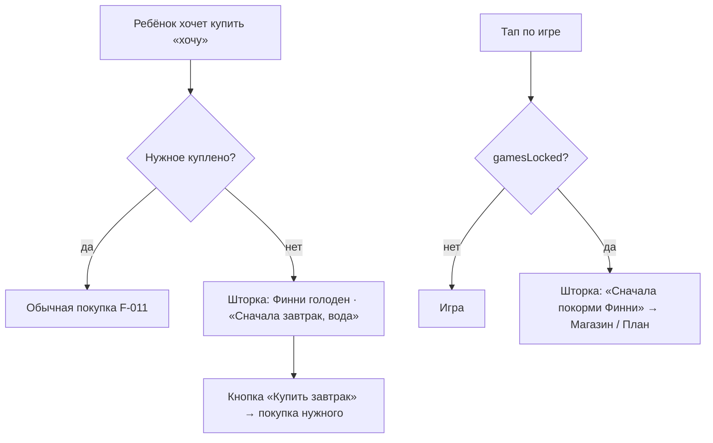

# Сначала нужное: порядок шагов дня — системная спецификация (SA)

| Поле | Значение |
|------|----------|
| **ID** | F-021 |
| **Назначение** | Игра не даёт перескочить через потребности героя: пока нужное дня не куплено, нельзя тратить на «хочу», откладывать монеты, без которых не хватит на нужное, и играть в игры с наградой |
| **Репозиторий** | `Pet_Finni_hackathon` |
| **Источник** | Запрос Егора 2026-09-24: «если хочется кушать или пить, я могу играть в игры… надо, чтобы персонаж следовал шагам; если не поел/попил и решил что-то купить — предупредить, что надо сначала закрыть свои потребности» |
| **Статус** | Согласовано Егором 2026-09-24 |
| **Участники** | Егор; ревью правила — Иван (экономика) |
| **Связанные артефакты** | F-006 (контроллер), F-011 (магазин), F-013 (мини-игры), F-014 (копилка), F-020 (желания героя) |

---

## 1. Контекст

Порядок дня (F-020 BR-01): план → нужное → квест → игра → копилка → сон. Сейчас это только подсказка: ребёнок может, пока Финни голоден, купить очки, сыграть в игру или унести все монеты в копилку и остаться без завтрака. Карманные деньги дня (20) покрывают нужное (16–18), так что единственная честная причина не купить нужное — нехватка монет.

## 2. Цель

Ключевой урок финграмотности «сначала потребности, потом желания» становится правилом игры, а не советом. Правило живёт в контроллере (домен игры), UI только объясняет его голосом героя и ведёт к исполнению.

## 3. Бизнес-требования

| ID | Требование | Приоритет |
|----|------------|-----------|
| BR-01 | Пока нужное дня не куплено, покупка «хочу» отклоняется с причиной `needsFirst`; монеты не списываются | Must |
| BR-02 | Перевод в копилку отклоняется (`needsFirst`), если после него в кошельке останется меньше, чем стоит не купленное нужное | Must |
| BR-03 | Игры с наградой закрыты, пока нужное не куплено и на него хватает монет. Без плана игры тоже закрыты (сначала план) | Must |
| BR-04 | Исключение: если монет на нужное не хватает, игры открыты — это способ заработать (F-011 пути восстановления) | Must |
| BR-05 | «План дня» в разделе Игры открыт всегда; квесты-уроки открыты всегда (знания не запираем) | Must |
| BR-06 | Отказ объясняется от лица героя: что именно он ещё хочет (названия нужного) и кнопка, ведущая к покупке | Must |
| BR-07 | Закрытые игры видны (не прячем), с замком и подписью; тап — объяснение, а не молчание | Must |
| BR-08 | Тексты правил — в `copy.json` (`rule.*`) | Must |
| BR-09 | Облачко героя (F-020) полупрозрачное с размытием фона, текст остаётся контрастным | Should |

## 4. Описание

### 4.1 Правило

```
needsLeft      = нужное дня, которое ещё не куплено
needsLeftCost  = Σ price(needsLeft)
canAffordNeeds = available ≥ needsLeftCost

buy(want)      → needsFirst, если needsLeft ≠ ∅
toSavings(n)   → needsFirst, если needsLeft ≠ ∅ и available − n < needsLeftCost
gamesLocked    = needsLeft ≠ ∅ и canAffordNeeds   // без плана needsLeft = всё нужное дня
```

### 4.2 Поток



### 4.3 Затронутые компоненты

| Слой | Путь |
|------|------|
| Правило | `client/lib/game/game_controller.dart` (`needsLeft`, `needsLeftCost`, `canAffordNeeds`, `gamesLocked`, проверки в `buy`, `toSavings`) |
| Причина отказа | `client/lib/game/game_feedback.dart` (`FeedbackReason.needsFirst`) |
| Тексты | `client/assets/content/copy.json` (`rule.*`) |
| Магазин | `client/lib/ui/widgets/buy_sheet.dart` (шторка «Сначала нужное») |
| Игры | `client/lib/ui/tabs/games_tab.dart` (замок, шторка) |
| Облачко | `client/lib/ui/widgets/pet_speech.dart` (полупрозрачность) |

## 5. Use cases

| UC | Актор | Сценарий |
|----|-------|----------|
| UC-01 | Ребёнок | План есть, завтрак не куплен, тапает «Очки» → шторка «Финни сначала хочет: Завтрак, Вода» → «Купить Завтрак» → покупка завтрака |
| UC-02 | Ребёнок | Нужное не куплено, пробует отложить всё в копилку → отказ: «не хватит на нужное» |
| UC-03 | Ребёнок | Нужное не куплено, открывает Игры → карточки с замком; тап → шторка → Магазин |
| UC-04 | Ребёнок | Монет на нужное не хватает → игры открыты, можно заработать |
| UC-05 | Ребёнок | Всё нужное куплено → всё открыто, как раньше |

## 6. Матрица исходов

### Success (S)

| ID | Условие | Результат |
|----|---------|-----------|
| S-01 | needsLeft = ∅, покупка «хочу» | Покупка проходит |
| S-02 | needsLeft ≠ ∅, перевод в копилку, остаток ≥ needsLeftCost | Перевод проходит |
| S-03 | needsLeft = ∅ | `gamesLocked = false` |
| S-04 | needsLeft ≠ ∅, available < needsLeftCost | `gamesLocked = false` (заработать) |
| S-05 | Покупка нужного при needsLeft ≠ ∅ | Проходит (правило не мешает нужному) |

### Failure (F)

| ID | Условие | Результат |
|----|---------|-----------|
| F-01 | needsLeft ≠ ∅, покупка «хочу» | `needsFirst`, кошелёк без изменений, текст с названиями нужного |
| F-02 | needsLeft ≠ ∅, available − n < needsLeftCost | `needsFirst` в `toSavings`, копилка без изменений |
| F-03 | Нет плана, монет на нужное хватает | `gamesLocked = true`, шторка ведёт в План |
| F-04 | Нужное не куплено, монет хватает | `gamesLocked = true`, шторка ведёт в Магазин |

### Exception (E)

| ID | Условие | Поведение |
|----|---------|-----------|
| E-01 | Повтор покупки с тем же commandId | Идемпотентность F-006 важнее правила: повтор отвечает `repeat` |
| E-02 | Нет строки `rule.*` | Показывается id (видно в QA) |
| E-03 | Монет меньше, чем стоит нужное (план тоже не собрать) | Игры и квесты открыты — способ заработать; тупика нет |

## 7. Нефункциональные требования

| Категория | Требование |
|-----------|------------|
| Прозрачность | Любой отказ говорит, что сделать дальше (кнопка) |
| Доступность | Замок на игре продублирован подписью «Сначала нужное» (не только цветом) |
| Данные | Без сети и ПДн; только игровые монеты |

## 8. API и контракты

```dart
enum FeedbackReason { ..., needsFirst }

class GameController {
  List<ShopItem> get needsLeft;      // нужное дня, ещё не купленное
  int get needsLeftCost;
  bool get canAffordNeeds;           // available >= needsLeftCost
  bool get gamesLocked;              // BR-03/BR-04
  String get needsLeftTitles;        // «Завтрак, Вода» — для текстов

  Future<GameFeedback> buy(String itemId, {required String commandId}); // + needsFirst для want
  Future<GameFeedback> toSavings(int amount);                           // + needsFirst
}
```

`copy.json`:

| Ключ | Текст |
|------|-------|
| `rule.want_blocked` | «{pet} сначала хочет: {needs}. Нужное — раньше хотелок!» |
| `rule.save_blocked` | «Если отложить {n}, не хватит на нужное: {needs}. Сначала купи его.» |
| `rule.games_locked` | «{pet} голоден и не может играть. Сначала купи нужное: {needs}.» |
| `rule.games_no_plan` | «Сначала план: разложи монеты по банкам, потом игры.» |

## 9. Тестирование

| Тест | Проверяет |
|------|-----------|
| `game_controller_test`: want до нужного | F-01, кошелёк не изменился |
| `game_controller_test`: want после нужного | S-01 |
| `game_controller_test`: копилка съедает нужное | F-02, S-02 |
| `game_controller_test`: gamesLocked | F-03, F-04, S-03, S-04 |
| `app_flow_test` | Тап по «хочу» до нужного показывает шторку; игры после нужного открыты |
