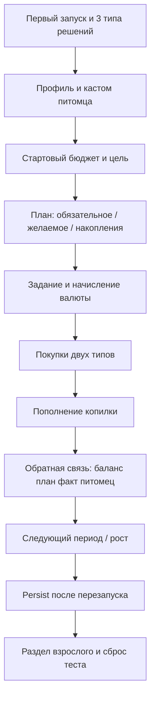

# Ядро продукта «Питомец Финни» — системная спецификация (SA)

> По шаблону `docs/templates/FEATURE_SA_SPEC_TEMPLATE.md`.  
> Код клиента не начинать, пока нет выбранного исполнения writing-plans №1 (economy). Design и SA согласованы 2026-09-20.

| Поле | Значение |
|------|----------|
| **ID** | F-001 |
| **Назначение** | SA конкурсного MVP: обязательный игровой цикл и границы продукта |
| **Репозиторий** | `Pet_Finni_hackathon` |
| **Источник** | ТЗ Департамента финансов города Москвы (2026); разведка `TZ_RESEARCH_AND_PLANS.md`; чат 2026-09-20 |
| **Статус** | Согласовано |
| **Участники** | Иван (`Ivan_DevStand`); второй участник — уточнить роль |
| **Связанные артефакты** | `docs/superpowers/specs/2026-09-20-finni-core-design.md`, `docs/superpowers/plans/2026-09-20-finni-program-roadmap.md` |

**Валюта.** Только вымышленные игровые монеты внутри приложения. Продукт — обучающая платформа. Это не меняется в развитии после MVP: не планируется связь с деньгами или услугами вне игры.

---

## Содержание

1. [Контекст](#1-контекст)
2. [Цель](#2-цель)
3. [Бизнес-требования](#3-бизнес-требования)
4. [Описание](#4-описание)
5. [Сценарии](#5-сценарии)
6. [Матрица исходов](#6-матрица-исходов)
7. [NFR](#7-nfr)
8. [API и контракты](#8-api-и-контракты)
9. [Зависимости](#9-зависимости)
10. [Открытые вопросы](#10-открытые-вопросы)
11. [Приложения](#11-приложения)

---

## 1. Контекст

Заказчик конкурса — Департамент финансов города Москвы. Нужен функциональный прототип Android-приложения для детей 7–11 лет: виртуальный питомец, **вымышленная игровая валюта**, план бюджета, покупки в игре, накопления, задания по финансовой грамотности как учебной теме.

AS-IS: репозиторий с правилами процесса, без клиентского кода и без ветки `Ivan_DevStand`.

Ограничения навсегда: только обучающая платформа и игровые монеты; без рекламы, внутриигровых покупок за средства вне игры, сбора ПДн, чатов; питомец не умирает и не болеет как наказание; ошибка обратима и объясняется.

Родитель не принимает решения вместо ребёнка.

---

## 2. Цель

За один демо-прогон (Приложение А ТЗ) ребёнок распределяет ограниченный бюджет на обязательное, желаемое и накопления, совершает оба типа покупок, копит на цель, видит связь решения с питомцем и может пройти 5 игровых периодов в демо-режиме без календарного ожидания.

---

## 3. Бизнес-требования

| ID | Требование | Приоритет |
|----|------------|-----------|
| BR-01 | Обучение действием: выбор → финансовое и игровое следствие | Must |
| BR-02 | Три связанные механики: план, приоритет трат, накопления на цель | Must |
| BR-03 | Различение обязательных и необязательных расходов | Must |
| BR-04 | Регулярные откладывания на цель с понятной стоимостью | Must |
| BR-05 | Объяснение «что изменилось и почему» простыми словами | Must |
| BR-06 | Безопасная ошибка: прогресс не обнуляется, есть путь восстановления | Must |
| BR-07 | Взрослый видит цели приложения и общий прогресс без стыда, может сбросить профиль | Must |
| BR-08 | Гостевой локальный профиль, без аккаунта и ПДн | Must |
| BR-09 | Демо-режим и тестовый профиль для экспертизы | Must |
| BR-10 | Новое задание добавляется данными, не переписыванием ядра | Must |
| BR-11 | Соответствие 6 компетенциям рамки (базовый уровень НОО) | Must |
| BR-12 | Связь экономики приложения с чем-либо вне игровых монет | Out of scope (MVP и далее) |
| BR-13 | Сезоны контента, игровые «дела» с подтверждением взрослого (награда — только монеты), публикация стора | Could (после P8 плана) |
| BR-14 | ИИ, сервер, iOS | Out of scope MVP |

---

## 4. Описание

### 4.1 AS-IS

Документы процесса и разведка. Нет игрового клиента.

### 4.2 TO-BE

Одно приложение: ребёнок ведёт локальный профиль и питомца. До периода составляет план из трёх направлений. В периоде получает доход (задание и/или периодическое начисление), покупает обязательное и желаемое, переводит в накопления. После периода видит план vs факт и изменение состояния/стадии питомца. Контент (товары, цели, задания, фразы) лежит отдельно от UI.

### 4.3 Поток / процесс

Игровой период: конкретная длительность (день / условная кнопка «завершить период») фиксируется по итогам P0; в демо периоды идут подряд.

### 4.4 Затронутые компоненты

| Слой | Путь / модуль |
|------|----------------|
| Экономика | домен: баланс, план, факт, магазин, копилка, период, состояние, стадия |
| Контент | JSON/YAML заданий, SKU, целей, глоссария |
| Хранение | локально (Room/SQLite или эквивалент стека), без облака |
| UI | онбординг, дом, бюджет, магазин, задания, цель, прогресс, взрослый |
| Демо | тестовый профиль, ускорение периодов, сброс |
| Сборка | signed APK, unique package name |

---

## 5. Сценарии

| UC | Актор | Цель | Предусловия |
|----|-------|------|-------------|
| UC-01 | Ребёнок | Понять три типа решений и создать питомца | Чистая установка |
| UC-02 | Ребёнок | Составить план, не превысив бюджет | Есть доступный баланс |
| UC-03 | Ребёнок | Купить обязательное и желаемое | План подтверждён, есть товары |
| UC-04 | Ребёнок | Получить отказ при нехватке средств | Цена > баланса |
| UC-05 | Ребёнок | Выполнить задание и увидеть начисление | Есть активное задание |
| UC-06 | Ребёнок | Выбрать цель и пополнить накопления | Есть цель в каталоге |
| UC-07 | Ребёнок | Снять с копилки осознанно | Есть накопления |
| UC-08 | Ребёнок | Увидеть рост питомца за серию периодов | Демо, несколько периодов |
| UC-09 | Ребёнок | Исправить неудачное решение | Была ошибка в периоде |
| UC-10 | Любой | Закрыть и открыть приложение с тем же прогрессом | Был прогресс |
| UC-11 | Взрослый | Открыть раздел, сбросить тестовый профиль | Знает барьер |
| UC-12 | Эксперт | Пройти обязательный сценарий без календаря | Демо-режим |

### UC-01 — Первый запуск

Шаги: установка → короткое знакомство (потратить на нужное / на желаемое / отложить) → игровое имя, без ФИО/телефона/email → выбор облика и имени питомца → главный экран. Подсказка доступна снова.

### UC-02 — План бюджета

Шаги: открыть план → распределить сумму по ≥3 направлениям → видеть остаток → менять до подтверждения → подтвердить. После этого факт сравнивается с планом.

### UC-03 — Покупки

Шаги: карточка товара (цена, тип, влияние на питомца) → подтверждение → баланс уменьшается → запись в истории периода. Минимум одна обязательная и одна необязательная покупка в демо.

### UC-04 — Нехватка

Шаги: попытка купить дорогое → нет списания → объяснение чего не хватает и какие варианты есть (заработать заданием, отказаться от желаемого, подождать период).

### UC-05 — Задание

Шаги: игровая ситуация с выбором (не только тест) → действие → начисление с источником и суммой → короткое объяснение при любом исходе.

### UC-06 — Цель

Шаги: выбор из ≥3 целей → стоимость, накоплено, осталось → перевод части валюты в накопления.

### UC-07 — Снятие с накоплений

Шаги: запрос снятия → до подтверждения показать уменьшение суммы и, если есть срок, его изменение → отдельное подтверждение → списание только после него.

### UC-08 — Рост

Шаги: серия периодов с решениями по обязательным тратам, плану и регулярности накоплений → смена стадии (≥3) → фраза, почему изменилось состояние.

### UC-09 — Восстановление

Шаги: неудачный выбор → объяснение → предложенный следующий шаг (новое задание / правка следующего плана / отказ от желаемого) → прогресс прошлого не обнулён.

### UC-10 — Persist

Шаги: закрыть приложение → открыть → профиль, баланс, покупки, накопления, цель, учебный прогресс на месте.

### UC-11 — Взрослый

Шаги: барьер (удержание кнопки или арифметика) → цели продукта, темы, общий прогресс без негативных оценок → сброс или удаление локальных данных с подтверждением.

### UC-12 — Демо

Шаги: тестовый профиль → шаги 1–12 Приложения А подряд → сброс к исходному состоянию.

---

## 6. Матрица исходов

### Success (S)

| ID | Условие | Результат |
|----|---------|-----------|
| S-01 | План ≤ доступному бюджету | План сохранён, период начат |
| S-02 | Покупка при достаточном балансе | Баланс − цена, история, изменение показателя питомца, фраза «почему» |
| S-03 | Пополнение копилки | Доступный баланс −, накопления +, прогресс цели |
| S-04 | Задание завершено | Начисление с источником, объяснение |
| S-05 | Серия решений в демо | Смена стадии с объяснением |
| S-06 | Перезапуск | Состояние как до закрытия |
| S-07 | Сброс теста взрослым | Исходное состояние демо-профиля |

### Exception (E)

| ID | Условие | HTTP / поведение |
|----|---------|------------------|
| E-01 | Сумма плана > бюджета | Подтверждение недоступно, показан остаток/перерасход |
| E-02 | Покупка при нехватке | Отказ, объяснение, варианты; баланс не меняется |
| E-03 | Снятие копилки без второго подтверждения | Накопления не меняются |
| E-04 | Нет сети | Основной цикл работает; если когда-либо появится сеть — сообщение, прогресс не теряется (MVP сеть не требует) |
| E-05 | Действие удаления прогресса | Требует подтверждения |
| E-06 | Ребёнок в разделе взрослого без барьера | Раздел недоступен |
| E-07 | Падение / тупик в демо | Недопустимо; фиксируется как блокер сдачи |

---

## 7. NFR

| ID | Категория | Требование |
|----|-----------|------------|
| NFR-01 | Платформа | Android 8+, портрет, ширина от 360 dp; проверка на физическом устройстве ≥ 3 ГБ RAM |
| NFR-02 | Offline | Игровой цикл без постоянного интернета |
| NFR-03 | Privacy | Нет аккаунта, нет ПДн, нет лишних permissions |
| NFR-04 | Safety | Нет рекламы, нет покупок за средства вне игры, нет внешних ссылок ребёнку в обход раздела взрослого |
| NFR-05 | UX | Короткие фразы, ≥ 16 sp, тач ≥ 48 dp, цвет не единственный сигнал, звук отключаем |
| NFR-06 | Perf | Холодный старт до старта/дома ≤ 5 с; отклик на локальное действие ≤ 1 с |
| NFR-07 | Quality | Нет падений в обязательном демо; экономика покрыта автотестами или детальными кейсами |
| NFR-08 | Content | Учебный контент отделён от UI-кода |
| NFR-09 | Legal | Сторонние ассеты только с правом использования, перечень в доках |
| NFR-10 | Ethics | Тексты не стыдят и не пугают; забота о питомце зависит только от игровых решений |
| NFR-11 | Currency | Все цены, доходы, копилка и цели — только вымышленные монеты; обмен и привязка вне игры не допускаются |

Серверного API нет.

---

## 8. API и контракты

Внешнего API нет. Внутренний контракт контента (черновик, уточняется в P2):

| Сущность | Поля минимум |
|----------|----------------|
| Item | id, type (need\|want), price, petEffect, title |
| Goal | id, title, cost |
| Task | id, theme (budget\|save\|buy), scene, choices[], outcomes[], explanation |
| Copy | id, plainLanguage |

---

## 9. Зависимости

| Зависимость | Тип |
|-------------|-----|
| ТЗ и Приложение А | Блокер |
| Согласование этой SA Иваном | Блокер на код |
| Ответ коллеги: стек, арт, период | Soft на P0/P2; дефолты ниже |
| Рамка компетенций / fincult / Открытый бюджет | Soft на формулировки P5 |
| RuStore инструкция | Soft на P6, публикация out of scope |

Дефолты, если коллега не ответил к концу P0: стек — Flutter (один код, сдача APK); период в демо — кнопка «Завершить период»; питомец — нейтральный зверек, 3 тела × 3 цвета = 9 комбинаций, без «болезни».

---

## 10. Открытые вопросы

| # | Вопрос | Владелец | Статус |
|---|--------|----------|--------|
| 1 | Стек: Kotlin / Flutter / RN? | Оба | Открыт; дефолт Flutter |
| 2 | Кто рисует питомца и магазинные иконки? | Второй участник | Открыт |
| 3 | Длина живого периода вне демо | Оба | Открыт; демо = кнопка |
| 4 | Есть ли файл рамки компетенций? | Иван спросить коллегу | Открыт |
| 5 | Кто готовит презентацию PPTX? | Оба | Открыт |
| 6 | Имя пакета Android | Иван | Открыт до P2 |

---

## 11. Приложения

- Разведка: `docs/work/product/TZ_RESEARCH_AND_PLANS.md`
- План программы: `docs/superpowers/plans/2026-09-20-finni-program-roadmap.md`
- Design: `docs/superpowers/specs/2026-09-20-finni-core-design.md`
- Объёмы контента ТЗ 2.6: 9 обликов, 5 периодов демо, 6 заданий / 3 темы, 8 покупок / 2 типа, 3 цели, 3 стадии
- Демо-шаги: ТЗ Приложение А, пункты 1–12
- Формулы баланса/роста: появятся отдельным подразделом после P0.5 / P2.2; до кода черновик антипаттернов тамагочи обязателен
