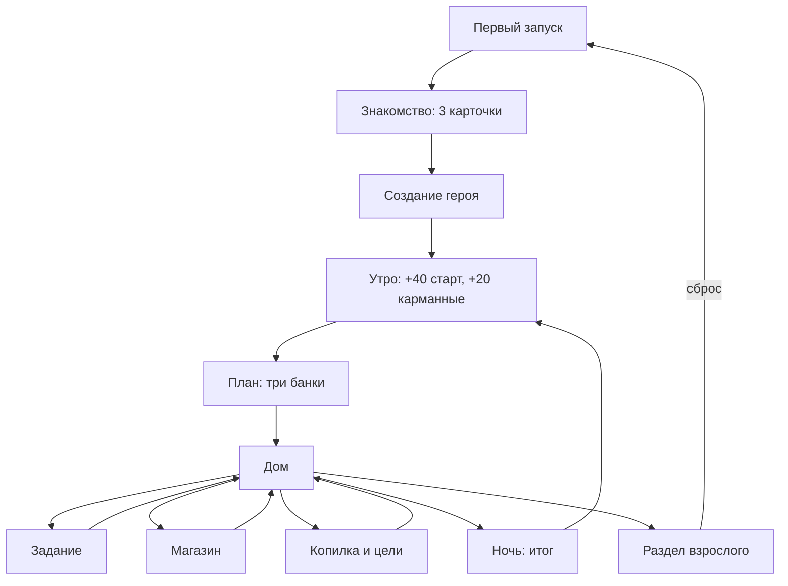

# Игра поверх экономики «Питомец Финни»: системная спецификация (SA)

> По шаблону `docs/templates/FEATURE_SA_SPEC_TEMPLATE.md`. Дополняет F-001, не заменяет его.

| Поле | Значение |
|------|----------|
| **ID** | F-002 |
| **Назначение** | Контент, хранение, экраны и игровой цикл MVP (подсистемы 2–5 roadmap) |
| **Репозиторий** | `Pet_Finni_hackathon` |
| **Источник** | Handoff 2026-09-21 (Иван), SA F-001, ТЗ Приложение А |
| **Статус** | Согласовано Егором 2026-09-24; Ивану на ревью |
| **Участники** | Егор (`Egor_DevStand`), Иван (ревью, домен) |
| **Связанные артефакты** | `docs/superpowers/specs/2026-09-24-finni-game-ui-design.md` |

**Валюта.** Только вымышленные игровые монеты. Никаких связей вне игры.

---

## 1. Контекст

Домен экономики готов (`client/lib/economy/`, 19 тестов). UI нет, контента нет, профиль не сохраняется. До промежуточной сдачи **29.09 23:59** нужен APK с обязательным путём Приложения А.

---

## 2. Цель

Ребёнок проходит 5 дней подряд: план в трёх банках → задание → покупки → копилка → ночь с итогом. Видит, как решения меняют лицо героя, комнату и стадию. Всё переживает перезапуск; взрослый сбрасывает профиль.

---

## 3. Бизнес-требования

| ID | Требование | Приоритет |
|----|------------|-----------|
| BR-01 | Знакомство с тремя типами решений, подсказка доступна всегда | Must |
| BR-02 | Создание героя: имя игрока, имя героя, ≥ 9 обликов | Must |
| BR-03 | Главный экран: герой, настроение, стадия, баланс, копилка, цель, задание | Must |
| BR-04 | План трёх корзин до трат, сумма ≤ доступно | Must |
| BR-05 | Магазин ≥ 8 позиций двух типов, цена/тип/влияние, подтверждение, отказ при нехватке | Must |
| BR-06 | 6 заданий / 3 темы, сцена с выбором, монеты за любой выбор, объяснение | Must |
| BR-07 | 3 цели, пополнение, двухшаговое снятие, получение цели | Must |
| BR-08 | Ночь: план vs факт, настроение, рост, совет | Must |
| BR-09 | 3 стадии героя достижимы в демо | Must |
| BR-10 | Сохранение после перезапуска | Must |
| BR-11 | Раздел взрослого за барьером, сброс профиля | Must |
| BR-12 | Контент в JSON, новое задание без правки кода | Must |
| BR-13 | Купленные want видны на герое или в комнате | Should |
| BR-14 | Словарик ≥ 10 терминов | Should |
| BR-15 | Звук/вибрация с выключателем | Could |
| BR-18 | 3D-маскот (сфера с проекцией черт), анимации, вращение пальцем | Must (Егор) |
| BR-19 | 3 мини-игры: «Нужно или хочу?», «Уложись в бюджет», «Копилка-ловец»; награда раз в день | Must (Егор) |
| BR-16 | Бонус серии дней в копилку | Out of scope (сумма не зафиксирована) |
| BR-17 | Начисления от родителя, гости, облако | Out of scope |

---

## 4. Описание

### 4.1 AS-IS

Шаблонный `main.dart`, домен экономики без UI и без сохранения.

### 4.2 TO-BE

Flutter-клиент: контент из `assets/content/*.json`, `GameController` поверх `EconomyEngine`, снимок в `shared_preferences`, 11 экранов (см. design §3).

### 4.3 Поток

### 4.4 Затронутые компоненты

| Слой | Путь |
|------|------|
| Домен | `client/lib/economy/` — только команда `RedeemGoal` |
| Контент | `client/lib/content/`, `client/assets/content/` |
| Хранение | `client/lib/store/` |
| Игра | `client/lib/game/` |
| UI | `client/lib/ui/`, `client/lib/main.dart` |
| Тесты | `client/test/{content,store,game,ui}/` |

---

## 5. Сценарии

| UC | Актор | Цель | Предусловия |
|----|-------|------|-------------|
| UC-01 | Ребёнок | Знакомство и создание героя | Чистая установка |
| UC-02 | Ребёнок | Разложить монеты по банкам | Утро дня, план не подтверждён |
| UC-03 | Ребёнок | Купить нужное и хотелку | План подтверждён |
| UC-04 | Ребёнок | Получить отказ при нехватке | Цена > доступно |
| UC-05 | Ребёнок | Пройти задание | Задание дня не пройдено |
| UC-06 | Ребёнок | Выбрать цель и отложить | Есть доступные монеты |
| UC-07 | Ребёнок | Снять с копилки | Копилка > 0 |
| UC-08 | Ребёнок | Получить цель | Копилка ≥ цены цели |
| UC-09 | Ребёнок | Закончить день и увидеть итог | Любой момент дня |
| UC-10 | Любой | Перезапуск без потери прогресса | Есть прогресс |
| UC-11 | Взрослый | Барьер и сброс | — |
| UC-12 | Ребёнок | Надеть/снять купленную налепку | Налепка куплена |
| UC-13 | Ребёнок | Сыграть мини-игру, получить награду дня | Награда игры сегодня не получена |

### UC-02 — План

Шаги: видно «нужное дня» и его сумму → `+`/`−` у каждой банки → остаток сверху → «Готово» активна при сумме ≤ доступно → `ConfirmPlan`. Подсказка, если в «Нужное» положили меньше суммы нужного дня.

### UC-03 / UC-04 — Магазин

Шаги: карточка → «Купить за N» → подтверждение → `BuyItem` → анимация, баланс, лицо. При нехватке: списания нет, фраза «Не хватает N монет» и три варианта: задание, отказаться от хотелки, подождать до завтра.

### UC-05 — Задание

Шаги: 2–3 реплики → 2–3 выбора → `Credit(+12 или +6, 'quest:<id>')` → объяснение, почему этот выбор такой. Задание помечено пройденным, следующее — завтра.

### UC-07 — Снятие

Шаги: сумма → экран «Цель отодвинется: было X из 50, станет Y» → второе подтверждение → `RequestWithdraw` + `ConfirmWithdraw`. Отмена = `pending` сбрасывается, копилка не меняется.

### UC-08 — Цель

Шаги: копилка ≥ 50 → «Забрать цель» → `RedeemGoal` → комната/облик меняется, цель отмечена полученной, можно выбрать следующую.

### UC-09 — Ночь

Шаги: «Лечь спать» → подтверждение, если нужное дня не куплено → `ClosePeriod` → итог: столбики план/факт по трём корзинам, лицо, ступеньки стадии, совет → «Доброе утро» → `Credit(20, 'pocket')`, новый список нужного.

### UC-11 — Взрослый

Шаги: удерживать кнопку 3 с → цели приложения, темы, дни, стадия, пройденные задания → «Сбросить профиль» → подтверждение → снимок удалён → S1.

---

## 6. Матрица исходов

### Success (S)

| ID | Условие | Результат |
|----|---------|-----------|
| S-01 | План ≤ доступно | План сохранён, дом открыт |
| S-02 | Покупка при хватке | Баланс − цена, want в инвентаре, лицо обновлено |
| S-03 | Задание | +12/+6 с источником, объяснение |
| S-04 | В копилку | Доступно −, копилка +, банка заполняется |
| S-05 | Цель получена | Копилка − 50, предмет/облик/комната добавлены |
| S-06 | Ночь | Итог, новый день, +20 |
| S-07 | 2 хороших дня / 4 хороших дня | Стадия 2 / стадия 3, конфетти, фраза |
| S-08 | Перезапуск | Всё как до закрытия |
| S-09 | Сброс | Чистая установка |

### Exception (E)

| ID | Условие | Поведение |
|----|---------|-----------|
| E-01 | План > доступно | «Готово» неактивна, показан перерасход |
| E-02 | Покупка при нехватке | Нет списания, объяснение, варианты |
| E-03 | Покупка до плана | Переход к плану с подсказкой |
| E-04 | Двойной тап покупки | Одно списание (commandId) |
| E-05 | Снятие без второго подтверждения | Копилка не меняется |
| E-06 | Цель при нехватке | Кнопка неактивна, «осталось N» |
| E-07 | Повреждённый снимок | Мягкий старт с нуля, без падения |
| E-08 | Ребёнок в разделе взрослого без барьера | Недоступно |

---

## 7. NFR

| ID | Категория | Требование |
|----|-----------|------------|
| NFR-01 | UX | Текст ≥ 16 sp, тач ≥ 48 dp, цвет не единственный сигнал (иконка + текст) |
| NFR-02 | Perf | Старт ≤ 5 с, отклик ≤ 1 с, анимации ≤ 600 мс |
| NFR-03 | Offline | Без сети полностью |
| NFR-04 | Privacy | Никаких permissions, только игровые имена |
| NFR-05 | Legal | Весь арт — код (`CustomPainter`) или системный шрифт; перечень в README |
| NFR-06 | Ethics | Нет таймеров, наказаний, «питомец страдает» |
| NFR-07 | Layout | Портрет, ширина от 360 dp |

---

## 8. API и контракты

Внешнего API нет. Контракт контента (`assets/content/`):

| Файл | Сущность | Поля |
|------|----------|------|
| `items.json` | Item | id, kind (need\|want), price, title, emoji, effect (text), slot (hero\|room\|consumable) |
| `goals.json` | Goal | id, title, cost, reward (room\|skin\|furniture), options[] |
| `quests.json` | Quest | id, theme (budget\|save\|buy), title, lines[], choices[{text, reward, explanation}] |
| `copy.json` | Copy | id → текст (включая `exp.*` домена), glossary[] |
| `looks.json` | Look | id, baseColor, hair |

Снимок профиля: `{version, profile, economy, inventory, goal, day, questsDone, lastSummary}`.

---

## 9. Зависимости

| Зависимость | Тип |
|-------------|-----|
| Домен F-001 (Иван) | Блокер, есть |
| Ок Ивана на `RedeemGoal` | Soft: без неё цель получается через снятие + покупку |
| Flutter SDK на машине | Блокер на сборку |
| Android SDK для APK | Блокер на сдачу |

---

## 10. Открытые вопросы

| # | Вопрос | Владелец | Статус |
|---|--------|----------|--------|
| 1 | Цифры баланса (40/20/8–10/12–18/50) финальные? | Иван | Черновик из handoff |
| 2 | Название приложения на иконке | Оба | Пока «Финни» |
| 3 | Бонус серии дней | Иван | Вне итерации |
| 4 | `RedeemGoal` в домене ок? | Иван | Открыт |

---

## 11. Приложения

- Design: `docs/superpowers/specs/2026-09-24-finni-game-ui-design.md`
- Handoff: `docs/work/product/2026-09-21_PRODUCT_HANDOFF.md`
