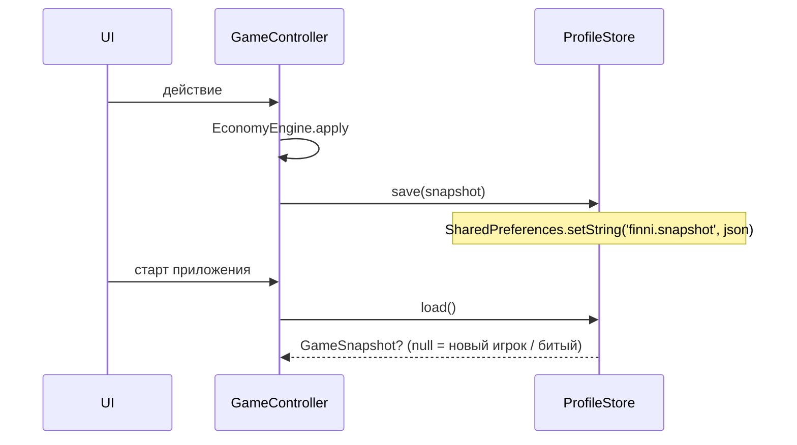

# Профиль и локальное хранение — системная спецификация (SA)

| Поле | Значение |
|------|----------|
| **ID** | F-005 |
| **Назначение** | Снимок игры переживает перезапуск; сброс тестового профиля |
| **Репозиторий** | `Pet_Finni_hackathon` |
| **Источник** | ТЗ Приложение А п. 11–12; SA F-001 UC-10, UC-11, S-06, S-07; BR-08 (без ПДн) |
| **Статус** | Согласовано Егором 2026-09-24 |
| **Участники** | Егор |
| **Связанные артефакты** | F-002, F-006 (контроллер пишет снимок), F-016 (сброс из раздела взрослого) |

---

## 1. Контекст

Домен и контент живут в памяти. После закрытия приложения прогресс теряется, а ТЗ проверяет перезапуск (А.11) и сброс (А.12).

## 2. Цель

Один JSON-снимок в `shared_preferences`: запись после каждого действия, чтение на старте, удаление при сбросе. Битый снимок не роняет приложение.

## 3. Бизнес-требования

| ID | Требование | Приоритет |
|----|------------|-----------|
| BR-01 | Сохраняются: профиль, экономика, инвентарь, цель, день, прогресс заданий и игр, итог прошлого дня, настройки | Must |
| BR-02 | Только игровые имена; без ПДн, без сети, без permissions | Must |
| BR-03 | Сброс удаляет всё, следующий старт = чистая установка | Must |
| BR-04 | Битый или старый по версии снимок → мягкий старт с нуля | Must |
| BR-05 | Домен не знает о JSON: кодек живёт в `store/` | Must |

## 4. Описание

### 4.1 AS-IS

Нет хранения.

### 4.2 TO-BE

`GameSnapshot` (иммутабельный) + `ProfileStore` (интерфейс) с двумя реализациями: `SharedPrefsProfileStore` (прод) и `MemoryProfileStore` (тесты).

### 4.3 Поток



### 4.4 Затронутые компоненты

| Слой | Путь |
|------|------|
| Модели снимка | `client/lib/store/snapshot.dart` |
| Кодек домена | `client/lib/store/economy_codec.dart` |
| Хранилище | `client/lib/store/profile_store.dart` |
| Тесты | `client/test/store/store_test.dart` |

## 5. Сценарии

| UC | Актор | Цель | Предусловия |
|----|-------|------|-------------|
| UC-01 | Любой | Перезапуск без потерь | Был прогресс |
| UC-02 | Взрослый | Сброс | Прошёл барьер F-016 |
| UC-03 | Система | Пережить битый снимок | Строка не JSON / другая версия |

## 6. Матрица исходов

### Success (S)

| ID | Условие | Результат |
|----|---------|-----------|
| S-01 | save → load | Снимок равен исходному по всем полям (round-trip) |
| S-02 | clear → load | `null` |
| S-03 | Первый запуск | `null` → онбординг |

### Exception (E)

| ID | Условие | Поведение |
|----|---------|-----------|
| E-01 | Строка не JSON | `load()` → `null`, ключ удалён |
| E-02 | `version` ≠ 1 | `load()` → `null`, ключ удалён |
| E-03 | Отсутствует поле | `load()` → `null`, ключ удалён |

## 7. NFR

| ID | Категория | Требование |
|----|-----------|------------|
| NFR-01 | Perf | save ≤ 50 мс (снимок < 5 КБ) |
| NFR-02 | Privacy | Нет ФИО, телефона, email, геолокации |
| NFR-03 | Offline | Только локально |

## 8. API и контракты

### 8.1 Dart API

```dart
final class Profile { final String playerName; final String petName; final String lookId; }

final class Inventory {
  final Set<String> owned;      // купленные постоянные want (hero/room), id товаров
  final Set<String> worn;       // надетые hero-налепки ⊆ owned
  final Set<String> goalsDone;  // id полученных целей
  final String? skin;           // 'monkey' | null
  final int rooms;              // 1 | 2
  final String? furniture;      // sofa|shelf|tv|console | null
  static const empty;
  Inventory copyWith({...});
}

final class DaySummary {
  final int day; final int planNeed, planWant, planSave;
  final int spentNeed, spentWant, saved;
  final PetMood mood; final int stageBefore, stageAfter; final bool good; final int goodPeriods;
  bool get grew => stageAfter > stageBefore;
}

final class GameSnapshot {
  static const version = 1;
  final Profile profile; final EconomyState economy; final Inventory inventory;
  final String? goalId; final String? goalOption; final int day;
  final List<String> boughtToday;     // id товаров, купленных сегодня (чеклист нужного, шоколадка)
  final bool questDoneToday; final bool gameRewardToday;
  final List<String> questsDone;      // id заданий за всё время (учебный прогресс)
  final Map<String, int> gameBest;    // лучший результат по мини-играм
  final DaySummary? lastSummary; final bool soundOn;
  Map<String, dynamic> toJson();
  factory GameSnapshot.fromJson(Map<String, dynamic> j); // FormatException при несовпадении версии
  GameSnapshot copyWith({...});
}

abstract interface class ProfileStore {
  Future<GameSnapshot?> load();
  Future<void> save(GameSnapshot snapshot);
  Future<void> clear();
}
final class SharedPrefsProfileStore implements ProfileStore { static const key = 'finni.snapshot'; }
final class MemoryProfileStore implements ProfileStore { String? raw; }

abstract final class EconomyCodec {
  static Map<String, dynamic> encode(EconomyState s);
  static EconomyState decode(Map<String, dynamic> j);
}
```

### 8.2 JSON снимка (v1)

```json
{
  "version": 1,
  "profile": {"playerName": "Аня", "petName": "Финни", "lookId": "sun_tuft"},
  "economy": {"available": 12, "savings": 20, "plan": {"need": 16, "want": 4, "save": 10},
              "spentNeed": 16, "spentWant": 0, "savedThisPeriod": 10, "petMood": "glad",
              "petStage": 1, "goodPeriods": 1, "processedBuyIds": ["b1"], "pendingWithdraw": null,
              "lastCreditSourceId": "quest:q_budget_breakfast"},
  "inventory": {"owned": ["glasses"], "worn": ["glasses"], "goalsDone": [], "skin": null, "rooms": 1, "furniture": null},
  "goalId": "room2", "goalOption": null, "day": 2,
  "boughtToday": ["breakfast", "water"], "questDoneToday": true, "gameRewardToday": false,
  "questsDone": ["q_budget_breakfast"], "gameBest": {"sort": 9},
  "lastSummary": {"day": 1, "planNeed": 16, "planWant": 4, "planSave": 10, "spentNeed": 16, "spentWant": 0,
                  "saved": 10, "mood": "glad", "stageBefore": 1, "stageAfter": 1, "good": true, "goodPeriods": 1},
  "soundOn": true
}
```

## 9. Зависимости

| Зависимость | Тип |
|-------------|-----|
| `shared_preferences` (pub, BSD-3) | Блокер |
| `EconomyState` (домен) | Блокер, есть |

## 10. Открытые вопросы

Нет.
