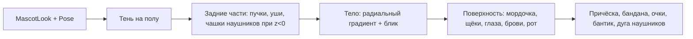

# 3D-маскот с анимациями — системная спецификация (SA)

| Поле | Значение |
|------|----------|
| **ID** | F-007 |
| **Назначение** | Живой 3D-герой: облик, настроение, стадия, налепки, анимации реакции |
| **Репозиторий** | `Pet_Finni_hackathon` |
| **Источник** | Design F-002 §1, §9.1; handoff §2.1–2.2 (две оси, слои внешности); запрос Егора 2026-09-24 «3D маскот с анимашками» |
| **Статус** | Согласовано Егором 2026-09-24 |
| **Участники** | Егор |
| **Связанные артефакты** | F-006 (настроение, стадия, инвентарь), F-008…F-016 (все экраны показывают героя) |

---

## 1. Контекст

ТЗ: питомец с ≥ 9 обликами, 3 стадиями, состоянием на главном экране. Handoff: жёлтый эмодзи-кружок своего арта; лицо = настроение; налепки want поверх базы; редкая база — цель копилки. Егор хочет настоящий 3D с анимациями.

## 2. Цель

Шар-герой рендерится как 3D-сфера: черты и налепки лежат на поверхности и корректно поворачиваются. 60 fps на среднем Android. Без 3D-движка, моделей и сторонних картинок.

## 3. Бизнес-требования

| ID | Требование | Приоритет |
|----|------------|-----------|
| BR-01 | Сфера с объёмным светом: градиент, блик, тень на полу | Must |
| BR-02 | Черты (глаза, рот, щёки, брови) — точки на сфере, поворот yaw/pitch | Must |
| BR-03 | 3 настроения: `glad` (улыбка, блеск глаз), `steady`, `uneasy` (грустные брови, рот вниз) | Must |
| BR-04 | 3 стадии: размер 0.8 / 0.9 / 1.0, пропорции глаз «малыш → взрослый» | Must |
| BR-05 | 3 оттенка × 3 причёски (хохолок, чёлка, пучки) = 9 обликов | Must |
| BR-06 | Облик «Обезьянка»: коричневый, мордочка, уши | Must |
| BR-07 | Налепки: бандана, очки, бантик, наушники — на сфере, с учётом поворота | Must |
| BR-08 | Idle: дыхание, покачивание, моргание раз в 2–5 с | Must |
| BR-09 | Вращение пальцем с пружинным возвратом; тап — прыжок | Must |
| BR-10 | Реакции по команде: `jump` (покупка/награда), `shake` (отказ), `dance` (рост стадии, цель) | Must |
| BR-11 | Статичный режим (без Ticker) для превью в карточках и тестов | Should |

## 4. Описание

### 4.1 AS-IS

Героя нет.

### 4.2 TO-BE

Чистая математика сферы (`sphere.dart`), painter (`mascot_painter.dart`), виджет с анимациями (`mascot_view.dart`).

### 4.3 Рендер кадра



Проекция точки (широта φ, долгота λ) на единичной сфере:

- `x = cos φ · sin λ`, `y = −sin φ`, `z = cos φ · cos λ`
- поворот yaw `a` вокруг Y: `x' = x cos a + z sin a`, `z' = −x sin a + z cos a`
- наклон pitch `b` вокруг X: `y'' = y cos b + z' sin b`, `z'' = −y sin b + z' cos b` (b > 0 — кивок вниз)
- экран: `center + (x', y'') · R`; точка видима при `z'' > 0`

### 4.4 Затронутые компоненты

| Слой | Путь |
|------|------|
| Математика | `client/lib/ui/mascot/sphere.dart` |
| Облик и поза | `client/lib/ui/mascot/mascot_look.dart` |
| Отрисовка | `client/lib/ui/mascot/mascot_painter.dart` |
| Виджет и анимации | `client/lib/ui/mascot/mascot_view.dart` |
| Тесты | `client/test/ui/mascot_test.dart` |

## 5. Сценарии

| UC | Актор | Цель | Предусловия |
|----|-------|------|-------------|
| UC-01 | Ребёнок | Увидеть героя на главном экране | Профиль есть |
| UC-02 | Ребёнок | Покрутить героя пальцем | — |
| UC-03 | Ребёнок | Увидеть реакцию на покупку / отказ / рост | Действие в F-011, F-014, F-015 |
| UC-04 | Ребёнок | Выбрать облик при создании | F-008 |

## 6. Матрица исходов

### Success (S)

| ID | Условие | Результат |
|----|---------|-----------|
| S-01 | yaw = 0 | Точка λ = 0 в центре, видима |
| S-02 | yaw = π/2 | Лицо ушло вбок, точка λ = 0 на краю (z ≈ 0) |
| S-03 | Точка на обратной стороне | Не рисуется |
| S-04 | Любой облик × настроение × стадия × набор налепок | Рисуется без исключений |
| S-05 | `controller.jump()` | Прыжок 600 мс с squash & stretch |

### Exception (E)

| ID | Условие | Поведение |
|----|---------|-----------|
| E-01 | Неизвестная причёска / налепка | Пропускается |
| E-02 | Размер виджета 0 | Ничего не рисуется, без падения |

## 7. NFR

| ID | Категория | Требование |
|----|-----------|------------|
| NFR-01 | Perf | Кадр ≤ 4 мс на painter; перерисовка только самого героя (`RepaintBoundary`) |
| NFR-02 | Legal | 100% код, без ассетов |
| NFR-03 | Ethics | Грусть мягкая: без слёз, болезни, «умирания» |
| NFR-04 | A11y | `Semantics` с именем, настроением и стадией |

## 8. API и контракты

```dart
// sphere.dart
final class SpherePose { final double yaw, pitch; const SpherePose(this.yaw, this.pitch); }
final class Projected { final Offset offset; final double z; bool get visible => z > 0; }
Projected projectLatLon(double lat, double lon, SpherePose pose, Offset center, double radius, {double lift = 1});
Projected projectVector(double x, double y, double z, SpherePose pose, Offset center, double radius);

// mascot_look.dart
final class MascotLook {
  final Color color; final String hair; final String? skin;   // 'monkey'
  final Set<String> accessories;                              // bandana|glasses|bow|headphones
  final PetMood mood; final int stage;
  factory MascotLook.fromGame(GameController game);
  factory MascotLook.fromLook(Look look, {PetMood mood, int stage, Set<String> accessories, String? skin});
  double get scale; // 0.8 / 0.9 / 1.0
}

// mascot_painter.dart
final class MascotPainter extends CustomPainter {
  MascotPainter({required MascotLook look, required SpherePose pose, double blink = 0, double hop = 0, double squash = 0});
}

// mascot_view.dart
final class MascotController extends ChangeNotifier { void jump(); void shake(); void dance(); }
final class MascotView extends StatefulWidget {
  const MascotView({required MascotLook look, MascotController? controller, double size = 240,
    bool interactive = true, bool animated = true, String? semanticsLabel});
}
```

## 9. Зависимости

| Зависимость | Тип |
|-------------|-----|
| F-006 `mood`, `stage`, `inventory.worn`, `inventory.skin` | Блокер, готово |
| F-004 `Look` | Блокер, готово |

## 10. Открытые вопросы

| # | Вопрос | Владелец | Статус |
|---|--------|----------|--------|
| 1 | Нужны ли ручки/ножки? | Егор | Ножки есть, ручки — после сдачи 29.09 |
