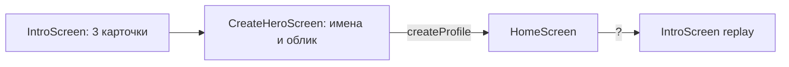

# Знакомство и создание героя — системная спецификация (SA)

| Поле | Значение |
|------|----------|
| **ID** | F-008 |
| **Назначение** | Первый запуск: три типа решений, имена, облик героя |
| **Репозиторий** | `Pet_Finni_hackathon` |
| **Источник** | ТЗ Приложение А п. 1–3; SA F-001 UC-01; handoff §2.2 |
| **Статус** | Согласовано Егором 2026-09-24 |
| **Участники** | Егор |
| **Связанные артефакты** | F-006 `createProfile`, F-007 маскот, F-016 (подсказка из дома) |

---

## 1. Контекст

Ребёнок должен до первой траты понять три корзины и создать «своего» героя. ТЗ: гостевой профиль, игровое имя без ПДн, ≥ 9 обликов, подсказка доступна снова.

## 2. Цель

За ≤ 60 секунд от установки до дома: 3 карточки знакомства → имя игрока → имя героя → облик (живое 3D-превью) → «Поехали!».

## 3. Бизнес-требования

| ID | Требование | Приоритет |
|----|------------|-----------|
| BR-01 | 3 карточки: Нужное / Хочу / Отложить, у каждой иконка, цвет и пример | Must |
| BR-02 | Имя игрока 1–16 символов, подсказка «не пиши настоящую фамилию» | Must |
| BR-03 | Имя героя 1–16 символов, по умолчанию «Финни» | Must |
| BR-04 | Выбор оттенка (3) и причёски (3) с живым 3D-превью | Must |
| BR-05 | Кнопка «Поехали!» создаёт профиль (старт 40 + 20) и ведёт на план дня | Must |
| BR-06 | Карточки знакомства открываются снова с дома (кнопка «?») | Must |

## 4. Описание

### 4.3 Поток



### 4.4 Затронутые компоненты

| Слой | Путь |
|------|------|
| Экраны | `client/lib/ui/screens/intro_screen.dart`, `create_hero_screen.dart` |
| Тесты | `client/test/ui/app_flow_test.dart` |

## 5. Сценарии

| UC | Актор | Цель | Предусловия |
|----|-------|------|-------------|
| UC-01 | Ребёнок | Пройти знакомство | Первый запуск |
| UC-02 | Ребёнок | Создать героя | После знакомства |
| UC-03 | Ребёнок | Перечитать подсказку | Дом, кнопка «?» |

## 6. Матрица исходов

### Success (S)

| ID | Условие | Результат |
|----|---------|-----------|
| S-01 | Имена заполнены, облик выбран | Профиль создан, дом, 60 монет |
| S-02 | Смена оттенка/причёски | Превью обновляется мгновенно |

### Exception (E)

| ID | Условие | Поведение |
|----|---------|-----------|
| E-01 | Пустое имя | «Поехали!» неактивна, подсказка под полем |
| E-02 | Имя > 16 | Ввод ограничен `maxLength` |

## 7. NFR

| ID | Категория | Требование |
|----|-----------|------------|
| NFR-01 | Privacy | Только игровые имена; хранятся локально |
| NFR-02 | UX | Текст ≥ 16 sp, кнопки ≥ 48 dp |

## 8. API и контракты

```dart
class IntroScreen extends StatefulWidget { const IntroScreen({required VoidCallback onDone, bool replay = false}); }
class CreateHeroScreen extends StatefulWidget { const CreateHeroScreen({required GameController game}); }
// → game.createProfile(playerName:, petName:, lookId: '${tone}_${hair}')
```

Ключи виджетов для тестов: `intro.next`, `hero.player`, `hero.pet`, `hero.tone.<id>`, `hero.hair.<id>`, `hero.go`.

## 9. Зависимости

F-006, F-007 — готово.

## 10. Открытые вопросы

Нет.
