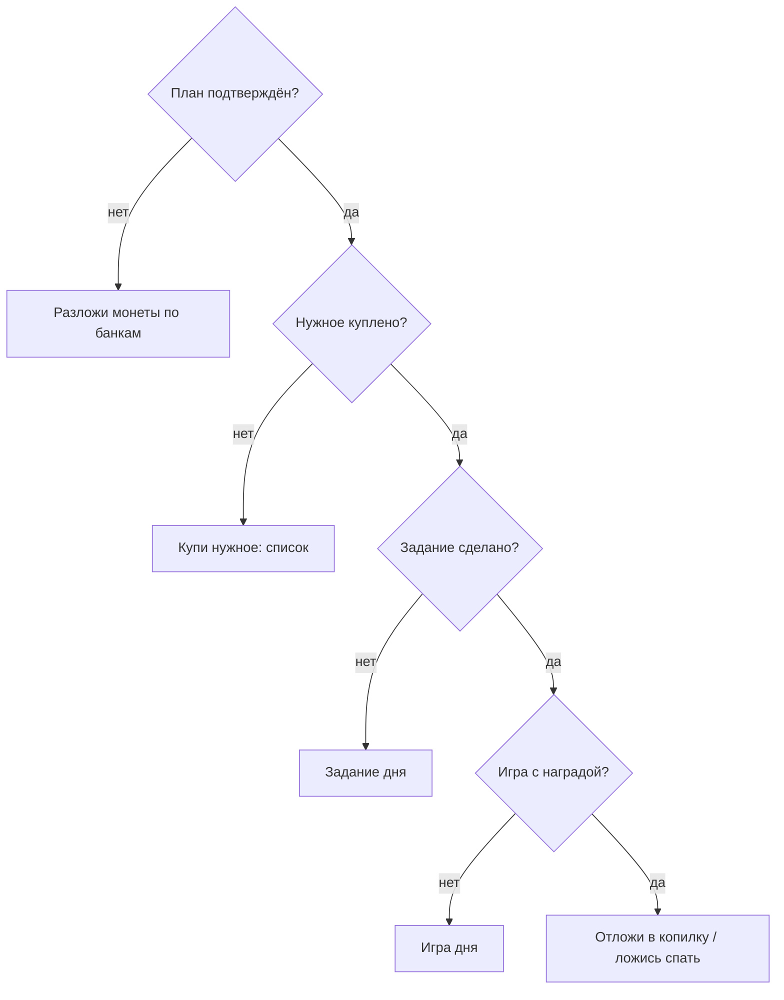

# Дом: комната, герой, приборная панель дня — системная спецификация (SA)

| Поле | Значение |
|------|----------|
| **ID** | F-009 |
| **Назначение** | Главный экран: комната с героем и вещами, баланс, копилка, цель, дела дня |
| **Репозиторий** | `Pet_Finni_hackathon` |
| **Источник** | ТЗ 2.5.3 (главный экран), Приложение А п. 4, 10; handoff §2.6 |
| **Статус** | Согласовано Егором 2026-09-24 |
| **Участники** | Егор |
| **Связанные артефакты** | F-006, F-007, F-010…F-016 |


> **Актуальность (2026-09-24).** Дом — вкладка `ui/tabs/home_tab.dart` с 3D-комнатой (F-019), облачком желаний героя вместо карточки следующего шага (F-020) и пятью разделами Нужное · Хотелки · Одежда · Дом · Копилка (F-022). `home_screen.dart` и 2D-комната удалены.

---

## 1. Контекст

ТЗ: на главном — питомец, баланс, накопления, цель, состояние, активное задание, без сложной навигации. Handoff: одна комната-студия; want-мебель в слотах; need на столе; вторая комната и крупная мебель — цели.

## 2. Цель

За 3 секунды видно: кто мой герой и как он себя чувствует, сколько монет, как далеко цель и что сделать дальше.

## 3. Бизнес-требования

| ID | Требование | Приоритет |
|----|------------|-----------|
| BR-01 | Комната (painter): стена, окно, пол, стол с купленным нужным дня | Must |
| BR-02 | Слоты want: ночник, коврик, постер с героем; крупная мебель (диван/полка/ТВ/приставка) | Must |
| BR-03 | Вторая комната (цель): дверь и вкладка «Игровая» с отдельным фоном | Must |
| BR-04 | 3D-герой в центре; подпись: имя, настроение словом, стадия текстом | Must |
| BR-05 | Верхняя панель: кошелёк, копилка, день N | Must |
| BR-06 | Карточка «Дела дня» — следующий шаг: план → нужное → задание → игра → копилка → спать | Must |
| BR-07 | Меню-кнопки: План, Магазин, Задание, Игры, Копилка, Спать; вторично: Словарик, «?», Взрослым | Must |
| BR-08 | Лицо и тексты объясняют настроение (почему грустит / радуется) | Must |
| BR-09 | После 5 дней — плашка «Демо пройдено» | Should |

## 4. Описание

### 4.3 Поток «Дела дня»



### 4.4 Затронутые компоненты

| Слой | Путь |
|------|------|
| Экран | `client/lib/ui/screens/home_screen.dart` |
| Комната | `client/lib/ui/widgets/room_view.dart` |
| Панели | `client/lib/ui/widgets/common.dart` |

## 5. Сценарии

| UC | Актор | Цель | Предусловия |
|----|-------|------|-------------|
| UC-01 | Ребёнок | Понять состояние и следующий шаг | Профиль есть |
| UC-02 | Ребёнок | Увидеть купленные вещи в комнате | Покупка room-товара |
| UC-03 | Ребёнок | Перейти во вторую комнату | Цель «Вторая комната» получена |

## 6. Матрица исходов

### Success (S)

| ID | Условие | Результат |
|----|---------|-----------|
| S-01 | Нет плана | Дела дня: «Разложи монеты» + кнопка |
| S-02 | Куплен ночник | Ночник на столе светится |
| S-03 | Цель «мебель: ТВ» получена | ТВ в комнате |
| S-04 | rooms = 2 | Переключатель «Спальня / Игровая» |

### Exception (E)

| ID | Условие | Поведение |
|----|---------|-----------|
| E-01 | Узкий экран 360 dp | Панели переносятся, без переполнения |

## 7. NFR

| ID | Категория | Требование |
|----|-----------|------------|
| NFR-01 | Layout | Портрет, от 360 dp, без горизонтального скролла |
| NFR-02 | A11y | Цвет не единственный сигнал: иконка + подпись |

## 8. API и контракты

```dart
class HomeScreen extends StatefulWidget { const HomeScreen({required GameController game}); }
class RoomView extends StatelessWidget {
  const RoomView({required Inventory inventory, required List<String> tableItems, required int room, required Widget hero, required Look posterLook});
}
enum DayStep { plan, needs, quest, game, save }
DayStep nextStep(GameController g);
```

Ключи: `home.plan`, `home.shop`, `home.quest`, `home.games`, `home.savings`, `home.sleep`, `home.help`, `home.glossary`, `home.adult`, `home.next`.

## 9. Зависимости

F-006, F-007.

## 10. Открытые вопросы

Нет.
