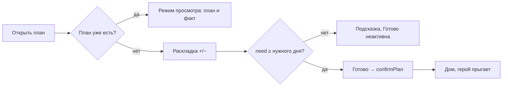

# План дня: три банки — системная спецификация (SA)

| Поле | Значение |
|------|----------|
| **ID** | F-010 |
| **Назначение** | Распределение монет по трём корзинам до трат |
| **Репозиторий** | `Pet_Finni_hackathon` |
| **Источник** | ТЗ 2.5.4, Приложение А п. 5; SA F-001 UC-02, E-01; design F-002 §1.2 |
| **Статус** | Согласовано Егором 2026-09-24 |
| **Участники** | Егор |
| **Связанные артефакты** | F-006 `confirmPlan`, F-015 (план vs факт) |

---

## 1. Контекст

План — первая из трёх связанных механик ТЗ. Форма с цифрами скучна и абстрактна для 7–11 лет. Банки с падающими монетами делают распределение физическим.

## 2. Цель

Ребёнок раскладывает все или часть монет по банкам «Нужное / Хочу / Отложить», видит остаток и подтверждает. Перерасход невозможен, «Нужное» не меньше списка дня.

## 3. Бизнес-требования

| ID | Требование | Приоритет |
|----|------------|-----------|
| BR-01 | Три стеклянные банки с уровнем монет, подписью, иконкой и суммой | Must |
| BR-02 | Кнопки −/+ (шаг 1) и −5/+5 (долгое нажатие = +5) | Must |
| BR-03 | Остаток сверху, анимация монеты, падающей в банку | Must |
| BR-04 | + при остатке 0 — банка «отскакивает», подсказка «монеты кончились» | Must |
| BR-05 | Под банкой «Нужное» — список нужного дня и сумма, отметка «хватает» | Must |
| BR-06 | «Подсказать» раскладывает: нужное = сумма дня, отложить = треть остатка, хочу = остаток | Should |
| BR-07 | «Готово» → `confirmPlan`; ошибки показываются текстом | Must |
| BR-08 | После подтверждения план виден только для чтения до конца дня | Must |

## 4. Описание

### 4.3 Поток



### 4.4 Затронутые компоненты

| Слой | Путь |
|------|------|
| Экран | `client/lib/ui/screens/plan_screen.dart` |
| Банка | `client/lib/ui/widgets/jar_view.dart` |

## 5. Сценарии

| UC | Актор | Цель | Предусловия |
|----|-------|------|-------------|
| UC-01 | Ребёнок | Разложить монеты | План не подтверждён |
| UC-02 | Ребёнок | Посмотреть план днём | План подтверждён |

## 6. Матрица исходов

### Success (S)

| ID | Условие | Результат |
|----|---------|-----------|
| S-01 | need ≥ N, total ≤ available | План принят, возврат домой |
| S-02 | «Подсказать» | Корректная раскладка, можно править |

### Exception (E)

| ID | Условие | Поведение |
|----|---------|-----------|
| E-01 | + при остатке 0 | Ничего не меняется, «Монеты кончились» |
| E-02 | need < суммы дня | «Готово» неактивна, текст «Положи в Нужное хотя бы N» |

## 7. NFR

| ID | Категория | Требование |
|----|-----------|------------|
| NFR-01 | UX | Кнопки 56 dp, числа 22 sp |
| NFR-02 | A11y | Банки подписаны словами, не только цветом |

## 8. API и контракты

```dart
class PlanScreen extends StatefulWidget { const PlanScreen({required GameController game}); }
class JarView extends StatelessWidget {
  const JarView({required String title, required String emoji, required Color color, required int coins, required int capacity, double height = 150});
}
```

Ключи: `plan.<need|want|save>.plus`, `plan.<…>.minus`, `plan.suggest`, `plan.done`, `plan.left`.

## 9. Зависимости

F-006.

## 10. Открытые вопросы

Нет.
