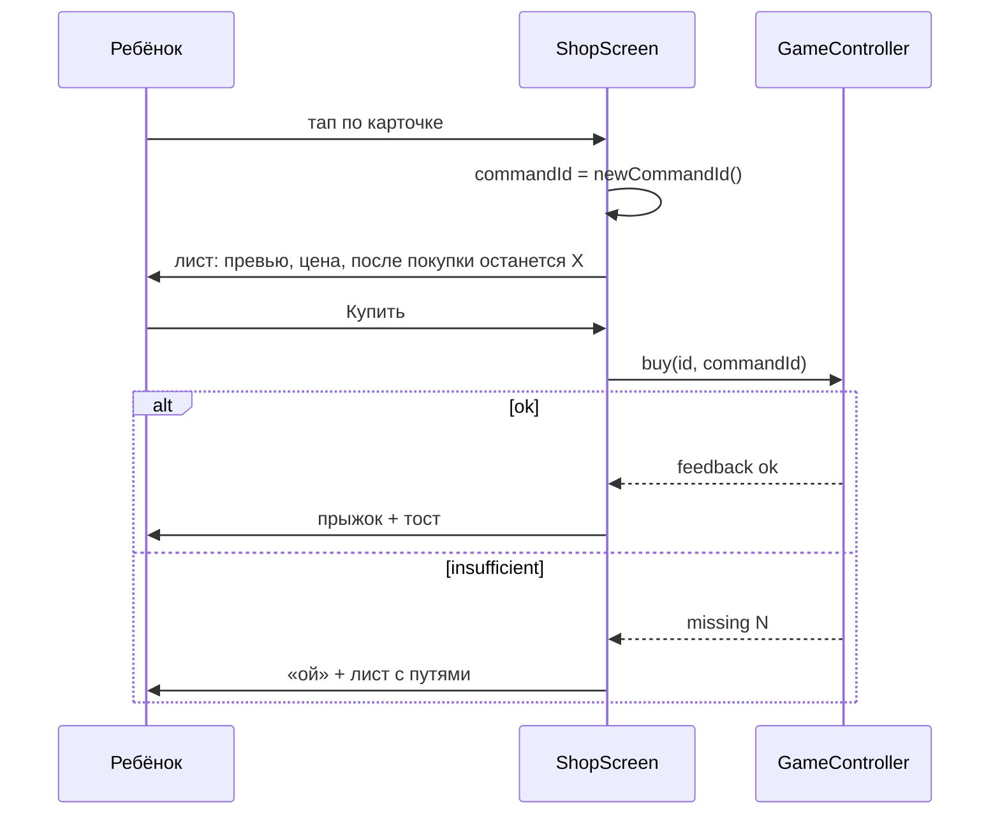

# Магазин и гардероб — системная спецификация (SA)

| Поле | Значение |
|------|----------|
| **ID** | F-011 |
| **Назначение** | Покупка нужного и хотелок, отказ при нехватке, примерка налепок |
| **Репозиторий** | `Pet_Finni_hackathon` |
| **Источник** | ТЗ 2.5.5, Приложение А п. 7; SA F-001 UC-03, UC-04, E-02; handoff §2.3 |
| **Статус** | Согласовано Егором 2026-09-24 |
| **Участники** | Егор |
| **Связанные артефакты** | F-006 `buy`, `toggleWear`; F-007 реакции героя |


> **Актуальность (2026-09-24).** Общий магазин и вкладка «Магазин» убраны: покупки разнесены по разделам Нужное, Хотелки, Одежда, Дом (F-022). Хотелки закрыты, пока не куплено нужное (F-021). Шторка покупки и отказ «не хватает N» сохранены.

---

## 1. Контекст

ТЗ: ≥ 8 позиций двух типов, цена, категория, влияние на питомца, подтверждение, нельзя уйти в минус, отказ с объяснением.

## 2. Цель

Витрина с вкладками «Нужное», «Хочу» и «Гардероб». Карточка → лист подтверждения с превью эффекта → покупка → анимация героя и понятное сообщение. При нехватке — «не хватает N» и три пути.

## 3. Бизнес-требования

| ID | Требование | Приоритет |
|----|------------|-----------|
| BR-01 | Вкладка «Нужное»: только список дня, чеклист «куплено» | Must |
| BR-02 | Вкладка «Хочу»: все want, отметка «уже есть» | Must |
| BR-03 | Карточка: эмодзи, название, цена, тип словом, эффект на героя | Must |
| BR-04 | Лист подтверждения: для налепки — 3D-превью героя в ней; кошелёк до/после | Must |
| BR-05 | Успех: герой прыгает, тост с объяснением | Must |
| BR-06 | Нехватка: герой «ой», лист «Не хватает N» + «Задание», «Игры», «Выбрать другое» | Must |
| BR-07 | До плана: кнопка ведёт в план | Must |
| BR-08 | Гардероб: купленные налепки, надеть/снять бесплатно, превью | Must |
| BR-09 | Защита от двойного тапа: один `commandId` на открытие листа | Must |

## 4. Описание

### 4.3 Поток покупки



### 4.4 Затронутые компоненты

| Слой | Путь |
|------|------|
| Экран | `client/lib/ui/screens/shop_screen.dart` |

## 5. Сценарии

| UC | Актор | Цель | Предусловия |
|----|-------|------|-------------|
| UC-01 | Ребёнок | Купить нужное | План есть |
| UC-02 | Ребёнок | Купить хотелку | План есть, монет хватает |
| UC-03 | Ребёнок | Получить отказ | Монет мало |
| UC-04 | Ребёнок | Переодеть героя | Налепка куплена |

## 6. Матрица исходов

### Success (S)

| ID | Условие | Результат |
|----|---------|-----------|
| S-01 | Покупка нужного | Галочка в чеклисте, баланс − |
| S-02 | Покупка налепки | Налепка на герое, в гардеробе |
| S-03 | Снять налепку | Герой без неё, покупка сохраняется |

### Exception (E)

| ID | Условие | Поведение |
|----|---------|-----------|
| E-01 | Нехватка | Нет списания, «не хватает N», 3 пути |
| E-02 | Нет плана | «Сначала план» + кнопка |
| E-03 | Уже есть | Кнопка «Уже есть», неактивна |
| E-04 | Нужное уже куплено сегодня | «Куплено ✓» |

## 7. NFR

| ID | Категория | Требование |
|----|-----------|------------|
| NFR-01 | Perf | Отклик покупки ≤ 1 с |
| NFR-02 | Ethics | Нет таймеров, «скидок», давления |

## 8. API и контракты

```dart
class ShopScreen extends StatefulWidget { const ShopScreen({required GameController game, int initialTab = 0}); }
Future<void> showBuySheet(BuildContext context, GameController game, ShopItem item, MascotController mascot);
```

Ключи: `shop.item.<id>`, `shop.buy`, `shop.tab.<need|want|wardrobe>`, `wardrobe.<id>`.

## 9. Зависимости

F-006, F-007.

## 10. Открытые вопросы

Нет.
