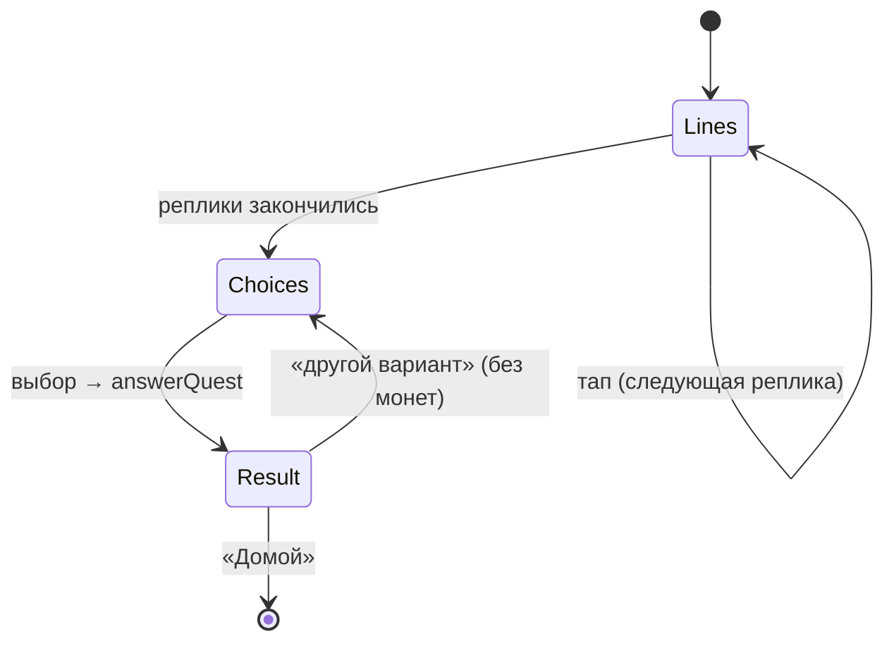

# Задания-сцены — системная спецификация (SA)

| Поле | Значение |
|------|----------|
| **ID** | F-012 |
| **Назначение** | Ежедневная сцена с выбором, начисление монет, объяснение |
| **Репозиторий** | `Pet_Finni_hackathon` |
| **Источник** | ТЗ 2.5.8, 2.6; Приложение А п. 6; Q&A жюри «задание даёт монеты»; SA F-001 UC-05, UC-09 |
| **Статус** | Согласовано Егором 2026-09-24 |
| **Участники** | Егор |
| **Связанные артефакты** | F-004 `quests.json`, F-006 `answerQuest` |

---

## 1. Контекст

ТЗ штрафует «только тест». Нужна ситуация с героями и выбором, где любой выбор объясняется, а прогресс не обнуляется.

## 2. Цель

Комикс-сцена: реплики появляются по тапу (пузыри от героя, подруги, продавца), затем 2–3 выбора. После выбора — монеты летят в кошелёк, герой реагирует, объяснение «почему».

## 3. Бизнес-требования

| ID | Требование | Приоритет |
|----|------------|-----------|
| BR-01 | Реплики по одной, аватар говорящего (герой — 3D, остальные — эмодзи) | Must |
| BR-02 | Выборы — большие кнопки, без пометки «правильно» до выбора | Must |
| BR-03 | После выбора: +N с источником «Задание: <название>», объяснение | Must |
| BR-04 | Мудрый выбор — герой прыгает; слабый — задумывается, но монеты есть | Must |
| BR-05 | «Попробовать другой вариант» — посмотреть другие объяснения без новых монет | Must |
| BR-06 | Тема задания подписана: Бюджет / Копилка / Покупки | Must |
| BR-07 | Список всех заданий с отметками пройденных (учебный прогресс) | Should |

## 4. Описание

### 4.3 Поток



### 4.4 Затронутые компоненты

| Слой | Путь |
|------|------|
| Экран | `client/lib/ui/screens/quest_screen.dart` |

## 5. Сценарии

| UC | Актор | Цель | Предусловия |
|----|-------|------|-------------|
| UC-01 | Ребёнок | Пройти задание дня | — |
| UC-02 | Ребёнок | Посмотреть другой вариант | Задание сделано |

## 6. Матрица исходов

### Success (S)

| ID | Условие | Результат |
|----|---------|-----------|
| S-01 | Мудрый выбор | +12, прыжок, объяснение |
| S-02 | Слабый выбор | +6, объяснение и совет |
| S-03 | Повтор | 0 монет, «Монеты за сегодня уже получены», объяснение |

### Exception (E)

| ID | Условие | Поведение |
|----|---------|-----------|
| E-01 | Контент задания без реплик | Не пройдёт валидацию F-004 |

## 7. NFR

| ID | Категория | Требование |
|----|-----------|------------|
| NFR-01 | Content | Реплика ≤ 140 символов, без стыда |
| NFR-02 | UX | Весь экран тапается для продолжения |

## 8. API и контракты

```dart
class QuestScreen extends StatefulWidget { const QuestScreen({required GameController game}); }
```

Ключи: `quest.tap`, `quest.choice.<i>`, `quest.home`, `quest.retry`.

Говорящие: `narrator` 📖, `pet` 3D-герой, `friend` 👧, `seller` 🧑‍🍳.

## 9. Зависимости

F-004, F-006, F-007.

## 10. Открытые вопросы

Нет.
