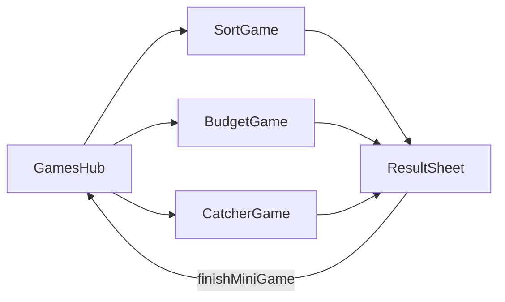

# Мини-игры: игротека — системная спецификация (SA)

| Поле | Значение |
|------|----------|
| **ID** | F-013 |
| **Назначение** | Три аркадные игры, которые учат финграмотности и приносят монеты раз в день |
| **Репозиторий** | `Pet_Finni_hackathon` |
| **Источник** | Design F-002 §9.2; запрос Егора 2026-09-24 «игры, чтобы было интересно»; рамка компетенций п. 1–4 |
| **Статус** | Согласовано Егором 2026-09-24 |
| **Участники** | Егор |
| **Связанные артефакты** | F-004 `minigames.json`, F-006 `finishMiniGame` |

---

## 1. Контекст

Задание-сцена учит через историю, но детям нужно ещё и поиграть руками. Каждая игра отрабатывает одну компетенцию и даёт монеты, не раздувая экономику: награда один раз в день.

## 2. Цель

Игротека из трёх игр. Каждая: правила в одну строку → игра 30–60 с → итог со счётом, лучшим результатом, объяснением ошибок и наградой.

## 3. Бизнес-требования

| ID | Требование | Приоритет |
|----|------------|-----------|
| BR-01 | Хаб: 3 карточки, «чему учит», лучший результат, отметка награды дня | Must |
| BR-02 | «Нужно или хочу?»: 10 случайных карточек, тап «Нужно»/«Хочу», таймер 40 с; победа ≥ 8 | Must |
| BR-03 | После сортировки — список ошибок с объяснением `why` | Must |
| BR-04 | «Уложись в бюджет»: задача дня, тап по товарам, итог и остаток; победа = все need и сумма ≤ бюджета | Must |
| BR-05 | В бюджете — подсказка после неудачной попытки, первая удачная попытка = победа | Must |
| BR-06 | «Копилка-ловец»: банка внизу ведётся пальцем, падают монеты (1 и 5) и соблазны (−3 из банки); 30 с; победа ≥ target | Must |
| BR-07 | В ловце при пойманном соблазне — всплывашка «Хотелка съела 3 монеты» | Must |
| BR-08 | Итог игры → `finishMiniGame(gameId, win, score)`; награда 12/6 раз в день | Must |
| BR-09 | Пауза при уходе со страницы, без фоновых таймеров | Must |

## 4. Описание

### 4.3 Игровые циклы



Физика ловца: предметы спавнятся каждые 0.45–0.8 с, скорость 160–320 px/с, коллизия — пересечение с прямоугольником банки. Цикл — `Ticker`, состояние в `CatcherModel` (тестируется без UI).

### 4.4 Затронутые компоненты

| Слой | Путь |
|------|------|
| Хаб | `client/lib/ui/games/games_hub.dart` |
| Игры | `client/lib/ui/games/sort_game.dart`, `budget_game.dart`, `catcher_game.dart` |
| Модели | `client/lib/game/minigames.dart` (чистая логика: сортировка, проверка корзины, физика ловца) |
| Тесты | `client/test/game/minigames_test.dart` |

## 5. Сценарии

| UC | Актор | Цель | Предусловия |
|----|-------|------|-------------|
| UC-01 | Ребёнок | Сыграть и получить награду | Награда дня не получена |
| UC-02 | Ребёнок | Потренироваться | Награда получена |
| UC-03 | Ребёнок | Разобрать ошибки | После сортировки |

## 6. Матрица исходов

### Success (S)

| ID | Условие | Результат |
|----|---------|-----------|
| S-01 | Сортировка 8+/10 | Победа, +12 |
| S-02 | Бюджет: все need, сумма ≤ бюджет | Победа, +12 (первая попытка) / +6 (после подсказки) |
| S-03 | Ловец ≥ target | Победа, +12 |
| S-04 | Проигрыш | +6 за старание (раз в день), совет |

### Exception (E)

| ID | Условие | Поведение |
|----|---------|-----------|
| E-01 | Бюджет: забыли need | «Не хватает нужного: …» |
| E-02 | Бюджет: перебор | «Перебор на N» |
| E-03 | Ловец: банка < 0 | Не опускается ниже 0 |
| E-04 | Повтор после награды | Счёт, лучший результат, без монет |

## 7. NFR

| ID | Категория | Требование |
|----|-----------|------------|
| NFR-01 | Perf | 60 fps в ловце на ≥ 3 ГБ RAM |
| NFR-02 | Ethics | Нет рекордов между игроками, лидербордов, лутбоксов |
| NFR-03 | UX | Кнопки 64 dp в сортировке |

## 8. API и контракты

```dart
// minigames.dart (чистая логика)
final class SortRound { SortRound(List<SortCard> deck, {int size = 10, Random? random});
  SortCard get current; bool get finished; int get score; List<SortCard> get mistakes;
  bool answer(ItemKind kind); bool get win; }            // win: score >= 8
final class BudgetCheck { final bool ok; final int total; final int over; final List<PuzzleItem> missingNeeds; }
BudgetCheck checkBasket(BudgetPuzzle p, Set<int> picked);
final class Falling { double x, y, speed; final int value; final String emoji; bool get isTemptation; }
final class CatcherModel { CatcherModel(CatcherConfig c, {Random? random});
  double jarX; int score; double timeLeft; List<Falling> items; bool get finished; bool get win;
  void tick(double dt, Size field); List<CatchEvent> takeEvents(); }

// UI
class GamesHub extends StatelessWidget { const GamesHub({required GameController game}); }
```

Id игр: `sort`, `budget`, `catcher`.

## 9. Зависимости

F-004, F-006.

## 10. Открытые вопросы

Нет.
