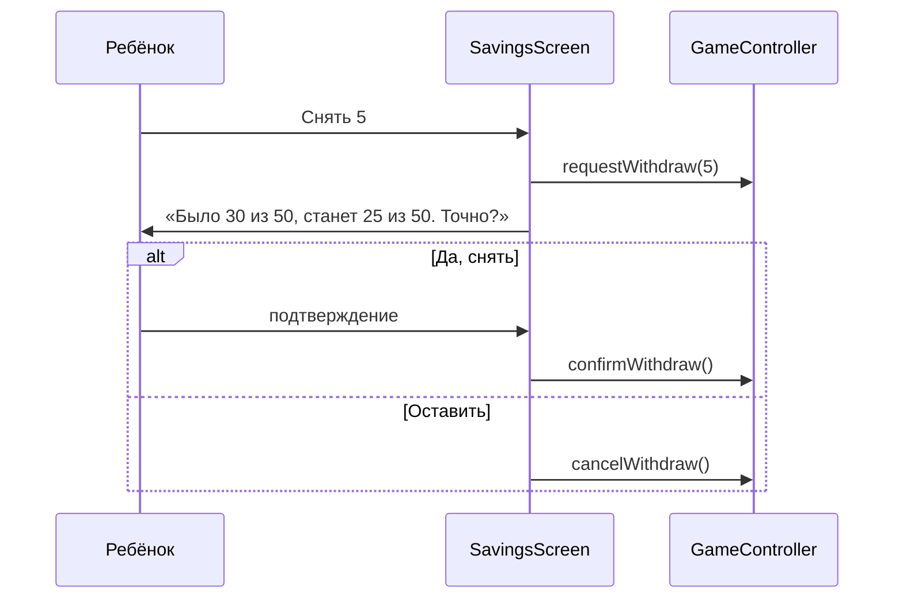

# Копилка и цели — системная спецификация (SA)

| Поле | Значение |
|------|----------|
| **ID** | F-014 |
| **Назначение** | Выбор цели, пополнение копилки, двухшаговое снятие, получение цели |
| **Репозиторий** | `Pet_Finni_hackathon` |
| **Источник** | ТЗ 2.5.6–2.5.7, Приложение А п. 8; SA F-001 UC-06, UC-07, E-03; handoff §2.6 |
| **Статус** | Согласовано Егором 2026-09-24 |
| **Участники** | Егор |
| **Связанные артефакты** | F-003 `RedeemGoal`, F-006 |


> **Актуальность (2026-09-24).** Цели: подарок другу 40, вторая комната 50, крупная мебель 50; облик-обезьянка больше не цель — открывается ростом (F-023). Перевод в копилку не может съесть деньги на нужное (F-021). Цели живут только в Копилке (F-022).

---

## 1. Контекст

Третья механика ТЗ — накопления на цель. Снятие должно показывать ущерб цели и требовать отдельного подтверждения.

## 2. Цель

Большая банка-копилка с картинкой цели над ней и шкалой «N из 50». Три цели на выбор. «Отложить» быстрыми суммами. Снятие — два шага с предупреждением. Цель достигнута — праздник и награда в доме.

## 3. Бизнес-требования

| ID | Требование | Приоритет |
|----|------------|-----------|
| BR-01 | 3 карточки целей: цена, описание, «получено» | Must |
| BR-02 | Мебель — выбор варианта (диван/полка/ТВ/приставка) | Must |
| BR-03 | Прогресс: банка + шкала + «осталось N» + «≈ K дней, если откладывать по 5» | Must |
| BR-04 | Отложить: +1, +5, +10, «всё, что в банке Отложить по плану» | Must |
| BR-05 | Снять: сумма → лист «Цель отодвинется: было X, станет Y» → «Да, снять» / «Оставить» | Must |
| BR-06 | «Забрать цель» при savings ≥ cost → `redeemGoal` → конфетти, танец героя | Must |
| BR-07 | Сменить цель можно, накопленное сохраняется | Must |

## 4. Описание

### 4.3 Поток снятия



### 4.4 Затронутые компоненты

| Слой | Путь |
|------|------|
| Экран | `client/lib/ui/screens/savings_screen.dart` |
| Праздник | `client/lib/ui/widgets/confetti.dart` |

## 5. Сценарии

| UC | Актор | Цель | Предусловия |
|----|-------|------|-------------|
| UC-01 | Ребёнок | Выбрать цель | Нет цели |
| UC-02 | Ребёнок | Отложить | Есть монеты в кошельке |
| UC-03 | Ребёнок | Снять | Есть накопления |
| UC-04 | Ребёнок | Забрать цель | savings ≥ cost |

## 6. Матрица исходов

### Success (S)

| ID | Условие | Результат |
|----|---------|-----------|
| S-01 | Отложить 5 | Банка +5, кошелёк −5 |
| S-02 | Снять с подтверждением | Копилка −, кошелёк + |
| S-03 | Забрать цель | Награда в доме, цель «получено» |

### Exception (E)

| ID | Условие | Поведение |
|----|---------|-----------|
| E-01 | Отложить больше, чем в кошельке | Кнопка неактивна / «не хватает N» |
| E-02 | «Оставить» | Копилка без изменений |
| E-03 | Забрать раньше времени | Кнопка неактивна, «осталось N» |

## 7. NFR

| ID | Категория | Требование |
|----|-----------|------------|
| NFR-01 | UX | Предупреждение о снятии — текстом и цифрами, не только цветом |

## 8. API и контракты

```dart
class SavingsScreen extends StatefulWidget { const SavingsScreen({required GameController game}); }
class ConfettiBurst extends StatefulWidget { const ConfettiBurst({required Widget child, required ConfettiController controller}); }
```

Ключи: `goal.<id>`, `goal.option.<id>`, `save.<amount>`, `withdraw.<amount>`, `withdraw.confirm`, `withdraw.keep`, `goal.redeem`.

## 9. Зависимости

F-003, F-006.

## 10. Открытые вопросы

Нет.
