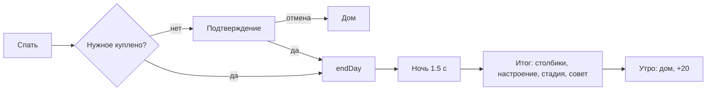

# Ночь: итог дня и рост — системная спецификация (SA)

| Поле | Значение |
|------|----------|
| **ID** | F-015 |
| **Назначение** | Закрытие периода: план vs факт, настроение, стадия, совет, утро |
| **Репозиторий** | `Pet_Finni_hackathon` |
| **Источник** | ТЗ 2.5.9–2.5.11, Приложение А п. 9–10; SA F-001 UC-08, S-05; handoff §2.1, §2.4 |
| **Статус** | Согласовано Егором 2026-09-24 |
| **Участники** | Егор |
| **Связанные артефакты** | F-006 `endDay`, `adviceFor`; F-007 `dance` |


> **Актуальность (2026-09-24).** На стадии 3 в итоге дня появляется «Открыт новый облик — Мартышка!» (F-023).

---

## 1. Контекст

ТЗ: обратная связь «что изменилось и почему», серия периодов → стадия, 5 периодов в демо без ожидания. Handoff: стадия — текст, не лицо; один срыв не откатывает стадию.

## 2. Цель

«Лечь спать» → ночная сцена со звёздами → карточка итога → утро с новым списком нужного и +20.

## 3. Бизнес-требования

| ID | Требование | Приоритет |
|----|------------|-----------|
| BR-01 | Подтверждение, если нужное не куплено: «{pet} ляжет голодным. Всё равно спать?» | Must |
| BR-02 | Ночь: тёмный фон, мерцающие звёзды, герой закрывает глаза | Must |
| BR-03 | План vs факт: 3 пары столбиков (Нужное, Хочу, Отложить) с числами | Must |
| BR-04 | Настроение дня словом + почему (`mood.*.why`) | Must |
| BR-05 | Лесенка стадий 1–3 с отметкой, счётчик хороших дней, условие «хорошего дня» | Must |
| BR-06 | Рост стадии: конфетти, танец героя, «{pet} вырос!» | Must |
| BR-07 | Совет на завтра (`adviceFor`) | Must |
| BR-08 | «Доброе утро» → дом, тост «+20 карманных» | Must |

## 4. Описание

### 4.3 Поток



### 4.4 Затронутые компоненты

| Слой | Путь |
|------|------|
| Экран | `client/lib/ui/screens/night_screen.dart` |
| Столбики | `client/lib/ui/widgets/plan_fact_bars.dart` |

## 5. Сценарии

| UC | Актор | Цель | Предусловия |
|----|-------|------|-------------|
| UC-01 | Ребёнок | Закончить день | — |
| UC-02 | Эксперт | 5 периодов подряд | Демо |

## 6. Матрица исходов

### Success (S)

| ID | Условие | Результат |
|----|---------|-----------|
| S-01 | Хороший день | «Хороший день ✓», счётчик + |
| S-02 | Рост | Конфетти, «вырос» |
| S-03 | Плохой день | Мягкий текст, совет, стадия не падает |

### Exception (E)

| ID | Условие | Поведение |
|----|---------|-----------|
| E-01 | Не было плана | Столбики плана пустые, совет «начни с плана» |

## 7. NFR

| ID | Категория | Требование |
|----|-----------|------------|
| NFR-01 | Ethics | Нет слов «плохо», «провал» |
| NFR-02 | A11y | Числа рядом со столбиками |

## 8. API и контракты

```dart
class NightScreen extends StatefulWidget { const NightScreen({required GameController game, required DaySummary summary}); }
class PlanFactBars extends StatelessWidget { const PlanFactBars({required DaySummary summary}); }
Future<void> goToSleep(BuildContext context, GameController game);
```

Ключи: `night.confirm`, `night.morning`.

## 9. Зависимости

F-006, F-007, F-014 (конфетти).

## 10. Открытые вопросы

Нет.
