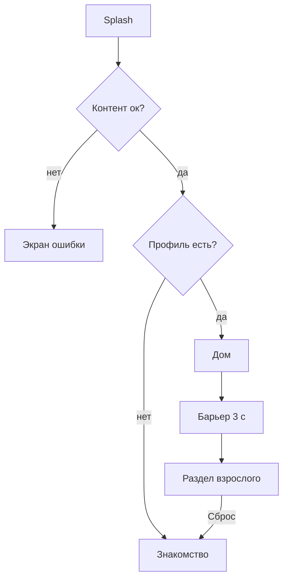

# Раздел взрослого, словарик, оболочка приложения — системная спецификация (SA)

| Поле | Значение |
|------|----------|
| **ID** | F-016 |
| **Назначение** | Барьер и раздел взрослого со сбросом; словарик; запуск, тема, навигация |
| **Репозиторий** | `Pet_Finni_hackathon` |
| **Источник** | ТЗ 2.5.12–2.5.14, Приложение А п. 11–12; SA F-001 UC-10–UC-12, E-05, E-06 |
| **Статус** | Согласовано Егором 2026-09-24 |
| **Участники** | Егор |
| **Связанные артефакты** | F-005 `clear`, F-006 `reset` |

---

## 1. Контекст

ТЗ: взрослый за барьером видит цели продукта и прогресс без стыда, может сбросить профиль. Словарик терминов. Холодный старт ≤ 5 с.

## 2. Цель

Оболочка `FinniApp`: сплэш → загрузка контента и снимка → знакомство или дом. Раздел взрослого за удержанием кнопки 3 с. Словарик одним экраном.

## 3. Бизнес-требования

| ID | Требование | Приоритет |
|----|------------|-----------|
| BR-01 | Барьер: удерживать кнопку 3 с (кольцо прогресса); отпустил — сброс | Must |
| BR-02 | Раздел: «Чему учит приложение» (6 компетенций), прогресс (день, стадия, хорошие дни, копилка, задания по темам, цели) | Must |
| BR-03 | Формулировки без оценок ребёнка | Must |
| BR-04 | «Сбросить профиль» → подтверждение → `reset` → знакомство | Must |
| BR-05 | Переключатель звука/вибрации | Could |
| BR-06 | Словарик: ≥ 10 терминов, карточки | Should |
| BR-07 | Сплэш с героем пока грузится; ошибка контента — экран «Что-то сломалось» с текстом для разработчика | Must |
| BR-08 | Тема: тёплые цвета, крупные скругления, портрет | Must |

## 4. Описание

### 4.3 Поток



### 4.4 Затронутые компоненты

| Слой | Путь |
|------|------|
| Точка входа | `client/lib/main.dart` |
| Приложение | `client/lib/ui/app.dart`, `client/lib/ui/theme.dart` |
| Экраны | `client/lib/ui/screens/adult_screen.dart`, `glossary_screen.dart` |
| Тесты | `client/test/ui/app_flow_test.dart` |

## 5. Сценарии

| UC | Актор | Цель | Предусловия |
|----|-------|------|-------------|
| UC-01 | Взрослый | Войти за барьер | — |
| UC-02 | Взрослый | Сбросить профиль | В разделе |
| UC-03 | Ребёнок | Открыть словарик | Дом |

## 6. Матрица исходов

### Success (S)

| ID | Условие | Результат |
|----|---------|-----------|
| S-01 | Удержание 3 с | Раздел открыт |
| S-02 | Сброс подтверждён | Знакомство, снимка нет |

### Exception (E)

| ID | Условие | Поведение |
|----|---------|-----------|
| E-01 | Отпустил раньше | Кольцо сбрасывается |
| E-02 | Отмена сброса | Ничего не меняется |

## 7. NFR

| ID | Категория | Требование |
|----|-----------|------------|
| NFR-01 | Perf | Старт до дома ≤ 5 с |
| NFR-02 | Safety | Внешних ссылок нет |

## 8. API и контракты

```dart
class FinniApp extends StatefulWidget { const FinniApp({ProfileStore? store, Future<GameContent> Function()? loadContent}); }
ThemeData finniTheme();
class AdultGate extends StatefulWidget { const AdultGate({required VoidCallback onPassed, Duration hold = const Duration(seconds: 3)}); }
class AdultScreen extends StatelessWidget { const AdultScreen({required GameController game}); }
class GlossaryScreen extends StatelessWidget { const GlossaryScreen({required GameContent content}); }
```

Ключи: `adult.hold`, `adult.reset`, `adult.reset.confirm`.

## 9. Зависимости

F-005, F-006.

## 10. Открытые вопросы

Нет.
