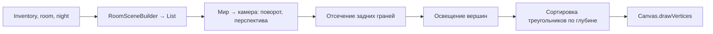

# Настоящие 3D-комнаты — системная спецификация (SA)

| Поле | Значение |
|------|----------|
| **ID** | F-019 |
| **Назначение** | Заменить нарисованную 2D-комнату на 3D-сцену: объёмные стены, пол, мебель, свет; Финик внутри |
| **Репозиторий** | `Pet_Finni_hackathon` |
| **Источник** | Запрос Егора 2026-09-24: «это тамагочи, которое учит финграмотности; комнаты должны быть не 2D, а как настоящая комната с Фиником; другие комнаты тоже» |
| **Статус** | Согласовано Егором 2026-09-24 |
| **Участники** | Егор |
| **Связанные артефакты** | F-007 (3D-маскот), F-009/F-017 (Дом), F-018 (стиль) |

---

## 1. Контекст

Сейчас комната — перспективный рисунок (F-017): глубина есть, но предметы плоские, повернуть сцену нельзя. Нужна сцена из объёмных тел, в которой живёт 3D-герой.

## 2. Цель

Лёгкий собственный 3D-рендер на Canvas (`drawVertices`): меши, камера с перспективой, освещение, сортировка по глубине. Комната-диорама в разрезе, крутится пальцем. Без внешних движков и моделей — всё генерируется кодом.

## 3. Бизнес-требования

| ID | Требование | Приоритет |
|----|------------|-----------|
| BR-01 | Меши-примитивы: коробка, цилиндр, конус, сфера, плоскость; трансформации (сдвиг, масштаб, поворот Y) | Must |
| BR-02 | Камера: азимут, наклон, дистанция, FOV; перспективная проекция; отсечение задних граней | Must |
| BR-03 | Свет: направленный (из окна, тёплый) + заполняющий + фоновый; ламберт; плавное затенение для сфер/цилиндров; затемнение у пола и в углах (AO) | Must |
| BR-04 | Комната-диорама: пол из досок разного тона, задняя и левая стены с плинтусами, окно-проём на левой стене со стеклом и рамой | Must |
| BR-05 | Декор всегда: подвесной светильник, растение в горшке, полка с книгами, часы | Must |
| BR-06 | Покупки и цели объёмные: коврик, ночник, постер, диван, книжный шкаф, ТВ на тумбе, приставка с геймпадом | Must |
| BR-07 | Игровая (цель «Вторая комната») — отдельная 3D-сцена: другая палитра, кубики, мяч, горка/палатка, шары | Must |
| BR-08 | Мягкие тени предметов на полу | Must |
| BR-09 | Финик стоит в сцене: позиция из мира, размер по перспективе, тень на полу | Must |
| BR-10 | Вращение пальцем: азимут 10°…70°, наклон 15°…40°, пружинный возврат | Must |
| BR-11 | Ночь: холодный свет, тёплое свечение ночника и светильника, звёзды в окне | Must |
| BR-12 | Перерисовка только при смене камеры, инвентаря, ночи | Must |

## 4. Описание

### 4.3 Конвейер кадра



Мир: пол `x ∈ [-2, 2]`, `z ∈ [-2, 2]`, `y` вверх; задняя стена `z = -2`, левая `x = -2`, высота 2.6. Финик стоит в `(0.35, 0, 0.5)`.

### 4.4 Затронутые компоненты

| Слой | Путь |
|------|------|
| Математика | `client/lib/ui/room3d/math3d.dart` |
| Меши | `client/lib/ui/room3d/mesh.dart` |
| Рендер | `client/lib/ui/room3d/renderer.dart` |
| Сцена | `client/lib/ui/room3d/room_builder.dart` |
| Виджет | `client/lib/ui/room/room_scene.dart` (тот же API, внутри 3D) |
| Тесты | `client/test/ui/room3d_test.dart` |

## 6. Матрица исходов

### Success (S)

| ID | Условие | Результат |
|----|---------|-----------|
| S-01 | Пустая спальня | Пол, 2 стены, окно, полка, растение, светильник, часы |
| S-02 | Куплены ночник, коврик, постер | Появляются в сцене |
| S-03 | furniture = sofa/shelf/tv/console | Соответствующий объект |
| S-04 | Драг по сцене | Комната поворачивается, отпустил — возвращается |
| S-05 | Задняя грань | Не рисуется |

### Exception (E)

| ID | Условие | Поведение |
|----|---------|-----------|
| E-01 | Размер 0 | Ничего не рисуется |
| E-02 | Треугольник за камерой | Отбрасывается |

## 7. NFR

| ID | Категория | Требование |
|----|-----------|------------|
| NFR-01 | Perf | ≤ 3000 треугольников, кадр ≤ 6 мс на среднем Android |
| NFR-02 | Legal | Всё генерируется кодом |

## 8. API и контракты

```dart
// math3d.dart
final class Vec3 { final double x, y, z; Vec3 operator +(Vec3); Vec3 operator -(Vec3); Vec3 operator *(double); double dot(Vec3); Vec3 cross(Vec3); Vec3 get normalized; }
final class Camera { Camera({double azimuth, double elevation, double distance, double fov, Vec3 target});
  Vec3 toView(Vec3 world); Offset? project(Vec3 view, Size size, {Offset shift, double zoom}); }

// mesh.dart
final class Mesh { List<Vec3> vertices; List<(int,int,int)> faces; Color color; bool smooth; bool doubleSided;
  Mesh translated(Vec3); Mesh scaled(Vec3); Mesh rotatedY(double);
  static Mesh box(Vec3 size, Color c); static Mesh cylinder(double r, double h, Color c, {int seg});
  static Mesh cone(double r, double h, Color c); static Mesh sphere(double r, Color c, {int lat, int lon});
  static Mesh quad(Vec3 a, Vec3 b, Vec3 c, Vec3 d, Color color); }

// renderer.dart
final class Light { Vec3 dir; Color color; double intensity; }
final class Renderer { static RenderedFrame render(List<Mesh> meshes, Camera cam, Size size, {List<Light> lights, Color ambient, ...}); }

// room_builder.dart
abstract final class RoomBuilder { static List<Mesh> build({required Inventory inventory, int room, bool night}); static const heroSpot = Vec3(0.35, 0, 0.5); }
```

## 10. Открытые вопросы

| # | Вопрос | Владелец | Статус |
|---|--------|----------|--------|
| 1 | Покраска Финика (любой цвет, узоры) — отдельная история | Егор | Предложено следующим шагом |
