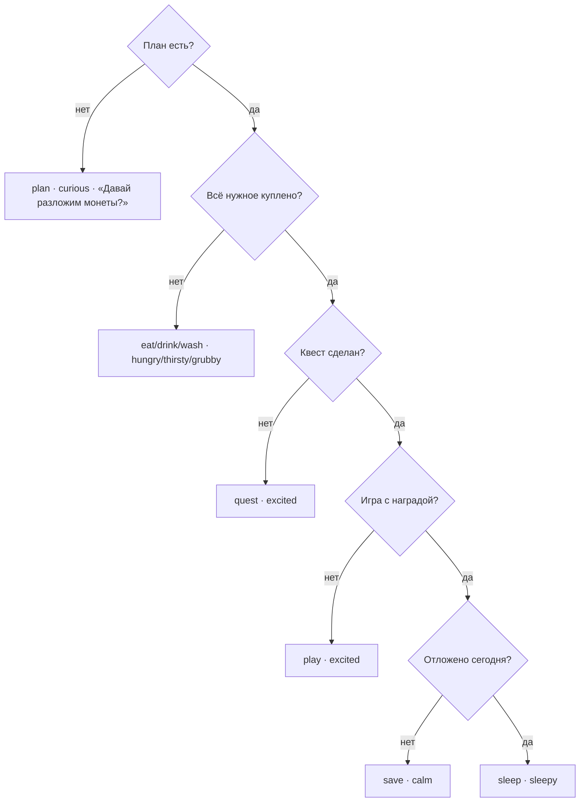

# Желания героя: реплики, эмоции, анимации — системная спецификация (SA)

| Поле | Значение |
|------|----------|
| **ID** | F-020 |
| **Назначение** | Вместо карточки «следующий шаг» герой сам говорит, чего хочет: реплика-сообщение над ним, эмоция на лице, анимация, компактная кнопка перехода |
| **Репозиторий** | `Pet_Finni_hackathon` |
| **Источник** | Запрос Егора 2026-09-24: «пуши от лица персонажа: хочу кушать/пить, поиграть, спать; разные эмоции; над ним как смска; анимации шарика; аккуратная очевидная кнопка перехода» |
| **Статус** | Согласовано Егором 2026-09-24 |
| **Участники** | Егор |
| **Связанные артефакты** | F-006 (состояние дня), F-007 (маскот), F-017/F-018 (Дом), F-019 (3D-комната) |

---

## 1. Контекст

На Доме внизу была карточка «Купи нужное · Магазин». Она функциональна, но безлика. Тамагочи живёт, когда питомец сам просит: так ребёнок чувствует заботу, а финансовое действие (купить нужное, отложить) становится ответом на просьбу героя.

## 2. Цель

Одно желание героя в каждый момент дня, вытекающее из состояния игры: реплика над героем, эмоция, анимация и одна кнопка, которая ведёт туда, где желание исполняется.

## 3. Бизнес-требования

| ID | Требование | Приоритет |
|----|------------|-----------|
| BR-01 | Порядок желаний дня: план → нужное (кушать / пить / умыться — по первому не купленному) → квест → игра → копилка → сон | Must |
| BR-02 | Реплика — облачко-сообщение с хвостиком к герою, от первого лица, ≤ 60 символов | Must |
| BR-03 | Перед текстом — «печатает…» (три точки) 0.6 с; при смене желания облачко всплывает заново | Must |
| BR-04 | Кнопка перехода внутри облачка: капсула «Магазин ›», высота 32, акцентный цвет | Must |
| BR-05 | Эмоции героя: curious, hungry, thirsty, grubby, excited, calm, sleepy | Must |
| BR-06 | Анимации: excited — сам подпрыгивает; hungry/thirsty/grubby — покачивается; sleepy — клюёт носом, над ним «z»; curious — оглядывается | Must |
| BR-07 | Тап по герою — он коротко говорит, как себя чувствует и почему (3 с), потом возвращается к желанию | Should |
| BR-08 | Тексты желаний — в `copy.json` (`wish.*`), не в коде | Must |
| BR-09 | Нижняя карточка «следующий шаг» на Доме убирается | Must |
| BR-10 | Грусть по-прежнему по правилам F-006: эмоция желания не заменяет настроение дня в итогах | Must |

## 4. Описание

### 4.3 Выбор желания



### 4.4 Затронутые компоненты

| Слой | Путь |
|------|------|
| Логика | `client/lib/game/pet_wish.dart` |
| Контент | `client/assets/content/copy.json` (`wish.*`) |
| Маскот | `client/lib/ui/mascot/mascot_look.dart`, `mascot_painter.dart`, `mascot_view.dart` |
| Реплика | `client/lib/ui/widgets/pet_speech.dart` |
| Дом | `client/lib/ui/tabs/home_tab.dart` |
| Тесты | `client/test/game/pet_wish_test.dart`, `client/test/ui/mascot_test.dart`, `app_flow_test.dart` |

## 6. Матрица исходов

### Success (S)

| ID | Условие | Результат |
|----|---------|-----------|
| S-01 | Нет плана | plan, curious, кнопка «План» |
| S-02 | План есть, завтрак не куплен | eat, hungry, «Магазин» |
| S-03 | Куплен завтрак, не куплена вода | drink, thirsty |
| S-04 | Нужно «уход» | wash, grubby |
| S-05 | Нужное куплено, квест не сделан | quest, excited |
| S-06 | Всё сделано, отложено | sleep, sleepy, кнопка «Спать» |
| S-07 | Тап по герою | Реплика о настроении 3 с |

### Exception (E)

| ID | Условие | Поведение |
|----|---------|-----------|
| E-01 | Нет строки в copy.json | Показывается id (видно в QA) |
| E-02 | Узкий экран | Облачко ≤ ширины − 32, текст переносится |

## 8. API и контракты

```dart
enum PetEmotion { curious, hungry, thirsty, grubby, excited, calm, sleepy }
enum WishKind { plan, eat, drink, wash, quest, play, save, sleep }

final class PetWish {
  final WishKind kind; final PetEmotion emotion;
  final String text;    // реплика от первого лица
  final String action;  // подпись кнопки
}
PetWish wishFor(GameController game);

class MascotLook { final PetEmotion? emotion; } // null — лицо по настроению (F-007)
class PetSpeech extends StatefulWidget {
  const PetSpeech({required String text, String? action, VoidCallback? onAction, Key? actionKey});
}
```

`copy.json`: `wish.plan`, `wish.eat`, `wish.drink`, `wash`, `wish.quest`, `wish.play`, `wish.save`, `wish.sleep` и подписи `wish.<kind>.action`.

Ключ кнопки в тестах: `home.next` (как раньше).
