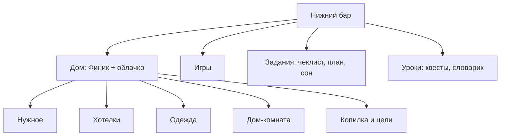

# Разделы без общего магазина: одно действие — одно место — системная спецификация (SA)

| Поле | Значение |
|------|----------|
| **ID** | F-022 |
| **Назначение** | Убрать вкладку «Магазин» и дубли точек входа; покупки разнести по отдельным разделам-категориям: Нужное, Хотелки, Одежда, Дом |
| **Репозиторий** | `Pet_Finni_hackathon` |
| **Источник** | Запрос Егора 2026-09-24: «слишком много точек входа… в нижнем баре убрать магазин; всё, что можно купить, делить на категории — одежда / дом / хотелки и отдельно что необходимо; магазин, в котором было всё, убрать» |
| **Статус** | Согласовано Егором 2026-09-24 |
| **Участники** | Егор |
| **Связанные артефакты** | F-011 (покупка), F-014 (копилка), F-017 (оболочка), F-020 (желания), F-021 (сначала нужное) |

---

## 1. Контекст: аудит точек входа (до)

| Действие | Где было |
|----------|----------|
| Купить вещь | вкладка Магазин, экран Одежда, экран Комната |
| Цели копилки | Магазин («Копим»), Копилка, Комната (плитки целей) |
| План | облачко, Задания, карточка в Играх, баннер Магазина |
| Сон | кнопка на Доме, «Завершить день» в Заданиях, облачко |

Пять вкладок + четыре кнопки Дома + меню, у каждого действия 3–4 двери.

## 2. Цель

Принцип: **одно действие — одно место.** Облачко героя (F-020) остаётся единственным «что дальше» и ведёт в это место.

## 3. Бизнес-требования

| ID | Требование | Приоритет |
|----|------------|-----------|
| BR-01 | Нижний бар: Игры · Задания · Дом · Уроки. Вкладки «Магазин» нет | Must |
| BR-02 | На Доме пять кнопок-разделов: **Нужное · Хотелки · Одежда · Дом · Копилка** | Must |
| BR-03 | Нужное — экран нужного на сегодня (покупка) | Must |
| BR-04 | Хотелки — экран вкусностей и радостей (расходуемые «хочу»): шоколадка, мороженое, лимонад | Must |
| BR-05 | Одежда — единственное место покупки и надевания вещей на героя | Must |
| BR-06 | Дом — единственное место покупки вещей в комнату; переключение Спальня/Игровая | Must |
| BR-07 | Цели (вторая комната, крупная мебель) — только в Копилке | Must |
| BR-08 | Убираются дубли: карточка «План дня» в Играх, кнопка «Спать» на Доме, плитки целей в Доме | Must |
| BR-09 | Облачко: кушать/пить/умыться → Нужное; игра → вкладка Игры; копилка → Копилка; план → План; сон → Сон | Must |
| BR-10 | «Купить нужное» в Заданиях ведёт в Нужное | Must |
| BR-11 | Любая вкусность из Хотелок радует героя (раньше — только шоколадка) | Should |
| BR-12 | Правила F-021 (сначала нужное) действуют во всех разделах | Must |

## 4. Описание

### 4.1 Карта (после)



### 4.2 Где что живёт (после)

| Действие | Единственное место |
|----------|--------------------|
| Купить нужное | Нужное |
| Купить вкусность | Хотелки |
| Купить / надеть одежду | Одежда |
| Купить вещь в комнату | Дом |
| Копить, цели | Копилка |
| План | Задания → План (облачко утром) |
| Сон | Задания → «Завершить день» (облачко вечером) |
| Квесты | Уроки (облачко днём, строка в Заданиях) |

### 4.3 Затронутые компоненты

| Слой | Путь |
|------|------|
| Оболочка | `client/lib/ui/shell/main_shell.dart`, `ui/widgets/duo.dart` (`ShellTab` без `shop`) |
| Разделы | `client/lib/ui/screens/category_screen.dart` (Нужное, Хотелки) — новый |
| Одежда / Дом | `client/lib/ui/screens/clothes_screen.dart`, `room_screen.dart` |
| Дом | `client/lib/ui/tabs/home_tab.dart` |
| Удаляется | `client/lib/ui/tabs/shop_tab.dart` |
| Контент | `assets/content/items.json` (+ мороженое, лимонад) |
| Контроллер | `game_controller.dart` (радость от любой вкусности) |

## 5. Use cases

| UC | Сценарий |
|----|----------|
| UC-01 | Финни «хочу кушать» → «Нужное ›» → экран Нужное → Завтрак → покупка |
| UC-02 | Дом → Хотелки → Мороженое (после нужного) → герой рад |
| UC-03 | Дом → Одежда → примерка → покупка → надето |
| UC-04 | Дом → Дом → Ночник → покупка → он в 3D-комнате |
| UC-05 | Дом → Копилка → цель «Вторая комната» |

## 6. Матрица исходов

### Success (S)

| ID | Условие | Результат |
|----|---------|-----------|
| S-01 | Таб-бар | Ровно 4 вкладки, «Магазина» нет |
| S-02 | Нужное | Только нужное на сегодня, куплено — «✓» |
| S-03 | Хотелки | Только расходуемые «хочу» |
| S-04 | Вкусность куплена, нужное куплено | Настроение «радуется» |

### Failure (F)

| ID | Условие | Результат |
|----|---------|-----------|
| F-01 | Хотелка до нужного | Шторка F-021 |
| F-02 | Нет плана | Шторка «Сначала план» (F-011) |

## 8. API и контракты

```dart
enum ShellTab { games, tasks, home, lessons }

enum ShopCategory { needs, treats }
class CategoryScreen extends StatelessWidget {
  const CategoryScreen({required GameController game, required ShopCategory category});
}

class GameContent {
  List<ShopItem> get treatItems; // kind == want && slot == consumable
}
```

Ключи тестов: `home.needs`, `home.treats`, `home.clothes`, `home.room`, `home.savings`; строки `shopRow.<id>`.
