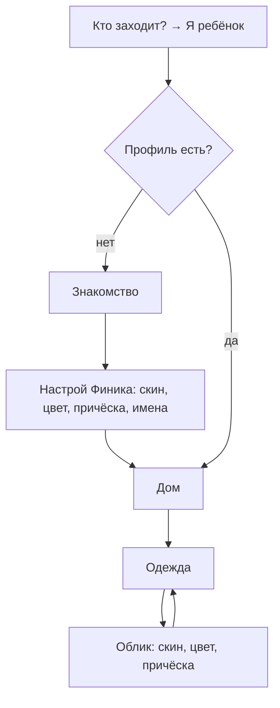

# Настройка Финика: скины и цвета — системная спецификация (SA)

| Поле | Значение |
|------|----------|
| **ID** | F-023 |
| **Назначение** | После входа ребёнка — экран настройки Финика: скин (Финик, Котик, Зайка; Мартышка закрыта до успехов), цвет, причёска, имена. Тот же экран доступен позже из Одежды |
| **Репозиторий** | `Pet_Finni_hackathon` |
| **Источник** | Запрос Егора 2026-09-24: «после входа как ребёнок — экран настройки Финика, где можно выбрать скин; мартышка закрыта с подписью, что её можно открыть за успехи в игре; настроить цвета; минимум 3 скина». Решения: скины Финик/Котик/Зайка; Мартышка открывается на стадии «взрослый» |
| **Статус** | Согласовано Егором 2026-09-24 |
| **Участники** | Егор |
| **Связанные артефакты** | F-005 (профиль), F-007 (маскот), F-008 (создание героя), F-014 (цели), F-022 (разделы) |

---

## 1. Контекст

Сейчас при создании героя выбираются 3 оттенка жёлтого и 3 причёски, а «Обезьянка» покупается как цель копилки за 50 монет. Ребёнку нужен настоящий выбор персонажа, а редкий облик должен быть наградой за успехи в финансовых привычках, а не за одну накопленную сумму.

## 2. Цель

Экран «Настрой Финика»: живой 3D-герой в центре, ряд скинов, палитра цветов, причёска (для Финика), имена. Мартышка видна, но закрыта: «Откроется, когда Финик станет взрослым» — это стадия 3 за хорошие дни (план + нужное + отложил).

## 3. Бизнес-требования

| ID | Требование | Приоритет |
|----|------------|-----------|
| BR-01 | Скины: **Финик** (хохолок/чёлка/пучки), **Котик** (треугольные ушки, усики), **Зайка** (длинные ушки), **Мартышка** (ушки и мордочка) | Must |
| BR-02 | Мартышка закрыта, пока стадия < 3; на плитке замок и подпись «Откроется, когда Финик станет взрослым» | Must |
| BR-03 | Палитра из 8 цветов; для Мартышки цвет не меняется (свой коричневый) | Must |
| BR-04 | Причёска выбирается только у Финика; у Котика и Зайки вместо причёски ушки | Must |
| BR-05 | Экран открывается после выбора «Я ребёнок» для нового игрока (вместо старого «Как зовут героя?») | Must |
| BR-06 | Тот же экран без полей имён открывается из Одежды кнопкой «Облик» | Must |
| BR-07 | Выбор сохраняется в профиле; старые сохранения без полей читаются (Финик + цвет из облика) | Must |
| BR-08 | Цель копилки «Облик Обезьянка» убирается (вместо неё цель «Подарок другу» — ТЗ требует ≥ 3 целей); если обезьянка уже была получена — Мартышка открыта | Must |
| BR-09 | Когда Финик становится взрослым, в итоге дня: «Открыт новый облик — Мартышка!» | Should |
| BR-10 | Смена облика бесплатна (игровые монеты не тратятся) | Must |

## 4. Описание

### 4.1 Модель

```
Profile { playerName, petName, lookId, skin = finik|cat|bunny|monkey, color?: ARGB, hair?: tuft|bangs|buns }
Внешний вид = skin + (color ?? look.color) + (hair ?? look.hair) + надетые вещи
monkeyUnlocked = stage ≥ 3 || inventory.skin == 'monkey' (старые сохранения)
```

### 4.2 Поток



### 4.3 Затронутые компоненты

| Слой | Путь |
|------|------|
| Профиль | `client/lib/store/snapshot.dart` (`Profile.skin/color/hair`) |
| Контроллер | `client/lib/game/game_controller.dart` (`createProfile(..., skin, color, hair)`, `restyle`, `isSkinUnlocked`) |
| Контент | `assets/content/looks.json` (`skins`, `palette`), `goals.json` (без обезьянки), `copy.json` (`skin.*`) |
| Маскот | `client/lib/ui/mascot/mascot_look.dart`, `mascot_painter.dart` (ушки кота и зайки, усики) |
| Экран | `client/lib/ui/screens/create_hero_screen.dart` → `FinikStyleScreen` |
| Одежда | `client/lib/ui/screens/clothes_screen.dart` (кнопка «Облик») |

## 5. Use cases

| UC | Сценарий |
|----|----------|
| UC-01 | Новый ребёнок: Зайка, мятный цвет, имя «Банни» → Дом с мятной Зайкой |
| UC-02 | Тап по Мартышке на стадии 1 → Финик качает головой, подсказка «Откроется, когда Финик станет взрослым» |
| UC-03 | Стадия 3 → Мартышка открыта → выбор в Одежде → Облик |
| UC-04 | Старое сохранение → Финик с прежним цветом и причёской |

## 6. Матрица исходов

### Success (S)

| ID | Условие | Результат |
|----|---------|-----------|
| S-01 | createProfile со skin/color/hair | Профиль с выбором, герой так и выглядит |
| S-02 | restyle(skin: cat) | Скин сменён, монеты не списаны |
| S-03 | Стадия 3, restyle(skin: monkey) | Сменён |
| S-04 | Старый JSON профиля без skin | skin = finik, color/hair из облика |

### Failure (F)

| ID | Условие | Результат |
|----|---------|-----------|
| F-01 | restyle(skin: monkey), стадия < 3 | `FeedbackReason.locked`, текст `skin.monkey.locked`, профиль без изменений |
| F-02 | Неизвестный скин | `locked` |

## 7. Нефункциональные требования

| Категория | Требование |
|-----------|------------|
| Доступность | Плитки скинов и цветов с семантическими подписями («Котик», «Мятный»); замок продублирован текстом |
| Данные | Только имя героя и игровое имя, без ПДн |

## 8. API и контракты

```dart
class Profile {
  final String skin;   // finik|cat|bunny|monkey
  final int? color;    // ARGB
  final String? hair;  // tuft|bangs|buns
}

class SkinDef { final String id, title; final int unlockStage; }
class GameContent { List<SkinDef> skins; List<PaletteColor> palette; }

class GameController {
  bool isSkinUnlocked(String skin);
  Future<void> createProfile({..., String skin = 'finik', int? color, String? hair});
  Future<GameFeedback> restyle({String? skin, int? color, String? hair});
}

class FinikStyleScreen extends StatefulWidget {
  const FinikStyleScreen({required GameController game, bool create = true});
}
```

`looks.json`:

```json
"skins": [
  {"id": "finik", "title": "Финик"}, {"id": "cat", "title": "Котик"},
  {"id": "bunny", "title": "Зайка"}, {"id": "monkey", "title": "Мартышка", "unlockStage": 3}
],
"palette": [{"id": "sun", "title": "Солнечный", "color": "#FFCC33"}, ...]
```

Ключи тестов: `hero.skin.<id>`, `hero.color.<id>`, `hero.hair.<id>`, `hero.pet`, `hero.player`, `hero.go`, `clothes.style`.
