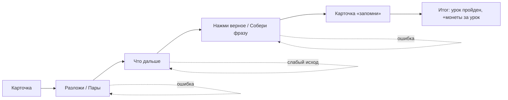

# Уроки как в Duolingo: шесть игр по одному рецепту — системная спецификация (SA)

| Поле | Значение |
|------|----------|
| **ID** | F-025 |
| **Назначение** | Урок на 3–5 минут собирается из шагов-игр: Карточка, Нажми верное, Разложи, Пары, Собери фразу, Что дальше. Заменяет прежние квесты-сцены: их ситуации переезжают в шаги «Что дальше» |
| **Репозиторий** | `Pet_Finni_hackathon` |
| **Источник** | Макеты и таблицы Егора 2026-09-24: «Урок идёт 3–5 минут и собирается одним рецептом», «Набор игр», «Макеты мини-игр урока» |
| **Статус** | Согласовано Егором 2026-09-24 |
| **Участники** | Егор; Иван — к сведению (награда урока в экономике не меняется) |
| **Связанные артефакты** | F-012 (квесты-сцены, заменяются), F-017 (вкладка Уроки), F-020 (желание «учиться»), F-026 (задания дня и недели) |

---

## 1. Контекст

Сейчас «урок» — это одна сцена с выбором. Нет ни объяснения мысли до выбора, ни закрепления формулировки. Команда утвердила рецепт урока в стиле Duolingo.

## 2. Цель

Движок уроков, где коллега собирает урок из JSON, без кода: пять шагов рецепта, шесть типов игр, обратная связь после каждого хода, без жизней, очков и рейтинга.

## 3. Бизнес-требования

| ID | Требование | Приоритет |
|----|------------|-----------|
| BR-01 | Рецепт: 1 Карточка → 2 Разложи или Пары → 3 Что дальше → 4 Нажми верное или Собери фразу → 5 Карточка «запомни». Короткий урок без шага 4; для практики шаг 2 или 3 повторяется с новой карточкой | Must |
| BR-02 | Рамка: × сверху слева, полоска шагов, одна фраза-задание, крупные плитки, внизу «Проверить» | Must |
| BR-03 | После хода полоска сменяется плашкой: «Верно» + фраза «почему» + «Дальше» либо «Ещё раз» + подсказка по смыслу, не весь ответ | Must |
| BR-04 | Карточка: заголовок, 1–3 фразы, аватар героя; «Дальше» включается после короткой паузы (0,8 с); проверки нет | Must |
| BR-05 | Нажми верное: 2–4 плитки, выбрать одну нельзя дважды; «Проверить» активна после выбора; ошибка отпускает плитку, шаг не сгорает | Must |
| BR-06 | Разложи: 2–3 корзины; тап по карточке, потом по корзине; повторный тап возвращает карточку в ряд; «Готово», когда ряд пуст; неверные выпадают обратно | Must |
| BR-07 | Показ перед игрой: при первой встрече темы Разложи сначала показан решённым, кнопка «Теперь я» | Should |
| BR-08 | Пары: 3–4 пары, слева пример, справа слово, списки перемешаны; верная пара остаётся связанной; неверная — «Эта пара не сошлась: X — Y, не Z» | Must |
| BR-09 | Собери фразу: слоты сверху, плитки снизу (3–4 и отвлекающие), тап переносит, тап по слоту возвращает | Must |
| BR-10 | Что дальше: ситуация, 2–3 исхода; после выбора экран меняется на последствие; слабый исход не стыдит, кнопка «Выбрать снова»; подходящий — «Дальше» | Must |
| BR-11 | Выход по × сохраняет шаг: урок можно доиграть позже | Must |
| BR-12 | Награда урока: первый законченный урок за период приносит монеты (как прежний квест, +12), подписанные «за урок»; повторы — без монет. Жизней, очков, рейтинга нет | Must |
| BR-13 | Вкладка Уроки — путь по темам; следующий урок открывается после предыдущего, пройденные можно повторить | Must |
| BR-14 | Контент: темы и уроки в `lessons.json`, проверка `validate()`; новый урок добавляется без кода | Must |
| BR-15 | Объём: ≥ 4 темы, ≥ 8 уроков, в контенте встречаются все 6 игр | Must |

## 4. Описание

### 4.1 Поток урока



### 4.2 Затронутые компоненты

| Слой | Путь |
|------|------|
| Модели | `client/lib/content/lesson_models.dart` (темы, уроки, шаги) — новый |
| Логика шагов | `client/lib/game/lesson_logic.dart` (проверки) — новый |
| Контент | `client/assets/content/lessons.json` — новый; `quests.json` удаляется |
| Контроллер | `game_controller.dart`: `startLesson`, `saveLessonStep`, `addLearnTime`, `finishLesson`, `recommendedLesson`, `isLessonOpen` |
| Хранение | `store/snapshot.dart`: `lessonLog`, `lessonProgress`, `learnSeconds` |
| Экраны | `ui/lesson/lesson_screen.dart`, `ui/lesson/steps/*.dart` — новые; `ui/tabs/lessons_tab.dart` (путь); `quest_screen.dart` удаляется |

## 5. Use cases

| UC | Сценарий |
|----|----------|
| UC-01 | Ребёнок открывает первый урок: Карточка → показ Разложи → сам раскладывает → Что дальше → Собери фразу → Запомни → «+12 🪙 за урок» |
| UC-02 | Ошибся в Нажми верное → серая плашка «Ещё раз» с подсказкой → выбирает снова |
| UC-03 | Выбрал слабый исход в Что дальше → последствие → «Выбрать снова» |
| UC-04 | Закрыл урок крестиком на шаге 3 → потом «Доиграть» → продолжает с шага 3 |
| UC-05 | Повторяет пройденный урок → без монет, в журнал как повтор |

## 6. Матрица исходов

| ID | Условие | Результат |
|----|---------|-----------|
| S-01 | Первый урок за день закончен | +12, подпись «за урок», журнал |
| S-02 | Второй урок за день | Без монет, журнал |
| S-03 | × на шаге k | `lessonProgress = (id, k)` |
| S-04 | Урок закончен | `lessonProgress` очищен, следующий урок пути открыт |
| F-01 | Неверный ход | Плашка «Ещё раз», шаг не засчитан, прогресс шагов не падает |
| F-02 | Закрытый урок пути | Недоступен, замок |
| E-01 | Кривой шаг в JSON | `validate()` сообщает проблему |

## 8. API и контракты

```dart
sealed class LessonStep
  CardStep(title, lines, emoji?)
  PickStep(question, options, answer, why, hint)
  SortStep(prompt, bins[{id,title}], cards[{text,bin}], why, hint, demo)
  PairsStep(prompt, pairs[(left,right)], why)
  OrderStep(prompt, tiles (верный порядок), extra, why, hint)
  NextStep(situation, emoji, outcomes[{text, good, result}], why)

class Lesson { id, topic, title, emoji, steps; bool get isShort; Set<String> kinds }
class Topic { id, title, emoji }

class GameController {
  Lesson get recommendedLesson;
  bool isLessonOpen(String id);
  Future<void> startLesson(String id);
  Future<void> saveLessonStep(String id, int step);
  Future<void> addLearnTime(int seconds);
  Future<GameFeedback> finishLesson(String id); // reward 12 first today
}
```

`lessons.json`: `{"topics":[...], "lessons":[{"id","topic","title","emoji","steps":[{"type":"card|pick|sort|pairs|order|next", ...}]}]}`.

Ключи: `lesson.close`, `lesson.check`, `lesson.next`, `lesson.retry`, `pick.<i>`, `sort.card.<i>`, `sort.bin.<id>`, `pairs.left.<i>`, `pairs.right.<i>`, `order.tile.<i>`, `order.slot.<i>`, `next.outcome.<i>`, `lesson.done`.
