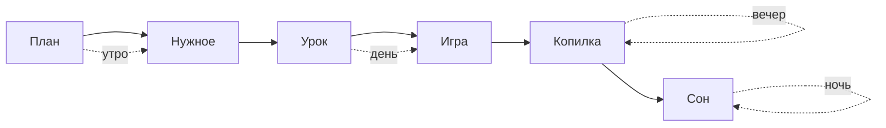

# Время суток в комнате по ходу дня — системная спецификация (SA)

| Поле | Значение |
|------|----------|
| **ID** | F-028 |
| **Назначение** | Свет и вид за окном меняются вместе с шагами дня: утро с солнышком, день, вечер-закат, ночь со звёздами и зажжёнными лампами |
| **Репозиторий** | `Pet_Finni_hackathon` |
| **Источник** | Запрос Егора 2026-09-24: «в зависимости от стадии меняется свет / время суток: когда хочет спать — ночь, звёзды, свет от ламп; утро — солнышко; вечер — не совсем темно». Решение: вечер = шаг копилки (план по ТЗ остаётся до трат, утром) |
| **Статус** | Согласовано Егором 2026-09-24 |
| **Участники** | Егор |
| **Связанные артефакты** | F-019 (3D-комната), F-020 (желания), F-027 (миски) |

---

## 1. Контекст

Игровой день — круг решений, но комната весь день одинаково освещена. Смена времени суток делает круг видимым: ребёнок чувствует, что день идёт к вечеру и пора отложить монеты и ложиться спать.

## 3. Бизнес-требования

| ID | Требование | Приоритет |
|----|------------|-----------|
| BR-01 | Время суток следует за желанием героя (F-020): план, еда, вода, уход — **утро**; урок, игра — **день**; копилка — **вечер**; сон — **ночь** | Must |
| BR-02 | Утро: за окном низкое тёплое солнце и облачко, мягкий тёплый свет | Must |
| BR-03 | День: высокое солнце, голубое небо, облака, яркий нейтральный свет | Must |
| BR-04 | Вечер: закат (оранжево-розовое небо, солнце у горизонта), тёплый приглушённый свет, лампы уже зажжены, но ещё не темно | Must |
| BR-05 | Ночь: тёмно-синее небо, месяц и звёзды, комната освещена люстрой и ночником (если куплен), мягкое свечение ламп | Must |
| BR-06 | Фон вокруг диорамы подстраивается под время суток | Should |
| BR-07 | Порядок дня и экономика не меняются | Must |

## 4. Описание



| Слой | Путь |
|------|------|
| Правило | `client/lib/game/pet_wish.dart` (`DayTime`, `PetWish.dayTime`) |
| Комната | `client/lib/ui/room3d/room_builder.dart` (небо, свет, лампы по времени), `ui/room/room_scene.dart` (солнце, облака, закат, месяц, звёзды в окне) |
| Экраны | `ui/tabs/home_tab.dart`, `ui/screens/room_screen.dart` |

## 6. Матрица исходов

| ID | Условие | Результат |
|----|---------|-----------|
| S-01 | Нет плана / нужное не куплено | Утро |
| S-02 | Нужное куплено, урок или игра впереди | День |
| S-03 | Остался шаг копилки | Вечер, лампы зажжены |
| S-04 | Всё сделано, «Хочу спать» | Ночь, звёзды, свет ламп |
| S-05 | Новый день после сна | Снова утро |

## 8. API

```dart
enum DayTime { morning, day, evening, night }
extension on WishKind { DayTime get dayTime; }        // pet_wish.dart
RoomBuilder.build({..., DayTime time = DayTime.day}); RoomBuilder.lighting({..., DayTime time});
RoomScene({..., DayTime time = DayTime.day});         // night: true = DayTime.night (совместимость)
```

## 9. Тестирование

`pet_wish_test`: время суток по шагам дня; `room3d_test`: свет по времени (утро/день без ламп, вечер/ночь с лампами), сцена рендерится во всех временах.
